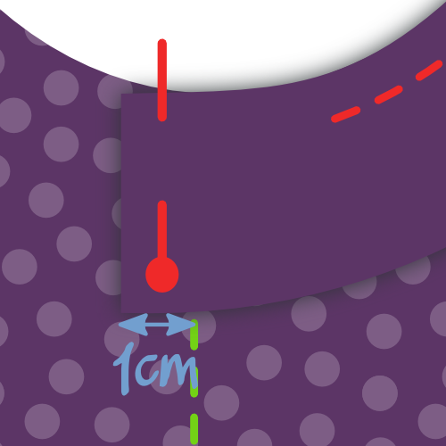
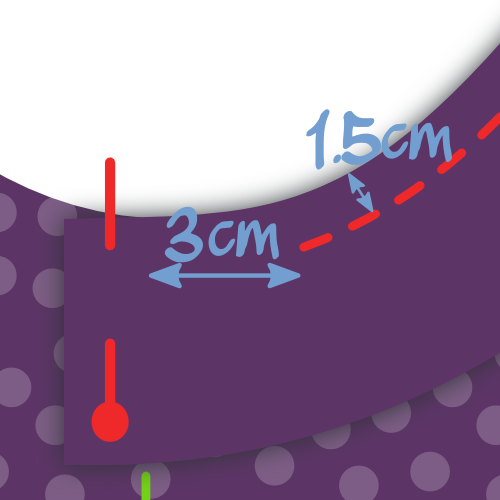
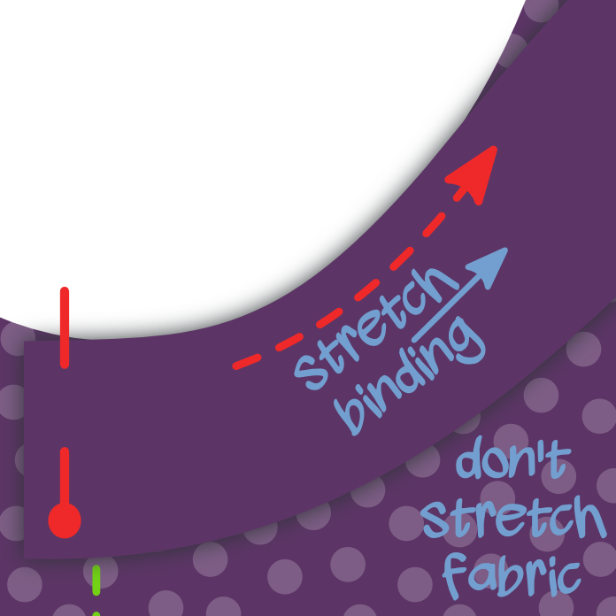
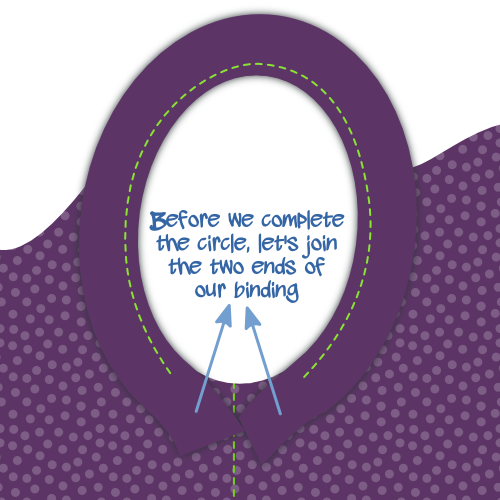
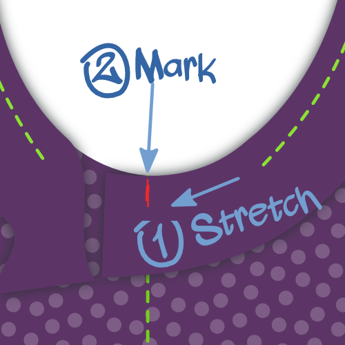
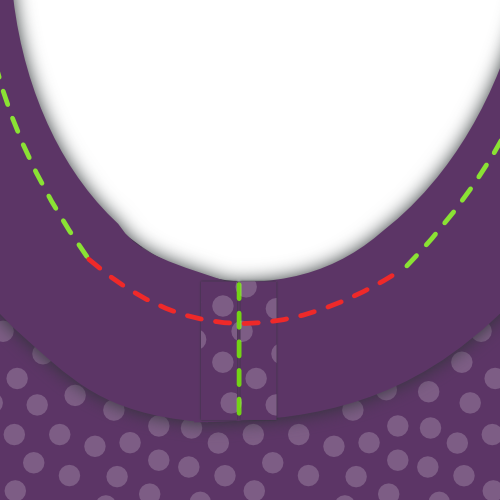
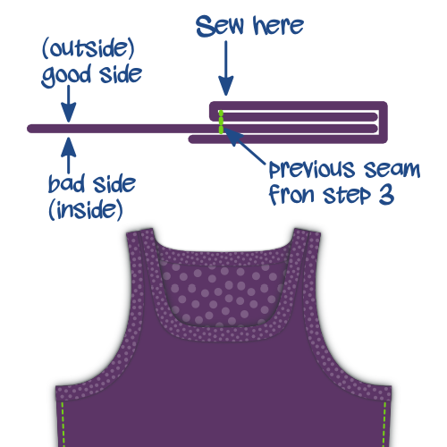
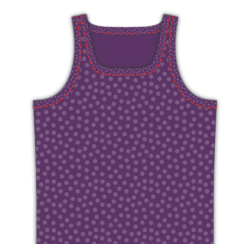

## Paso 1: Cerrar costuras

Put front and back on top of each other with _good sides together_. Sew the side seams and the short seams at the shoulder straps. If you have a serger, this is a good moment to use it. If not, finish your seams otherwise.

## Paso 2: Termina el dobladillo

Fold the hem upwards, and sew it down. If you have a coverlock, use it. If not, use a _twin needle_ or _zig-zag stitch_ to keep the seam stretchable.

<Note>

##### Fold only once, to avoid bulk

Knitwear doesn't ravel, so you can simply fold this over once and sew it down, then neatly trim back the fabric.

</Note>

## Paso 3: Acercar unión de tejidos al frente

<Note>

##### Acerca de la vinculación de knit

Si eres nuevo en [enlace de knit](/docs/sewing/knit-binding), puedes leer [esta página sobre el tema](/docs/sewing/knit-binding).

###### Repetir los pasos 3 y 4 para ambos brazos y la apertura del cuello

El procedimiento que se describe a continuación se aplica tanto a los agujeros de armadura, como a la abertura del cuello. En otras palabras, tendrá que hacerlo tres veces.

###### Empieza con la apertura más simple

Te aconsejo empezar con cualquier apertura que tenga la curvatura más uniforme. Por defecto, estos son los orificios del brazo, pero si cambió las opciones de patrón (piense en el acertijo) que podría no ser el caso.

En cualquier caso, cuanto menos afiladas sean las curvas, más fácil será. Así que comience con eso a calentarse antes de hacer las curvas más complicadas.

</Note>

We are going to finish the arm and neck hole with [knit binding](/docs/sewing/knit-binding) (note: not a knit band. There's a difference, and it's explained [here](/docs/sewing/knit-binding)).

<Note>

Esta es la única parte de hacer esta camisa que requiere un poco de práctica. No te preocupes, todo lo que tienes que hacer es hacer un par de estos y serás un profesional en poco tiempo.

</Note>

### Elige tu lugar

The first thing we need to do is decide where we are going to start/stop our binding. Here's what I suggest:

- Para los orificios de armadura: en la costura lateral. Esto ocultará nuestra costura bajo el brazo
- Para la apertura del cuello: el centro de la parte trasera del cuello. Puede que quieras marcar esto con un pin

### Colocar (el inicio de) tu vinculación

Put your A-shirt down with the good side up, and place your binding strip on top of it with the good side down (as in, good sides together).

Align the long edge of your strip with the edge of your fabric so the strip lies on top of the fabric (not in the opening). Place the corner on your starting point.

Now shift your binding strip 1cm beyond your starting point. This little extra will guarantee we can join the two ends later.

### Asegúrate de saber dónde coser

We are going to sew 1.5cm from the edge. So be careful because this is not the standard seam allowance.

<Tip>

La forma más fácil de mantener esta distancia de 1,5 cm es utilizando una gauga de costura.
O haga lo que hago, coloque una cinta de marcado en su máquina de coser y marque una línea en ella a 1,5 cm de su aguja.
Entonces todo lo que tienes que hacer es mantener alineado el borde de tu tela con esa línea.

</Tip>

Also, we are not starting at our start point, but we skip the first 3cm. We'll need this wiggle room later to join the ends of our binding.

### Marcar enlace en su lugar

Sew your binding in place while gently stretching the binding, but not the fabric. Make sure not to sew the last 3cm but leave them, just as you did at the start.

You might need to practice a bit to get the hang of it.

> Asegúrate de estirar más tu unión cuando estés tomando una curva más nítida. Lee mis notas sobre [enlace de tejidos](/docs/sewing/knit-binding) para más información.

### Marcar como enlace

With about 6cm left to go before we complete our circle, it's time to sew the ends of the binding together.

Take one of the edges, and stretch it along the 3cm seperating it from the start point as you would while sewing.

Mark the binding where it reaches the start point. Do the same for the other end.

### El encuadernado finaliza juntos

Fold your A-shirt in whatever way makes it easier for you to place both binding ends with good sides together, aligning the marks. Sew them together on the mark.

> 6 cm no es mucho, pero debe ser suficiente para conseguir que ambos bordes cómodamente debajo de su máquina de coser para coser togther.

### Terminar los últimos 6 cm de encuadernado

Now that your binding ends are joined together, it's time to finish the last 6cm of binding. Sew it down, staying 1.5cm from the edge as you did before.

## Paso 4: Doble unión de tejidos a la espalda y coser

### Doblar tu unión sobre el borde de la tela hacia atrás

Fold your binding fabric around the fabric of your A-shirt to the back. This is how we'll sew it down.

> Mientras que la tela está doblada en la parte delantera (ocultando el borde de la tela en el proceso) no hay necesidad de eso en la parte trasera. Nos limitaremos a recortar el borde más tarde, dado que el nudo no se cuelga. Si tuviésemos que doblar la tela también en la espalda, sólo añadiríamos granel.

### Explora tu vinculación

From the right side of your fabric, sew along the inner edge of your binding (furthest from the edge), making sure to catch the binding at the back in the process.

<Note>

Si tienes una máquina de cierre, eso sería perfecto para esta costura

</Note>

You'll have to, once again, stretch your binding a bit while doing this. But this time, there's an extra caveat to look out for.

<Note>

##### Beware of the uneven feed

As you feed your binding through your sewing machine, the feed dogs will pull the bottom layer (back of your binding) forward.

En un mundo perfecto, todas las capas seguirán sin problemas.
Pero la mayoría de las veces la capa superior (frontal de su enlace) tiende a retrasarse un poco.
Esto hace que su unión no se pliega bien alrededor del borde del tejido, sino que haga tortillas feas.

Así que ten cuidado con esto, y si ves que sucede, estira la capa inferior un poco más para compensar.

</Note>

## Paso 5: Recortar unión de tejidos en el interior

On the inside of your A-shirt, trim back the knit binding against your seam to finish up.

<Note>

Ten cuidado de no cortar un agujero en tu camiseta. Me ha ocurrido esto en más de una ocasión.

</Note>

