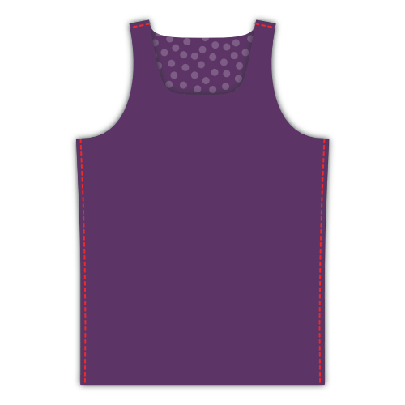

- - -
title: "Aaron A-Shirt: Sewing Instructions"
- - -

## Étape 1 : Faire les coutures d'assemblage

Put front and back on top of each other with _good sides together_. Sew the side seams and the short seams at the shoulder straps. If you have a serger, this is a good moment to use it. If not, finish your seams otherwise.

## Étape 2 : Faire l'ourlet

Fold the hem upwards, and sew it down. If you have a coverlock, use it. If not, use a _twin needle_ or _zig-zag stitch_ to keep the seam stretchable.

<Note>

##### Fold only once, to avoid bulk

Knitwear doesn't ravel, so you can simply fold this over once and sew it down, then neatly trim back the fabric.

</Note>

## Étape 3 : Coudre le biais de jersey à l'avant

<Note>

##### A propos de la liaison knit

Si vous êtes nouveau sur [knit binding](/docs/sewing/knit-binding), vous pouvez lire [cette page sur le sujet](/docs/sewing/knit-binding).

###### Répéter les étapes 3 et 4 pour les armures et l'ouverture du cou

La procédure décrite ci-dessous s'applique à la fois aux armures et à l'encolure. En d'autres termes, vous devrez le faire trois fois.

###### Commencez par l'ouverture la plus simple

Je vous conseille de commencer par n'importe quelle ouverture ayant la courbure la plus uniforme. Par défaut, ce sont les trous de bras, mais si vous avez changé les options de patron (pensez au dos nageur) alors cela pourrait ne pas être le cas.

Dans les deux cas, moins vous avez d'arrondi "serré", plus il sera facile de le faire. Alors commencez avec cela pour vous échauffer avant de faire les arrondis plus délicats.

</Note>

We are going to finish the arm and neck hole with [knit binding](/docs/sewing/knit-binding) (note: not a knit band. There's a difference, and it's explained [here](/docs/sewing/knit-binding)).

<Note>

C'est la seule partie de la fabrication de ce A-shirt qui nécessite un peu de pratique. Ne vous inquiétez pas, il vous suffit d'en faire quelques uns et vous serez un pro en un rien de temps.

</Note>

### Choisissez votre emplacement

The first thing we need to do is decide where we are going to start/stop our binding. Here's what I suggest:

- Pour les emmanchures : à la couture latérale. Cela cachera notre couture sous le bras
- Pour l'encolure : à l'arrière, au milieu. Vous pourriez vouloir marquer ceci avec une broche

### Placer (démarrer) votre biais

Put your A-shirt down with the good side up, and place your binding strip on top of it with the good side down (as in, good sides together).

Align the long edge of your strip with the edge of your fabric so the strip lies on top of the fabric (not in the opening). Place the corner on your starting point.

Now shift your binding strip 1cm beyond your starting point. This little extra will guarantee we can join the two ends later.

### Assurez-vous de savoir où coudre

We are going to sew 1.5cm from the edge. So be careful because this is not the standard seam allowance.

<Tip>

Le moyen facile de garder cette distance de 1,5 cm est d'utiliser une jauge de couture.
Ou faites ce que je fais, placez un ruban de marquage sur votre machine à coudre et marquez une ligne sur lui à 1,5 cm de votre aiguille.
Ensuite, il vous suffit de garder le bord de votre tissu aligné sur cette ligne.

</Tip>

Also, we are not starting at our start point, but we skip the first 3cm. We'll need this wiggle room later to join the ends of our binding.

### Coudre le biais bien positionné

Sew your binding in place while gently stretching the binding, but not the fabric. Make sure not to sew the last 3cm but leave them, just as you did at the start.

You might need to practice a bit to get the hang of it.

> Veillez à étirer votre biais davantage lorsque vous prenez une courbe plus nette. Lisez mes notes sur le [biais de jersey](/docs/sewing/knit-binding) pour plus d'informations.

### Marquer les extrémités du biais

With about 6cm left to go before we complete our circle, it's time to sew the ends of the binding together.

Take one of the edges, and stretch it along the 3cm seperating it from the start point as you would while sewing.

Mark the binding where it reaches the start point. Do the same for the other end.

### Assembler les extrémités du biais

Fold your A-shirt in whatever way makes it easier for you to place both binding ends with good sides together, aligning the marks. Sew them together on the mark.

> 6 cm n'est pas beaucoup, mais ça devrait suffire pour placer les deux bords confortablement sous votre machine pour les coudre.

### Terminer les 6 derniers cm de biais

Now that your binding ends are joined together, it's time to finish the last 6cm of binding. Sew it down, staying 1.5cm from the edge as you did before.

## Étape 4 : Replier le biais à l’intérieur et coudre

### Pliez votre biais sur le bord du tissu sur l'envers

Fold your binding fabric around the fabric of your A-shirt to the back. This is how we'll sew it down.

> Alors que le tissu est plié deux fois sur l'endroit (ce qui cache donc le bord du biais) il n'est pas nécessaire de faire cela à l'arrière. Nous allons simplement couper le bord plus tard, étant donné que le jersey ne s'effiloche pas. Si nous devions replier le tissu à l'arrière également, cela ne ferait qu'ajouter de l'épaisseur.

### Coudre votre biais

From the right side of your fabric, sew along the inner edge of your binding (furthest from the edge), making sure to catch the binding at the back in the process.

<Note>

Si vous avez une recouvreuse, ce sera parfait pour cette couture

</Note>

You'll have to, once again, stretch your binding a bit while doing this. But this time, there's an extra caveat to look out for.

<Note>

##### Beware of the uneven feed

As you feed your binding through your sewing machine, the feed dogs will pull the bottom layer (back of your binding) forward.

Dans un monde parfait, toutes les épaisseurs suivent sans problème.
Mais le plus souvent, la couche supérieure (face avant de votre biais) a tendance à se traîner un peu.
Cela fait que votre biais ne se plie pas bien autour du bord du tissu, mais fait des plis disgracieux.

Veillez donc à ce que cela se produise, et si vous le voyez, étirez un peu plus la sous-couche pour compenser.

</Note>

## Étape 5 : Couper l'excédent de biais à l'intérieur

On the inside of your A-shirt, trim back the knit binding against your seam to finish up.

<Note>

Faites attention à ne pas faire un trou dans votre A-shirt. Sérieusement, cela m'est arrivé à plusieurs reprises.

</Note>

