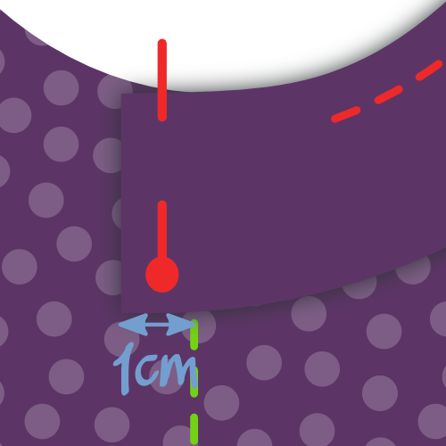
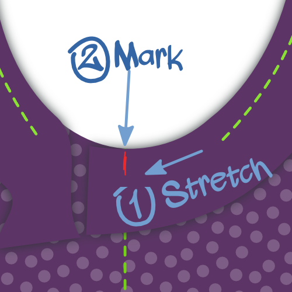

## Étape 1 : Faire les coutures d'assemblage

Put front and back on top of each other with *good sides together*. Cousez les coutures latérales et les coutures d'épaules. Si vous avez une surjeteuse, c'est un bon moment pour l'utiliser. Si ce n'est pas le cas, finissez vos coutures autrement.

## Étape 2 : Faire l'ourlet

Pliez l'ourlet vers le haut, et cousez-le. Si vous avez une recouvreuse, utilisez-la. If not, use a *twin needle* or *zig-zag stitch* to keep the seam stretchable.

<Note>

##### Fold only once, to avoid bulk

Knitwear doesn't ravel, so you can simply fold this over once and sew it down, then neatly trim back the fabric.

</Note>

## Étape 3 : Coudre le biais de jersey à l'avant

<Note>

##### A propos de la liaison knit

Si vous êtes nouveau sur [knit binding](/docs/sewing/knit-binding), vous pouvez lire [cette page sur le sujet](/docs/sewing/knit-binding).

###### Répéter les étapes 3 et 4 pour les armures et l'ouverture du cou

La procédure décrite ci-dessous s'applique à la fois aux armures et à l'encolure. En d'autres termes, vous devrez le faire trois fois.

###### Commencez par l'ouverture la plus simple

Je vous conseille de commencer par n'importe quelle ouverture ayant la courbure la plus uniforme. Par défaut, ce sont les trous de bras, mais si vous avez changé les options de patron (pensez au dos nageur) alors cela pourrait ne pas être le cas.

Dans les deux cas, moins vous avez d'arrondi "serré", plus il sera facile de le faire. Alors commencez avec cela pour vous échauffer avant de faire les arrondis plus délicats.

</Note>

We are going to finish the arm and neck hole with [knit binding](/docs/sewing/knit-binding) (note: not a knit band. Il y a une différence, et elle est expliquée [ici](/docs/sewing/knit-binding)).

<Note>

C'est la seule partie de la fabrication de ce A-shirt qui nécessite un peu de pratique. Ne vous inquiétez pas, il vous suffit d'en faire quelques uns et vous serez un pro en un rien de temps.

</Note>

### Choisissez votre emplacement

La première chose à faire est de décider où nous allons démarrer/arrêter notre biais. Voici ce que je suggère :

-   Pour les emmanchures : à la couture latérale. Cela cachera notre couture sous le bras
-   Pour l'encolure : à l'arrière, au milieu. Vous pourriez vouloir marquer ceci avec une broche

### Placer (démarrer) votre biais

Positionnez votre A-shirt avec l'endroit visible, et placez votre bande de biais sur le dessus avec l'endroit au-dessous (en gros, endroit contre endroit).

Alignez le bord long de votre bande avec le bord de votre tissu, de sorte que la bande se trouve sur le tissu (pas dans l'ouverture). Placez le coin sur votre point de départ.

Déplacez maintenant votre bande de biais de 1cm avant votre point de départ. Cette petite marge vous garantira de pouvoir rejoindre les deux extrémités plus tard.

### Assurez-vous de savoir où coudre

Nous allons coudre à 1,5 cm du bord. Soyez donc prudent car ce n'est pas la marge habituelle de couture.

<Tip>

Le moyen facile de garder cette distance de 1,5 cm est d'utiliser une jauge de couture.
Ou faites ce que je fais, placez un ruban de marquage sur votre machine à coudre et marquez une ligne sur lui à 1,5 cm de votre aiguille.
Ensuite, il vous suffit de garder le bord de votre tissu aligné sur cette ligne.

</Tip>

De plus, nous ne commençons pas à notre point de départ, nous laissons les 3 premiers centimètres. Nous aurons besoin de cette marge plus tard pour rejoindre les extrémités de notre biais.

### Coudre le biais bien positionné

Cousez votre biais bien placé tout en étirant délicatement le biais, mais pas le tissu. Assurez-vous de ne pas coudre les 3 derniers cm, laissez-les comme au début.

Vous aurez peut-être besoin de vous entraîner un peu pour y arriver.

> Veillez à étirer votre biais davantage lorsque vous prenez une courbe plus nette. Lisez mes notes sur le [biais de jersey](/docs/sewing/knit-binding) pour plus d'informations.

### Marquer les extrémités du biais

Avec environ 6cm de marge avant de terminer notre cercle, il est temps de coudre les extrémités du biais ensemble.

Prenez l'un des bords et étirez-le le le long des 3 cm en le séparant du point de départ comme vous le feriez lors de la couture.

Marquer la liaison où elle atteint le point de départ. Faites la même chose pour l'autre extrémité.

### Assembler les extrémités du biais

Pliez votre t-shirt de quelque manière que ce soit, il vous sera plus facile de placer les deux extrémités de reliure avec de bons côtés, alignant les marques. Coudre les extrémités sur les repères.

> 6 cm n'est pas beaucoup, mais ça devrait suffire pour placer les deux bords confortablement sous votre machine pour les coudre.

### Terminer les 6 derniers cm de biais

Maintenant que vos extrémités de biais sont réunies, il est temps de terminer les 6 dernière cm du biais. Cousez-les en restant à 1,5cm du bord comme vous l'avez fait auparavant.

## Étape 4 : Replier le biais à l’intérieur et coudre

### Pliez votre biais sur le bord du tissu sur l'envers

Pliez votre bande de biais par-dessus le tissu de votre A-Shirt sur l'envers. Voici comment nous allons le coudre.

> Alors que le tissu est plié deux fois sur l'endroit (ce qui cache donc le bord du biais) il n'est pas nécessaire de faire cela à l'arrière. Nous allons simplement couper le bord plus tard, étant donné que le jersey ne s'effiloche pas. Si nous devions replier le tissu à l'arrière également, cela ne ferait qu'ajouter de l'épaisseur.

### Coudre votre biais

Sur l'endroit de votre tissu, cousez le long du bord de votre biais (le plus loin du bord du pli), en s'assurant de bien prendre le biais de l'arrière dans la couture.

<Note>

Si vous avez une recouvreuse, ce sera parfait pour cette couture

</Note>

Une fois de plus, vous devrez étirer un peu votre biais en faisant cela. Mais cette fois-ci, il y a une mise en garde supplémentaire à respecter.

<Note>

##### Beware of the uneven feed

As you feed your binding through your sewing machine, the feed dogs will pull the bottom layer (back of your binding) forward.

Dans un monde parfait, toutes les épaisseurs suivent sans problème.
Mais le plus souvent, la couche supérieure (face avant de votre biais) a tendance à se traîner un peu.
Cela fait que votre biais ne se plie pas bien autour du bord du tissu, mais fait des plis disgracieux.

Veillez donc à ce que cela se produise, et si vous le voyez, étirez un peu plus la sous-couche pour compenser.

</Note>

## Étape 5 : Couper l'excédent de biais à l'intérieur

À l'intérieur de votre chemise A, coupez le tricot contre votre couture pour finir.

<Note>

Faites attention à ne pas faire un trou dans votre A-shirt. Sérieusement, cela m'est arrivé à plusieurs reprises.

</Note>

