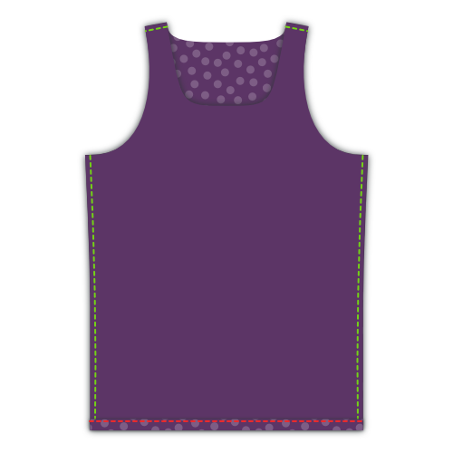

## Stap 1: Sluit de naden

Put front and back on top of each other with _good sides together_. Overlock de zijnaden, en de korte naden aan de schouderbandjes.

## Stap 2: Werk de zoom af

Vouw de zoom naar boven en stik door langs de goede kant. Als je een coverlock hebt is dit het moment om hem te gebruiken. If not, use a _twin needle_ or _zig-zag stitch_ to keep the seam stretchable.

<Note>

##### Fold only once, to avoid bulk
Knitwear doesn't ravel, so you can simply fold this over once and sew it down, then neatly trim back the fabric.

</Note>

## Stap 3: Stik de halsbies aan de voorkant

<Note>

##### About knit binding

If you are new to [knit binding](/docs/sewing/knit-binding), you might read [this page on the subject](/docs/sewing/knit-binding).

###### Repeat steps 3 and 4 for both armholes and the neck opening

The procedure outlined below applies to both of the armholes as well as the neck opening. Met andere woorden, je zal dit drie keer moeten doen.

###### Start with the simplest opening

I would advise you to start with whatever opening has the most uniform curvature. Meestal zijn dit de armsgaten, maar als je de patroonopties aangepast hebt (denk aan een racerback) is dat misschien niet het geval.

Hoe dan ook, hoe minder scherp de curves zijn, hoe makkelijker. Start dus met een makkelijker opwarmertje voor je aan de lastigere stukken begint.

</Note>

We are going to finish the arm and neck hole with [knit binding](/docs/sewing/knit-binding) (note: not a knit band. There's a difference, and it's explained [here](/docs/sewing/knit-binding)).

<Note>

Dit is het enige onderdeel van dit hemdje waar wat oefening voor vereist is. Geen zorgen, als je er een paar maakt ben je een pro voor je het weet.

</Note>

### Kies je startpunt

Het eerste dat we moeten doen is beslissen waar de bies gaat starten en stoppen. Dit zou ik suggereren:

  - Voor de armsgaten: aan de zijnaad. Zo zit de naad verstopt onder je arm
  - Voor de halsopening: middenachter aan je nek. You might want to mark this with a pin

### Positioneer (het begin van) je bies

Leg je hemdje neer met de goede kant naar boven, en leg je bies met de goede kant naar beneden op de stof (dus, goede kanten op elkaar).

Leg de lange rand van je bies gelijk met de rand van je stof zodat de bies op de stof ligt (en niet in de opening). Leg de hoek van je bies op je startpunt.

Leg nu je bies 1 cm voorbij je startpunt. Dit beetje extra garandeert dat we later de twee uiteindes aan elkaar kunnen bevestigen.

### Zorg dat je weet waar je naait

We gaan op 1,5 cm van de rand naaien. Opletten dus, want dit is niet de standaard naadwaarde.

<Tip>

The easy way to keep this 1.5cm distance is by using a seam gauge. 
Or do what I do, place a piece of marking tape on your sewing machine and mark a line on it 1.5cm from your needle. 
Then all you need to do is keep the edge of your fabric aligned with that line.

</Tip>

We beginnen ook niet aan het startpunt, maar slaan de eerste 3 cm over. Dit extra beetje plaats hebben we later nodig om te uiteindes van de bies aan elkaar te zetten.

### Stik de bies vast

Stik de bies vast, rek terwijl de bies lichtjes uit. Let op dat je de stof niet mee uitrekt. Stik de laatste 3 cm niet maar laat deze los, net als aan het begin.

Misschien moet je een beetje oefenen om dit beet te krijgen.

> Make sure to stretch your binding more when you're taking a sharper bend. Read my notes on [knit binding](/docs/sewing/knit-binding) for more info.

### Markeer het einde van je biezen

Met nog een zestal cm te gaan voor de een complete cirkel gemaakt hebben is het tijd om de uiteindes van de biezen aan elkaar te naaien.

Neem een van de uiteindes, en rek het lichtjes uit langs de 3 cm tot aan het startpunt, zoals je zou doen als je aan het naaien was.

Mark the binding where it reaches the start point. Doe hetzelfde voor het andere uiteinde.

### Stik de uiteindes van de biezen aan elkaar

Fold your A-shirt in whatever way makes it easier for you to place both binding ends with good sides together, aligning the marks. Naai de uiteindes aan elkaar op de markering.

> 6 cm is not much, but should be enough to get both edges comfortably under your sewing machine to sew them togther.

### Stik de laatste 6 cm van de bies vast

Nu de uiteindes van je biezen aan elkaar hangen is het tijd om de laatste 6 cm van je bies vast te stikken. Naai dit stukje, 1,5 cm van de rand, zoals eerder.

## Stap 4: Plooi bies naar achter en stik vast

### Plooi je bies over de rand van de stof naar de achterkant

Plooi je bies rond de stof van je hemdje naar de verkeerde kant. Zo gaan we de bies vaststikken.

> While the fabric is folded double at the front (hiding the fabric edge in the process) there's no need for that at the back. We will merely trim back the edge later, given that knit doesn't ravel. If we were to fold back the fabric at the back too, it would only add bulk.

### Stik de bies vast

Stik langs de goede kant van de stof langs je bies, langs de aanzetnaad (en zo ver mogelijk van de rand), zorg zeker dat je het stuk bies dat je naar achter geplooid hebt mee vaststikt.

<Note>

Als je een coverlock hebt is dit ook een perfect moment om die te gebruiken

</Note>

Wederom moet je de bies een beetje uitrekken terwijl je dit doet. Maar nu is er nog iets anders om voor uit te kijken.

<Note>

##### Beware of the uneven feed
As you feed your binding through your sewing machine, the feed dogs will pull the bottom layer (back of your binding) forward. 

In een ideale wereld zouden alle lagen gelijkmatig volgen. 
Maar meestal blijft de bovenste laag (de voorkant van je bies) wat achter. 
Dit zorgt dat je bies niet helemaal recht rond de randjes geplooid ligt, en lelijke rimpels maakt.

So watch out for this, and if you see it happening, stretch the under-layer a bit extra to compensate.

</Note>

## Stap 5: knip de bies bij aan de binnenkant

On the inside of your A-shirt, trim back the knit binding against your seam to finish up.

<Note>

Doe dit voorzichtig zodat je niet per ongeluk een gat in je hemdje knipt. Ik spreek uit ervaring.

</Note>

