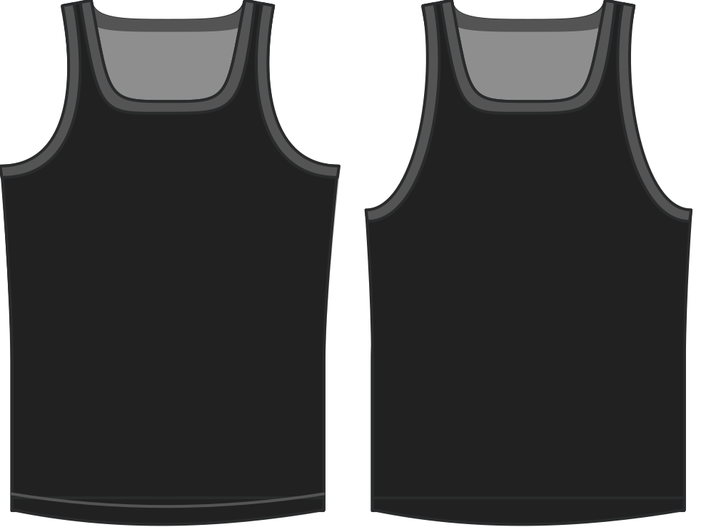

- - -
titre : "chute d'emmanchure"
- - -

De combien abaisser l'emmanchure par rapport à la valeur par défaut.

> Cette option permet également des valeurs négatives. Il va de soi que cela réduira la hauteur de l'emmanchure dans ce cas.

## Effet de cette option sur le motif

