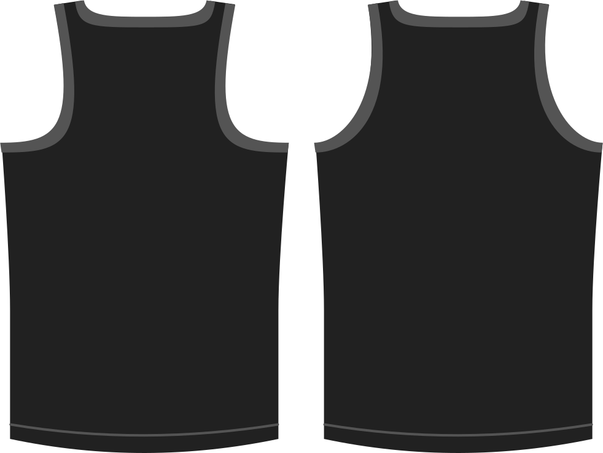

- - -
title: "Back armhole shape"
- - -

Determines the bend of the armhole at the back. In other words, the amount the arm opening is cut-out on your back.

> Höhere Werte verbiegen das Rüstungsloch mehr, was zu einem Raceback-artigen Oberteil führt.

## Effekt dieser Option auf das Schnittmuster

