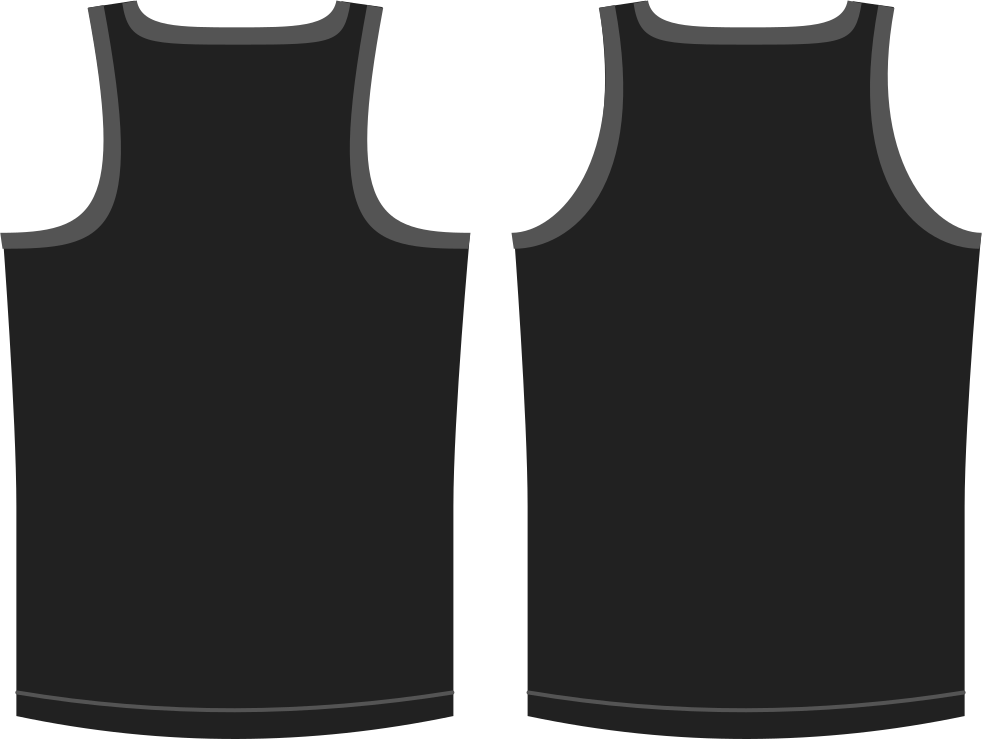

Détermine la courbure de l'emmanchure à l'arrière. En d'autres termes, il s'agit de combien augmenter l'échancrure des emmanchures sur le dos.

> Des valeurs plus élevées courbent davantage les emmanchures, ce qui donne plus un style de dos nageur.

## Effect of this option on the pattern
