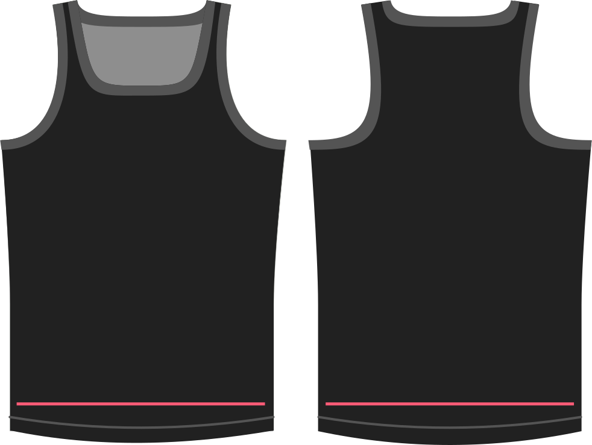

Combien d'aisance voulez-vous pour les hanches ?

Quelle que soit la valeur que vous choisissez, la valeur sera simplement ajoutée à votre mesure de tour de hanches lors de la génération du patron.

> ##### Cette option permet également des valeurs négatives.
>
> Vous ne devriez utiliser d'aisance négative que si vous utilisez un tissu très extensible que vous voulez bien ajuster. Le taux d'élasticité général doit être configuré avec l'option du taux d'élasticité.

## Effet de cette option sur le motif

