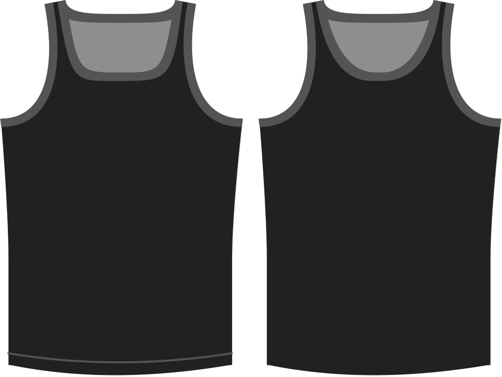

- - -
title: "Neckline shape"
- - -

Determines the bend of the front of the neck opening.

> Valores más altos doblan el cuello abriendo más el cuello, lo que resulta en una apertura de cuello más estrecha.

## Efecto de esta opción en el patrón

