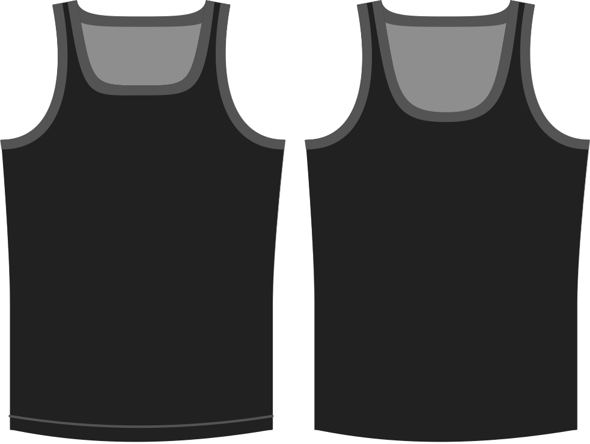

- - -
title: "Neckline drop"
- - -

Determines how much to lower the neckline of the top beyond the default.

> Higher values lower the neckline further, resulting in more exposed skin.

## Effect of this option on the pattern

