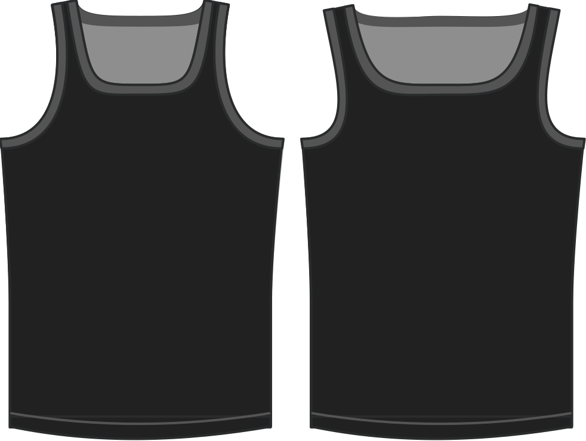

Determines the position of the shoulder strap on the shoulder.

> Los valores más bajos colocan la correa más cerca del cuello, mientras que los valores más altos la sitúan más cerca del hombro.

## Efecto de esta opción en el patrón

