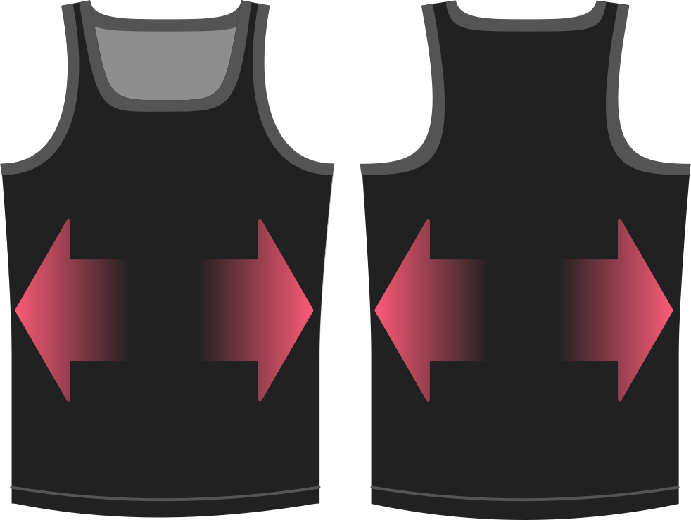

Quel est le taux d’élasticité de votre tissu ?  Choisissez 0% si votre tissu n'est pas du tout extensible.

> ##### Cette option ne concerne que l'élasticité horizontale (dans la largeur) uniquement.
> 
> Four-way stretch is not really a concern for this top, but if you want you can play with the [length bonus](../lengthbonus) option.

## Effet de cette option sur le motif

