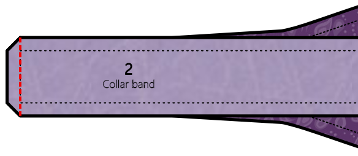
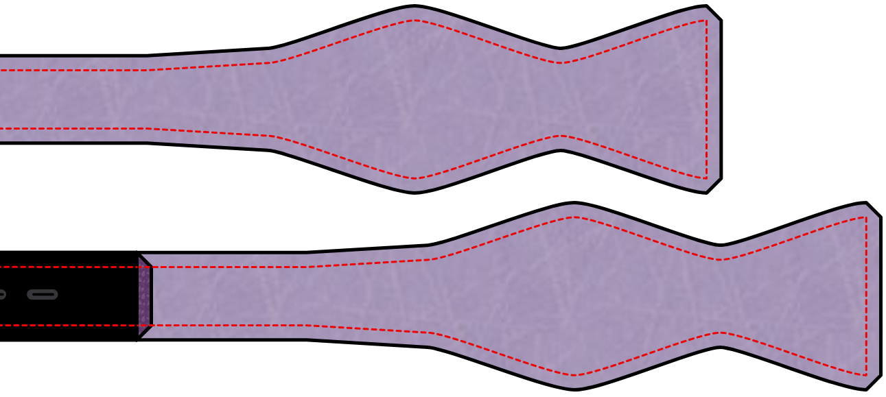

## Anmerkungen und Hinweise

### Präzision

Da eine Fliege ein ziemlich kleiner Gegenstand ist, ist Präzision beim Nähen ausschlaggebend für ein gutes Ergebnis. Jeder leichte Unterschied zwischen dem oberen und unteren Teil der Schleife wird hervorstechen. Um gute Ergebnisse zu erzielen, fand ich es immer sehr hilfreich, die Nahtlinie auf die Einlage zu übertragen und dieser beim Nähen zu folgen.

### Setze das Bügeleisen weise ein

In späteren Konstruktionsschritten wirst du aufgefordert, deinen Stoff zu bügeln. Sei dabei bitte vorsichtig, damit du deinen womöglich empfindlichen Stoff nicht zu viel Hitze aussetzt.

Es ist immer eine gute Idee, dein Bügeleisen auf ein paar Stoffresten zu testen. Dies erlaubt dir, die richtigen Hitzeinstellungen für den verwendeten Stoff zu finden.

### Fadenlauf wählen

Dieses Schnittmuster enthält einen Fadenlauf. Der Fadenlauf ist hier größtenteils dafür gedacht, um mit der Einlage verwendet zu werden. Da jedes Teil des Schnittmusters mit Einlage versehen wird, ist der Fadenlauf des Oberstoffes nicht so wichtig. Du kannst hier auch vom Standard abweichen, um einen informelleren Eindruck zu erzeugen.

<Note>

Wenn das alles sehr verwirrend ist, schlage ich vor, die Hilfeseite zum [Fadenlauf](/docs/sewing/fabric-grain) zu lesen.

</Note>

### Fliegen-Einstellband

Dieses Schnittmuster ermöglicht es dir, eine Fliege zu erstellen, die genau die richtige Länge für einen bestimmten Hals hat. Es ermöglicht es dir auch, eine Fliege zu erstellen, die ein Band und das nötige Zubehör hat, um die Fliege für verschiedene Hälse anpassbar zu machen. Das ist sehr nützlich, wenn deine Hemden nicht alle dasselbe Halsmaß/Kragenweite haben oder wenn du manchmal gerne Hemden trägst, die etwas mehr Zugabe am Hals haben.

Diese Bänder findest du in besseren Kurzwarenläden oder online.

### Nahtzugabe

Da die Fliege mit den rechten Seiten des Stoffes zueinander konstruiert wird, muss das Ganze am Ende von innen nach außen gedreht werden. Du solltest vielleicht erwägen, eine kleinere Nahtzugabe wie 6mm (¼ inch) zu verwenden, um die Menge an Stoff zu reduzieren.

## Konstruktion

### Schritt 1: Einlage einsetzen

Bringe Einlage an allen Teilen an, wo du sie für notwendig hältst.

### Ohne Einstellband

#### Schritt 2: Den Knoten an das Kragenband annähen

Lege das Kragenbandstück auf das Fliegenknotenstück, rechte Seiten zusammen. Richte die Enden beider Stücke aus. Nähe nun über das Ende um beide Teile zusammenzufügen.

Tu dies für jedes Ende beider Kragenbänder.

Alle Nähte außeinander bügeln.

Nun hast du zwei identische einseitige Fliegen.

#### Schritt 3: Beide Seiten zusammenfügen

Lege beide Seiten aufeinander, rechte Seiten zusammen. Nähe rundherum, aber lass dabei einen Bereich von 5cm in der Mitte des Kragenbandes offen. Durch diese Öffnung werden wir die Fliege auf rechts wenden.

#### Schritt 4: Wenden

Schneide die Nahtzugabe an den üblichen Stellen zurück und mache kleine Schnitte, um glatte Kurven zu ermöglichen.

Verwende dann das hintere Ende einer großen Häkelnadel oder ein anderes, angemessen langes und schmales Objekt, um beide Seiten durch die kleine Öffnung auf rechts zu wenden. Beginne damit, die beiden Stoffteile am Ende der Schleife sanft außeinanderzuziehen. Dann drücke das Ende der Schleife zwischen die beiden Stoffteile. Drücke vorsichtig weiter, während du den Rest der Fliege über sie hinweg ziehst. Das kann ein mühsamer Prozess sein. Lass dir Zeit und sei behutsam. Es passiert schnell zu fest zu schieben und dadurch Nähte oder Stoff zum Reißen zu bringen.

Sobald du die Fliege auf rechts gewendet hast, drücke alle Ecken und Kanten nach außen bevor du die Fliege bügelst.

#### Schritt 5: Schließen

Das Einzige was jetzt noch zu tun ist, ist die kleine Öffnung zu schließen, die wir zum Wenden verwendet haben. Du kannst dies per Hand mit einem Leiterstich oder einem Blindstich tun. Oder du nimmst die Maschine und nähst direkt an der Kante des Bandes entlang. Da diese Stelle normalerweise vom Kragen deines Hemdes verdeckt wird, wird es nicht so auffallen.

Bügel die Fliege nun ein letztes Mal und bewundere deine Arbeit.

### Mit Anpassungsband

#### Schritt 2: Das Band anfügen

Der erste Schritt ist, das Einstellband an das kürzeste Teil der Schlaufen zu nähen. Das Band sollte 290mm lang sein. Wenn es eine andere Länge hat, musst du sicherstellen, dass du es so ausrichtest, dass das Band und das kurze Schleifenteil zusammen so lang sind wie das lange Schleifenteil.

Lege die rechten Seiten des kurzen Schleifenteils und des Bandes aufeinander.

Nähe nun über das Ende um beide Teile zusammenzufügen.

#### Schritt 3: Beide Seiten zusammenfügen

Lege beide Seiten der mittleren Schleife rechts auf rechts zusammen. Und lege die lange Schleife auf das Band und den kurzen Schleifenteil, ebenso rechts auf rechts.

Nähe ringsherum, lasse aber die kurzen Enden offen. Durch diese Öffnungen werden wir die Fliegenteile auf rechts wenden.

#### Schritt 4: Wenden

Schneide die Nahtzugabe an den üblichen Stellen zurück und mache kleine Schnitte, um glatte Kurven zu ermöglichen.

Verwende dann das hintere Ende einer großen Häkelnadel oder ein anderes, angemessen langes und schmales Objekt, um beide Teile durch die Enden auf rechts zu wenden. Beginne damit, die beiden Stoffteile am Ende der Schleife sanft außeinanderzuziehen. Dann drücke das Ende der Schleife zwischen die beiden Stoffteile. Drücke vorsichtig weiter, während du den Rest der Fliege über sie hinweg ziehst. Das kann ein mühsamer Prozess sein. Lass dir Zeit und sei behutsam. Es passiert schnell zu fest zu schieben und dadurch Nähte oder Stoff zum Reißen zu bringen.

Sobald du ein Teil auf rechts gewendet hast, drücke alle Ecken und Kanten nach außen bevor du die Fliege bügelst.

Mache dies mit beiden Teilen.

#### Schritt 5: Zubehör hinzufügen

Jetzt müssen wir die beiden Zubehörteile anbringen, die die Fliege einstellbar machen. Das oval aussehende Stück wird an das Teil ohne Einstellband befestigt. Und das Stück mit der T-förmigen Befestigung kommt an das Teil mit der Schleife.

Befestige zunächst das Stück ohne die Schleife. Das liegt daran, dass das Stoffende des Schleifenstückes durch die ovale Öffnung passen muss, bevor wir das Zubehör annähen. Wenn du die Reihenfolge änderst, könnte es nicht mehr hindurchpassen.

Um die Enden zu versäubern, falten wir den Stoff in drei Schritten:

Zuerst falten wir die Seiten unter einem Winkel nach innen. Dann falten wir das Ende darüber, mit einer kleinen Nahtzugabe, etwa 5mm. Dann falten wir es nochmal, für ca. 1cm. Als letztes klemmen wir den ovalen Ring unter diese letzte Falte und nähen die Stofflagen fest.

Nun füttern Sie das Band durch das ovale Teil und beenden es auf die gleiche Weise.

Hake das T in einer der Verstelllöcher fest und deine Fliege ist fertig!

