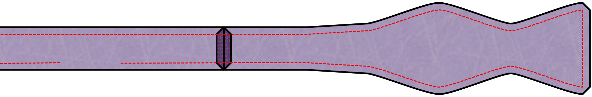

## Notes and tips

### Precision

Since a bow tie is a rather small item, precission with sewing is key to a good result.
Any slight difference between the upper and lower part of the bow will stand out.
To get a great result I found it very helpful to trace the actual seam lines
onto the interfacing and follow that while sewing.

### Press wisely

Later in the construction steps, you will be asked to press your fabric. Please be careful
that you are not using too much heat on a delicate fabric that can't handle it.

It's a good idea to try pressing some fabric scraps before you start. This will allow you to
figure out what is a good heat setting for the fabric you are using.

### Choosing your grain

This pattern includes a grain line. This grain line is mostly there to be used with
the interfacing. Since each pattern piece is interfaced, the grain line of the fabric
itself is not so important. You can even change this from the standard for more
informal impressions.

<Note>

If this all sounds very confusing, might I suggest reading the help
page on [Fabric grain](/docs/sewing/fabric-grain).

</Note>

### Bow tie adjustment ribbon

This pattern allows you to make a bow tie that is the right length for a certain neck
size. It can also make one that has a ribbon and hardware that makes the bow tie
adjustable to different neck sizes. This is useful if not all of your shirts have
the same neck measurements, or if you sometimes like shirts with more ease in the
neck.

These ribbons can be found in the better haberdasheries or can be ordered online.

### Seam allowance

Since the bow tie is constructed with the right sides of the fabric against each other,
the whole thing will have to be turned inside out. You probably want to consider using
a small seam allowance of 6mm (¼ inch) to reduce the bulk.

## Construction

### Step 1: Apply interfacing

Apply interfacing to all parts where you feel it's needed.

### Without adjustment ribbon

#### Step 2: Sew the knot to the collar band

Put the collar band part on the bow tie knot part, right sides together.
Align the ends of both parts. Now sew across the end to join the parts.

Do this for each end on both collar bands.

Press open all the seams.

You now have two identical single sided bow ties.

#### Step 3: Join both sides

Lay both the sides you made on top of each other, right sides together. Sew all
along, but leaving an area of 5cm open in the middle of the collar band. Through
this opening we will turn the bow tie right side out.

#### Step 4: Turning

Clip the seam allowance back in the usual spots and make little cuts to allow for
a smooth curves.

Then use the back of a large crochet hook, or some other appropriately long skinny
object, to turn the two sides right-side-out through the little opening. Start by
gently pulling the two fabric pieces at the end of the bow apart. Then push the
end of the bow up between the two pieces of fabric. Keep gently pushing while
pulling the rest of the tie down over it. This can be a tedious procedure. Take
your time and be gentle. It's easy to push too hard and rip stitches or fabric.

Once you have the tie right side out, make sure you push all the corners and sides
out before giving it a good press.

#### Step 5: Closing

Now all that is left is closing the litle hole we used to turn the bow tie
right side out. You can do this by hand with a slip stitch, or a ladder stitch.
Or you can use the machine and stitch right at the edge of the band. Since this
will normally be hidden by the collar of your shirt, it will not be all that obvious.

Now give it one last press and admire your work.

### With adjustment ribbon

#### Step 2: Attaching the ribbon

The first thing to do is to sew the adjustment ribbon to the shortest of the bow
parts. The ribbon should be 290mm long. If it is different, you have to make sure
that you align it such that the ribbon and short bow piece together are as long as
the long bow piece.

Put right sides of the short bow piece and the ribbon together.

Now sew across the end to join the parts.

#### Step 3: Join both sides

Lay both the parts of the medium bow on top of each other, right sides together.
And lay the long bow on top of the ribbon and short bow part, also rights sides
together.

Sew all along, but leave the short ends open. Through these openings we will turn
the bow tie parts right side out.

#### Step 4: Turning

Clip the seam allowance back in the usual spots and make little cuts to allow for
a smooth curves.

Then use the back of a large crochet hook, or some other appropriately long skinny
object, to turn the two parts right-side-out through the ends. Start by
gently pulling the two fabric pieces at the end of the bow apart. Then push the
end of the bow up between the two pieces of fabric. Keep gently pushing while
pulling the rest of the tie down over it. This can be a tedious procedure. Take
your time and be gentle. It's easy to push too hard and rip stitches or fabric.

Once you have the part right side out, make sure you push all the corners and sides
out before giving it a good press.

Do this with both parts.

#### Step 5: Add hardware

Now we need to add the two pieces of hardware that make the bow tie adjustable.
The oval looking piece will be attached to the part without the adjustment ribbon.
And the piece with the T shaped attachment will go on the part with the ribbon.

First do the part without the ribbon. This is because the fabric tail of the
ribbon piece will have to go through the oval part before sewing on its hardware.
If you would do it in the other sequence, you may not be able to feed it through.

To finish the ends, we're going to fold the fabric in three steps:

First we fold the side in under an angle. Then we fold the end over by just a small
seam allowance, something like 5mm. Then we fold it over again, for about 1cm.
Finally we stick the oval ring under this last fold and stitch across.

Now feed the ribbon piece through the oval part and finish it the same way.

Hook the T in one of the adjustment holes and your bow tie is done!

