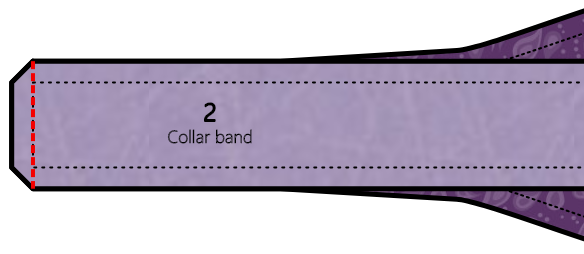
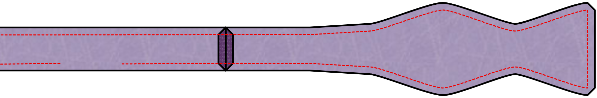
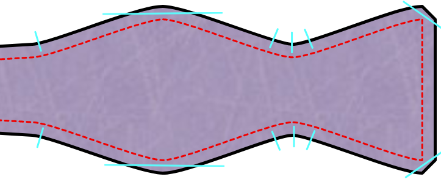
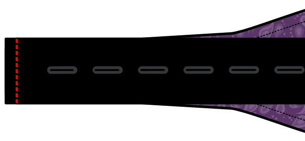
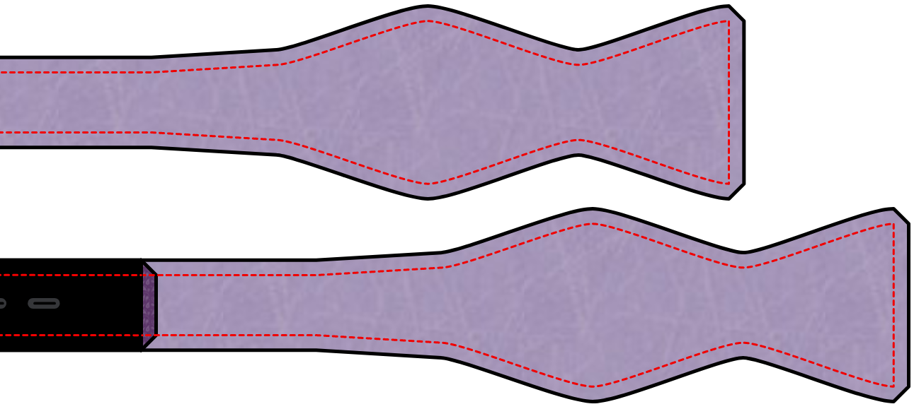
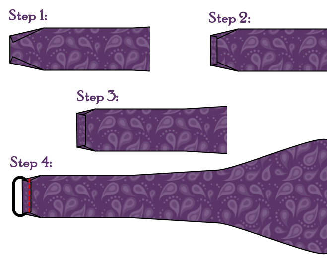

- - -
titre : "Nœud papillon Benjamin : Instructions de couture"
- - -

## Notes et conseils

### Précision

Comme un nœud papillon est un objet assez petit, la précision de la couture est la clé d'un bon résultat. Toute légère différence entre la partie supérieure et la partie inférieure du nœud se verra. Pour obtenir un excellent résultat, j'ai trouvé très utile de tracer les lignes de couture sur l'entoilage et de les suivre pendant la couture.

### Repassez judicieusement

Plus loin dans les étapes de construction, on vous demandera de repasser votre tissu. Faites attention à ne pas utiliser trop de chaleur sur un tissu délicat qui pourrait ne pas le supporter.

C'est une bonne idée de faire des essais sur quelques morceaux de tissu avant de commencer. Cela vous permettra de déterminer le bon réglage de chaleur pour le tissu que vous utilisez.

### Déterminez le sens du tissu

Ce patron comprend un sens de droit fil. Ce droit fil est principalement là pour être utilisé avec l'entoilage. Puisque chaque pièce de patron est entoilée, le droit fil du tissu lui-même n'est pas si important. Vous pouvez même changer cela du standard pour un effet plus original.

<Note>

Si tout cela semble très confus, puis-je suggérer de lire la page d'aide 
sur [le droit fil de tissu](/docs/sewing/fabric-grain).

</Note>

### Ruban d'ajustement de nœud papillon

Ce patron vous permet de faire un nœud papillon à la bonne longueur pour un certain tour de cou. Il permet également d'en faire un qui possède un ruban et les boucles qui rendent le nœud papillon réglable pour différentes tailles de cou. Ceci est utile si toutes vos chemises n'ont pas les mêmes mesures de cou, ou si vous portez parfois des chemises avec plus d'aisance au cou.

Ces rubans peuvent être trouvés dans les meilleures merceries ou peuvent être commandés en ligne.

### Marge de couture

Puisque le nœud papillon est construit avec le tissu endroit contre endroit, tout l'ouvrage devra être retourné. Vous voulez probablement envisager d'utiliser une petite marge de couture de 6 mm (¼ pouces) pour réduire les surépaisseurs.

## Montage

### Étape 1 : Thermocoller l'entoilage

Appliquez de l'entoilage sur les pièces où vous pensez que c'est nécessaire.

### Sans ruban d'ajustement

#### Étape 2 : Coudre le nœud à la bande de col

Mettre la partie bande de col sur la partie nœud, endroit contre endroit. Alignez les extrémités des deux parties. Maintenant coudre à travers les extrémités pour rejoindre les pièces.

Faites cela pour chaque extrémité sur les deux bandes de col.

Repassez pour ouvrir toutes les coutures.

Vous avez maintenant deux faces simples de nœud papillon.

#### Étape 3 : Assemblez les deux côtés

Disposez les deux côtés que vous avez faits l'un sur l'autre, endroit contre endroit. Cousez tout le long du bord, mais laissez une ouverture de 5 cm au milieu de la bande de col. Grâce à cette ouverture, nous allons retourner l'ouvrage.

#### Étape 4 : Retourner

Entaillez la marge de couture aux endroits usuels et faites de petites coupes pour permettre des courbes lisses.

Utilisez ensuite le dos d'un crochet de grande taille, ou un autre objet fin et long, afin de retourner les deux côtés à travers la petite ouverture. Commencez par écarter doucement les deux pièces de tissu aux bouts du nœud. Ensuite poussez la fin du nœud entre les deux pièces de tissu. Continuez à pousser doucement pendant que vous tirez en coulissant sur le reste de l'ouvrage. Cette manœuvre peut être un peu fastidieuse. Prenez votre temps et soyez délicat. C'est facile de pousser trop fort et de déchirer les points ou le tissu.

Une fois notre ouvrage sur l'endroit, assurez-vous de pousser tous les coins et côtés avant de lui donner un bon coup de fer.

#### Étape 5 : Fermeture

Maintenant tout ce qui reste à faire c'est de fermer le trou que nous avons utilisé pour retourner le nœud papillon. Vous pouvez le faire à la main avec un point de couture invisible. Ou vous pouvez utiliser la machine et coudre au point droit au bord de la bande (couture nervure). Puisque ce sera normalement caché par le col de votre chemise, ce ne sera pas très visible.

Maintenant donnez-lui un dernier coup de fer et admirez votre travail.

### Avec ruban d'ajustement

#### Étape 2 : Attacher le ruban

La première chose à faire est de coudre le ruban de réglage aux parties les plus courtes du nœud. Le ruban doit faire 290 mm de long. Si c'est différent, vous devez vous assurer de l'aligner de telle sorte que le ruban et la pièce courte du nœud ensemble sont aussi longs que la pièce longue du nœud.

Mettre la pièce courte du nœud face au ruban, endroit contre endroit.

Maintenant coudre à travers les extrémités pour rejoindre les pièces.

#### Étape 3 : Assemblez les deux côtés

Poser les deux parties du nœud moyen l'une sur l'autre, endroit contre endroit. Et superposez la partie longue du nœud au-dessus du ruban et de la partie courte, toujours endroit contre endroit.

Cousez tout le long, mais laissez les extrémités courtes ouvertes. Grâce à cette ouverture, nous allons retourner les deux parties de l'ouvrage.

#### Étape 4 : Retourner

Entaillez la marge de couture aux endroits usuels et faites de petites coupes pour permettre des courbes lisses.

Utilisez ensuite le dos d'un crochet de grande taille, ou un autre objet fin et long, afin de retourner les deux côtés à travers la petite ouverture. Commencez par écarter doucement les deux pièces de tissu aux bouts du nœud. Ensuite poussez la fin du nœud entre les deux pièces de tissu. Continuez à pousser doucement pendant que vous tirez en coulissant sur le reste de l'ouvrage. Cette manœuvre peut être un peu fastidieuse. Prenez votre temps et soyez délicat. C'est facile de pousser trop fort et de déchirer les points ou le tissu.

Une fois notre ouvrage sur l'endroit, assurez-vous de pousser tous les coins et côtés avant de lui donner un bon coup de fer.

Répétez l'opération avec les deux parties.

#### Étape 5 : Ajouter les accessoires d'ajustement

Maintenant, nous devons ajouter les deux pièces d'ajustement qui rendent la fixation réglable. La pièce ovale sera attachée à la pièce sans ruban d'ajustement. Et la pièce avec l'accessoire en forme de T ira sur la partie avec le ruban.

Faites d'abord la partie sans le ruban. En effet, le bout de tissu du ruban devra passer par la pièce ovale avant d'être cousue sur son accessoire. Si vous le faisiez dans l'ordre inverse, vous ne pourriez peut-être pas le passer.

Pour terminer les extrémités, nous allons plier le tissu en trois étapes :

Tout d'abord, on plie le côté sous un angle. Puis nous plions la fin avec juste une petite marge de couture, quelque chose comme 5mm. Puis nous le plions à nouveau, pour environ 1 cm. Enfin on place l'anneau ovale sous ce dernier pli et on coud.

Maintenant, placez la pièce avec le ruban à travers la partie ovale et finissez-le de la même manière.

Crochetez le T dans une des boucles d'ajustement et votre nœud papillon est terminé !

