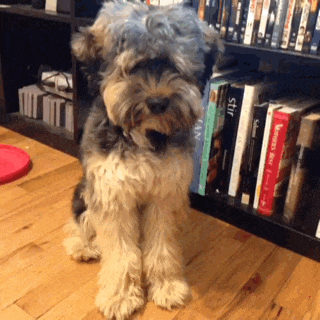

- - -
titre : "Nœud papillon Benjamin : Instructions de couture"
- - -

## Notes et conseils

### Précision

Comme un nœud papillon est un objet assez petit, la précision de la couture est la clé d'un bon résultat. Toute légère différence entre la partie supérieure et la partie inférieure du nœud se verra. Pour obtenir un excellent résultat, j'ai trouvé très utile de tracer les lignes de couture sur l'entoilage et de les suivre pendant la couture.

### Pressez judicieusement

Plus loin dans les étapes de construction, on vous demandera de repasser votre tissu. Faites attention à ce que vous n'utilisez pas trop de chaleur sur un tissu délicat qui pourrait ne pas le supporter.

C'est une bonne idée de faire des essais sur quelques morceaux de tissu avant de commencer. Cela vous permettra de déterminer le bon réglage de chaleur pour le tissu que vous utilisez.

### Déterminez le sens du tissu

Ce patron comprend un sens de droit fil. Ce droit fil est principalement là pour être utilisé avec l'entoilage. Puisque chaque pièce de patron est entoilée, le droit fil du tissu lui-même n'est pas si important. Vous pouvez même changer cela du standard pour un effet plus original.

<Note>

Si tout cela semble très confus, puis-je suggérer de lire la page d'aide 
sur [le droit fil de tissu](/docs/sewing/fabric-grain).

</Note>

### Ruban d'ajustement de nœud papillon

Ce patron vous permet de faire un nœud papillon à la bonne longueur pour une certain tour de cou. Il permet également d'en faire un qui possède un ruban et les boucles qui rendent le nœud papillon réglable pour différentes tailles de cou. Ceci est utile si toutes vos chemises n'ont pas les mêmes mesures de cou, ou si vous portez parfois des chemises avec plus d'aisance au cou.

Ces rubans peuvent être trouvés dans les meilleures merceries ou peuvent être commandés en ligne.

### Marge de couture

Puisque le nœud papillon est construit avec le tissu endroit contre endroit, tout l'ouvrage devra être retourné. Vous voulez probablement envisager d'utiliser une petite marge de couture de 6 mm (¼ pouces) pour réduire les surépaisseurs.

## Montage

### Étape 1 : Thermocoller l'entoilage

Apply interfacing to all parts where you feel it's needed.

### Sans ruban d'ajustement

#### Étape 2 : Coudre le nœud à la bande de col

Put the collar band part on the bow tie knot part, right sides together. Align the ends of both parts. Now sew across the end to join the parts.

Do this for each end on both collar bands.

Press open all the seams.

You now have two identical single sided bow ties.

#### Étape 3 : Assemblez les deux côtés

Lay both the sides you made on top of each other, right sides together. Sew all along, but leaving an area of 5cm open in the middle of the collar band. Through this opening we will turn the bow tie right side out.

#### Étape 4 : Retourner

Clip the seam allowance back in the usual spots and make little cuts to allow for a smooth curves.

Then use the back of a large crochet hook, or some other appropriately long skinny object, to turn the two sides right-side-out through the little opening. Start by gently pulling the two fabric pieces at the end of the bow apart. Then push the end of the bow up between the two pieces of fabric. Keep gently pushing while pulling the rest of the tie down over it. This can be a tedious procedure. Take your time and be gentle. It's easy to push too hard and rip stitches or fabric.

Once you have the tie right side out, make sure you push all the corners and sides out before giving it a good press.

#### Étape 5 : Fermeture

Now all that is left is closing the litle hole we used to turn the bow tie right side out. You can do this by hand with a slip stitch, or a ladder stitch. Or you can use the machine and stitch right at the edge of the band. Since this will normally be hidden by the collar of your shirt, it will not be all that obvious.

Maintenant donnez-lui un dernier coup de fer et admirez votre travail.

### Avec ruban d'ajustement

#### Étape 2 : Attacher le ruban

The first thing to do is to sew the adjustment ribbon to the shortest of the bow parts. Le ruban doit avoir une longueur de 290mm. If it is different, you have to make sure that you align it such that the ribbon and short bow piece together are as long as the long bow piece.

Assemblez les côtés droits du petit nœud et du ruban.

Coudre alors jusqu'au bout pour assembler les pièces.

#### Étape 3 : Assemblez les deux côtés

Poser les deux parties du nœud moyen l'une sur l'autre, endroit contre endroit. And lay the long bow on top of the ribbon and short bow part, also rights sides together.

Cousez tout le long, mais laissez les extrémités courtes ouvertes. Through these openings we will turn the bow tie parts right side out.

#### Étape 4 : Retourner

Clip the seam allowance back in the usual spots and make little cuts to allow for a smooth curves.

Then use the back of a large crochet hook, or some other appropriately long skinny object, to turn the two parts right-side-out through the ends. Start by gently pulling the two fabric pieces at the end of the bow apart. Then push the end of the bow up between the two pieces of fabric. Keep gently pushing while pulling the rest of the tie down over it. Cela peut être une procédure fastidieuse. Take your time and be gentle. Il est facile de pousser trop fort et de déchirer les points ou le tissu.

Once you have the part right side out, make sure you push all the corners and sides out before giving it a good press.

Do this with both parts.

#### Étape 5 : Ajouter les accessoires d'ajustement

Now we need to add the two pieces of hardware that make the bow tie adjustable. La pièce ovale sera attachée à la pièce sans ruban d'ajustement. And the piece with the T shaped attachment will go on the part with the ribbon.

D'abord faites la partie sans le ruban. This is because the fabric tail of the ribbon piece will have to go through the oval part before sewing on its hardware. Si vous le faisiez dans l'ordre inverse, vous ne pourriez peut-être pas le passer.

Pour terminer les extrémités, nous allons plier le tissu en trois étapes :

Tout d'abord, on plie le côté sous un angle. Then we fold the end over by just a small seam allowance, something like 5mm. Puis nous le plions à nouveau, pour environ 1cm. Enfin on place l'anneau ovale sous ce dernier pli et on coud.

Now feed the ribbon piece through the oval part and finish it the same way.

Accrochez le T dans une des boucles d'ajustement et votre nœud papillon est terminé !

