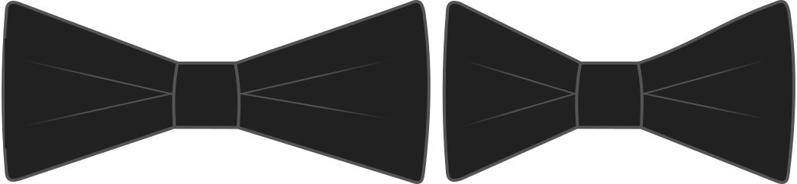

Puedes hacer corbatas anchas de arco o estrechas. Esta opción le permite cambiar el tamaño horizontal de los arcos. Make them larger to be more flamboyant, or small for a more subdued style.

## Efecto de esta opción en el patrón
