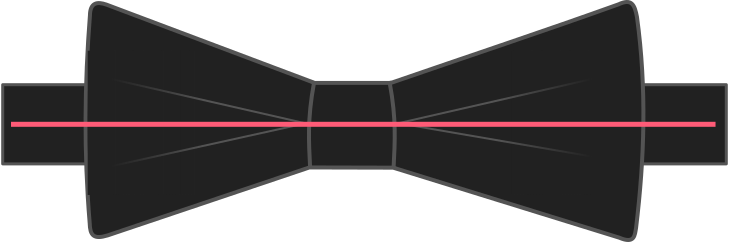

De halsomtrek gebruiken is één stap naar een goed passende vlinderdas. De tweede stap is kijken naar hoeveel overwijdte je hemdskragen gewoonlijk hebben. Samen bepalen ze hoe lang je vlinderdas wordt.

> #### Niet gebruikt met het aanpaslintje
> 
> Deze optie wordt gebruikt om een precies passende vlinderdas te maken. Als je voor het aanpaslintje kiest wordt deze optie niet gebruikt.
