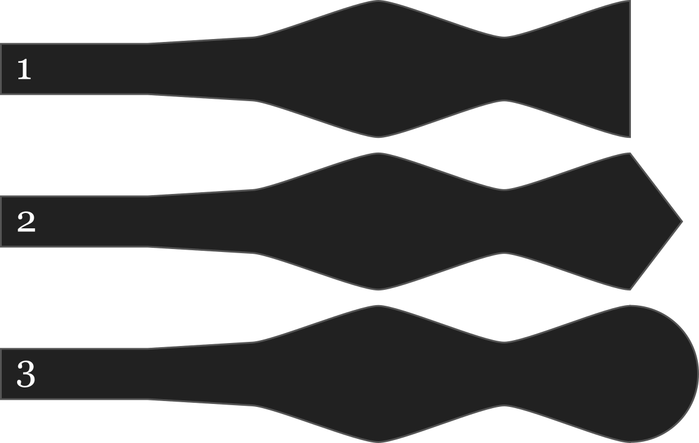

En plus d'avoir quatre styles de nœud papillon différents, chaque style peut être personnalisé avec trois options de pointe différentes :

- Droit
- Pointu
- Arrondi

## Effet de cette option sur le motif

