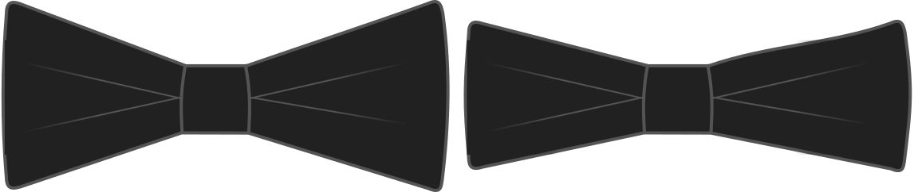

Vous pouvez faire des nœud papillon hauts ou fins. Cette option vous permet de changer la taille verticale des extrémités du nœud. Faites-les plus grand pour être plus flamboyant, ou petit pour un style plus discret.

<Note>

###### Not used with the Square bow tie type

This option is ignored with the Square bow tie option. Les nœud papillon carrés sont aussi larges que la largeur du nœud.

</Note>

