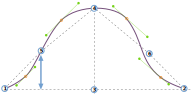

- - -
title: "Sleevecap back Y"
- - -

This option controls the vertical placement of the sleevecap inflection point at the back of the sleeve.

<Tip>

Consulta [entender la manga de mangaz](/docs/patterns/brian/options#understanding-the-sleevecap) para ver
en profundidad cómo se construye la manga y la influencia de las diferentes opciones en su forma.

</Tip>

## Efecto de esta opción en el patrón

