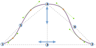

---
---

<PatternOptions pattern='brian' />

## Die Ärmel verstehen

In version 2 of FreeSewing, the sleevecap of Brian was redesigned to be more adaptable to different types of sleeves and garments. As a result, the sleevecap alone now has 20 options to control its shape. Whereas that may seem a bit overwhelming at first, understanding how the sleevecap is drafted makes it easy to understand what all the individual options do.

### Die Begrenzungsbox

The *bounding box* of the sleevecap is a rectangle that is as wide as the sleeve, and as high as the sleevecap. Innerhalb dieses Kastens werden wir später unsere Sleevecap bauen.

The image above shows a sleevecap, starting at point 1, then going up until point 4, and then down again to point 2.

<Note>

###### Finden Sie heraus, welches die Vorderseite der Ärmel(cap)

ist. In unserem Beispiel befindet sich die Vorderseite der Ärmel auf der rechten Seite. Aber wie würden Sie es wissen? 

Während Muster typischerweise eine Anzeige haben, die zeigt, welche Seite welche ist (eine einzige Note
bedeutet die Front, während ein Doppelbett den Rücken bedeutet), können Sie auch
die Vorderseite einer Ärmel erkennen, da sie kurviger ist. Die Rückseite der
Ärmelkarte wird ebenfalls gebogen, aber es ist eine flachere Kurve. Das liegt daran, dass die menschliche Schulter
ausgeprägter und gebogener ist auf der Vorderseite des Körpers So ist die Ärmelschale 
dort gebogen, um die Schulter zu passen.

</Note>

The width of the sleevecap (and thus the width of the sleeve at the bottom of the armhole) is equal to the distance between points 1 and 2. That distance depends on the measurements of the model, the amount of ease, the cut of the garment and so on. For our sleevecap, all we need to know is that we start with a given width. And while that width can be influenced by other factors, we can not influence it by any of the sleevecap options.

Die Höhe der Ärmel entspricht der Entfernung zwischen den Punkten 3 und 4. The exact height is a trade-off between the measurments of the model, options, ease, sleevecap ease, and the fact that the sleeve ultimately has to fit the armhole. So the height may vary, and we don't control the exact value. Aber es gibt zwei Optionen, die die Form unserer Ärmel kontrollieren:

 - [Sleevecap Top X](/docs/patterns/brian/options/sleevecaptopfactorx/) : Steuert die horizontale Platzierung von Punkt 3 und 4
 - [Sleevecap oben Y](/docs/patterns/brian/options/sleevecaptopfactory/) : Steuert die vertikale Platzierung von Punkt 4

In other words, point 4 can be made higher and lower and, perhaps less intutitively, it can also be changed to lie more to the right or the left, rather than smack in the middle as in our example.

### Die Wendepunkte

Mit den Punkten 1, 2, 3 und 4 haben wir ein Kästchen zum Einzeichnen unserer Ärmel. Now it's time to map out our *inflection points*. These are points 5 and 6 on our drawing, and their placement is determined by the following 4 options:

 - [Sleevecap zurück X](/docs/patterns/brian/options/sleevecapbackfactorx) : Steuert die horizontale Platzierung von Punkt 5
 - [Sleevecap zurück Y](/docs/patterns/brian/options/sleevecapbackfactory) : Steuert die vertikale Platzierung von Punkt 5
 - [Sleevecap Front X](/docs/patterns/brian/options/sleevecapbackfactorx) : Steuert die horizontale Platzierung von Punkt 6
 - [Sleevecap Front Y](/docs/patterns/brian/options/sleevecapbackfactory) : Steuert die vertikale Platzierung von Punkt 6

<Note>

Wie Sie in unserem Beispiel sehen, liegen diese Punkte nicht immer auf unserer Ärmel-Linie. Stattdessen sind sie
hilfreich, um die Punkte zu schaffen, die immer auf der Ärmel liegen: die Ankerpunkte.

</Note>

### Die Ankerpunkte

Letztlich wird unsere Ärmel die Kombination aus 5 Kurven sein. In addition to points 1 and 2, the four *anchor points* that are marked in orange in our example will be the start/finish of those curves.

The points are *offset* perpendicular from the middle of a line between the two anchor points surrounding them. Der Offset für jeden Punkt wird durch diese 4 Optionen kontrolliert:

 - [Sleevecap Q1 Offset](/docs/patterns/brian/options/sleevecapq1offset) : Steuert den senkrechten Offset zur Linie von Punkt 2 bis 6
 - [Sleevecap Q2 Offset](/docs/patterns/brian/options/sleevecapq2offset) : Steuert den senkrechten Offset auf die Linie von Punkt 6 bis 4
 - [Sleevecap Q3 Offset](/docs/patterns/brian/options/sleevecapq3offset) : Steuert den senkrechten Offset auf die Linie von Punkt 4 bis 5
 - [Sleevecap Q4 Offset](/docs/patterns/brian/options/sleevecapq3offset) : Steuert den senkrechten Offset auf die Linie von Punkt 5 bis 1

<Note>

Wir haben unsere Ärmel in 4 Quartale aufgeteilt. Wir beginnen vorne (das rechte Beispiel in unserem Beispiel)
mit Viertel 1, und fahren Sie mit Quartal 4 bis zur Rückseite.

Like the offset option, the last options to determine the shape of our sleevecap will just repeat so you can 
control each quarter individually.

</Note>

### Die Ausbreitung

Wir haben jetzt alle Anfangs- und Endpunkte, um die 5 Kurven zu zeichnen, die unsere Ärmel ausmachen. What we're missing are the control points (see [our info on Bézier curves](https://freesewing.dev/concepts/beziercurves) to learn more about how curves are constructed). Diese werden durch den so genannten *Spread* bestimmt.

For each of the anchor points (the ones marked in orange, not points 1 and 2) there is an option to control the spread upwards, and downwards:

 - [Sleevecap Q1 nach unten ausgebreitet](/docs/patterns/brian/options/sleevecapq1spread1) : Steuert die Abwärtsverteilung im ersten Quartal
 - [Sleevecap Q1 upward spread](/docs/patterns/brian/options/sleevecapq1spread2) : Controls the upward spread in the first quarter
 - [Sleevecap Q2 nach unten verteilt](/docs/patterns/brian/options/sleevecapq2spread1) : Steuert die Abwärtsverteilung im zweiten Quartal
 - [Sleevecap Q2 upward spread](/docs/patterns/brian/options/sleevecapq2spread2) : Controls the upward spread in the second quarter
 - [Sleevecap Q3 upward spread](/docs/patterns/brian/options/sleevecapq3spread1) : Controls the upward spread in the third quarter
 - [Sleevecap Q3 nach unten verteilt](/docs/patterns/brian/options/sleevecapq3spread2) : Steuert die Abwärtsverteilung im dritten Quartal
 - [Sleevecap Q4 upward spread](/docs/patterns/brian/options/sleevecapq4spread1) : Controls the upward spread in the fourth quarter
 - [Sleevecap Q4 downward spread](/docs/patterns/brian/options/sleevecapq4spread2) : Controls the downward spread in the fourth quarter

<Note>

Die aufmerksamen Leser werden bemerkt haben, dass Punkt 4 kein Ankerpunkt ist. Anders ausgedrückt: Es gibt keine Garantie
, dass es auf der Ärmelkante liegen wird. Das bedeutet auch, dass die Aufwärtsverteilung in den Quartalen 2 und 3
die Höhe der Ärmel beeinflussen wird. Reduziert den Aufwärtsausstoß und die Kurve wird unter Punkt 4 abtauchen. Erhöhe es und
die Kurve wird übersteigen.

</Note>

### Takeaways

While the sleevecap in Brian (and all patterns that extend Brian) have a lot of options, understanding how the sleevecap is constructed can help you design the exact sleevecap shape you want. Zu tun:

 - Beginnen Sie mit der Platzierung der Oberseite Ihrer Sleevecap
 - Dann bestimmen Sie die Wendepunkte
 - Benutzen Sie als nächstes den Offset um die Steilheit der Kurve zu steuern
 - Schließlich, nutzen Sie den Spread, um die Dinge zu glätten

Wichtig ist, dass Sie immer nur die Form der Ärmel kontrollieren. Whatever shape you design, it will be fitted to the armhole, meaning that its size can and will be adapted to make sure the sleeve fits the armscye. Die Form, die Sie entwerfen, wird jedoch stets respektiert.

