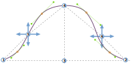
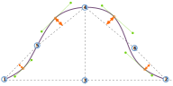

- - -
title: "Brian body block: Design Options"
- - -

<PatternOptions pattern='brian' />

## Comprendre la tête de manche

In version 2 of FreeSewing, the sleevecap of Brian was redesigned to be more adaptable to different types of sleeves and garments. As a result, the sleevecap alone now has 20 options to control its shape. Whereas that may seem a bit overwhelming at first, understanding how the sleevecap is drafted makes it easy to understand what all the individual options do.

### La bounding box (boîte englobante)

The _bounding box_ of the sleevecap is a rectangle that is as wide as the sleeve, and as high as the sleevecap. Inside this box, we will construct our sleevecap later.

The image above shows a sleevecap, starting at point 1, then going up until point 4, and then down again to point 2.

<Note>

###### Repérer le devant de la manche

Dans notre exemple, le devant de la manche est à droite. Mais comment le sait-on ?

Alors que les patrons l'indiquent généralement par des repères (une seule encoche pour le devant, une double encoche pour l'arrière), on peut aussi repérer où se trouve le devant d'une tête de manche par sa forme plus courbe. La partie de la tête de manche qui sera placée à l'arrière est de forme plus aplatie. That's because the human shoulder
is more pronounced and curved on the front of the body, thus the sleevecap is more curved
there to fit the shoulder.

</Note>

The width of the sleevecap (and thus the width of the sleeve at the bottom of the armhole) is equal to the distance between points 1 and 2. That distance depends on the measurements of the model, the amount of ease, the cut of the garment and so on. For our sleevecap, all we need to know is that we start with a given width. And while that width can be influenced by other factors, we can not influence it by any of the sleevecap options.

The height of the sleevecap is equal to the distance between points 3 and 4. The exact height is a trade-off between the measurments of the model, options, ease, sleevecap ease, and the fact that the sleeve ultimately has to fit the armhole. So the height may vary, and we don't control the exact value. But there are two options that control the shape of our sleevecap:

- [Haut de tête de manche X](/docs/patterns/brian/options/sleevecaptopfactorx/) : Contrôle la position horizontale des points 3 et 4
- [Haut de tête de manche Y](/docs/patterns/brian/options/sleevecaptopfactory/) : Contrôle la position verticale du point 4

In other words, point 4 can be made higher and lower and, perhaps less intutitively, it can also be changed to lie more to the right or the left, rather than smack in the middle as in our example.

### Les points d'inflexion

With points 1, 2, 3, and 4 in place, we have a box to draw our sleevecap in. Now it's time to map out our _inflection points_. These are points 5 and 6 on our drawing, and their placement is determined by the following 4 options:

- [Haut de tête de manche arrière X](/docs/patterns/brian/options/sleevecapbackfactorx) : Contrôle la position horizontale du point 5
- [Haut de tête de manche arrière Y](/docs/patterns/brian/options/sleevecapbackfactory) : Contrôle la position verticale du point 5
- [Haut de tête de manche avant X](/docs/patterns/brian/options/sleevecapbackfactorx) : Contrôle la position horizontale du point 6
- [Haut de tête de manche avant Y](/docs/patterns/brian/options/sleevecapbackfactory) : Contrôle la position verticale du point 6

<Note>

Comme vous le voyez dans notre exemple, ces points ne se trouvent pas toujours sur la ligne de la tête de manche. Mais ils permettent de créer des points qui se trouveront toujours sur la tête de manche : les points d'ancrage.

</Note>

### Les points d'ancrage

Ultimately, our sleevecap will be the combination of 5 curves. In addition to points 1 and 2, the four _anchor points_ that are marked in orange in our example will be the start/finish of those curves.

The points are _offset_ perpendicular from the middle of a line between the two anchor points surrounding them. The offset for each point is controlled by these 4 options:

- [Décalage de tête de manche Q1](/docs/patterns/brian/options/sleevecapq1offset) : contrôle le décalage perpendiculaire à la ligne située entre les points 2 et 6
- [Décalage de tête de manche Q2](/docs/patterns/brian/options/sleevecapq2offset) : contrôle le décalage perpendiculaire à la ligne située entre les points 6 et 4
- [Décalage de tête de manche Q3](/docs/patterns/brian/options/sleevecapq3offset) : contrôle le décalage perpendiculaire à la ligne située entre les points 4 et 5
- [Décalage de tête de manche Q4](/docs/patterns/brian/options/sleevecapq3offset) : contrôle le décalage perpendiculaire à la ligne située entre les points 5 et 1

<Note>

Notre manche est divisée en 4 quadrants. Nous commençons à l'avant (à droite dans notre exemple)
avec le quadrant 1, en allant vers l'arrière pour finir avec le quatrième quadrant.

Like the offset option, the last options to determine the shape of our sleevecap will just repeat so you can
control each quarter individually.

</Note>

### La répartition

Nous disposons maintenant de tous les points de départ et d'arrivée pour dessiner les 5 courbes qui constitueront nos capuchons de manche. What we're missing are the control points (see [our info on Bézier curves](https://freesewing.dev/concepts/beziercurves) to learn more about how curves are constructed). These are determined by the so-called _spread_.

For each of the anchor points (the ones marked in orange, not points 1 and 2) there is an option to control the spread upwards, and downwards:

- [Répartition de tête de manche vers le bas Q1](/docs/patterns/brian/options/sleevecapq1spread1) : contrôle la répartition vers le bas dans le premier quadrant<0><0>
- [Répartition de tête de manche vers le haut Q1](/docs/patterns/brian/options/sleevecapq1spread2) : contrôle la répartition vers le haut dans le premier quadrant<0><0>
- [Répartition de tête de manche vers le bas Q2](/docs/patterns/brian/options/sleevecapq2spread1) : contrôle la répartition vers le bas dans le deuxième quadrant<0><0>
- [Répartition de tête de manche vers le haut Q2](/docs/patterns/brian/options/sleevecapq2spread2) : contrôle la répartition vers le haut dans le deuxième quadrant<0><0>
- [Répartition de tête de manche vers le haut Q3](/docs/patterns/brian/options/sleevecapq3spread1) : contrôle la répartition vers le haut dans le troisième quadrant<0><0>
- [Répartition de tête de manche vers le bas Q3](/docs/patterns/brian/options/sleevecapq3spread2) : contrôle la répartition vers le bas dans le troisième quadrant<0><0>
- [Répartition de tête de manche vers le haut Q4](/docs/patterns/brian/options/sleevecapq4spread1) : contrôle la répartition vers le haut dans le quatrième quadrant<0><0>
- [Répartition de tête de manche vers le bas Q4](/docs/patterns/brian/options/sleevecapq4spread2) : contrôle la répartition vers le bas dans le quatrième quadrant<0><0>

<Note>

Les lecteurs attentifs auront remarqué que le point 4 n'est pas un point d'ancrage. En d'autres termes, il peut ne pas se trouver sur la ligne de la tête de manche. La hauteur de la tête de manche se répartira donc vers le haut entre les quadrants 2 et 3, en fonction de la hauteur de la tête de manche. Si l'on réduit la répartition vers le haut, la courbe s'infléchira sous le point 4. Si on l'augmente, la courbe passera au dessus.

</Note>

### En résumé

While the sleevecap in Brian (and all patterns that extend Brian) have a lot of options, understanding how the sleevecap is constructed can help you design the exact sleevecap shape you want. Pour ce faire :

- Commencez par positionner le haut de votre tête de manche
- Déterminer ensuite les points d'inflexion
- Ensuite, utilisez le décalage pour contrôler la pente de la courbe
- Enfin, utilisez la répartition pour homogénéiser le tout

What's important to remember is that you're only ever controlling the shape of the sleevecap. Whatever shape you design, it will be fitted to the armhole, meaning that its size can and will be adapted to make sure the sleeve fits the armscye. Toutefois, la forme que vous avez conçue sera toujours respectée.
