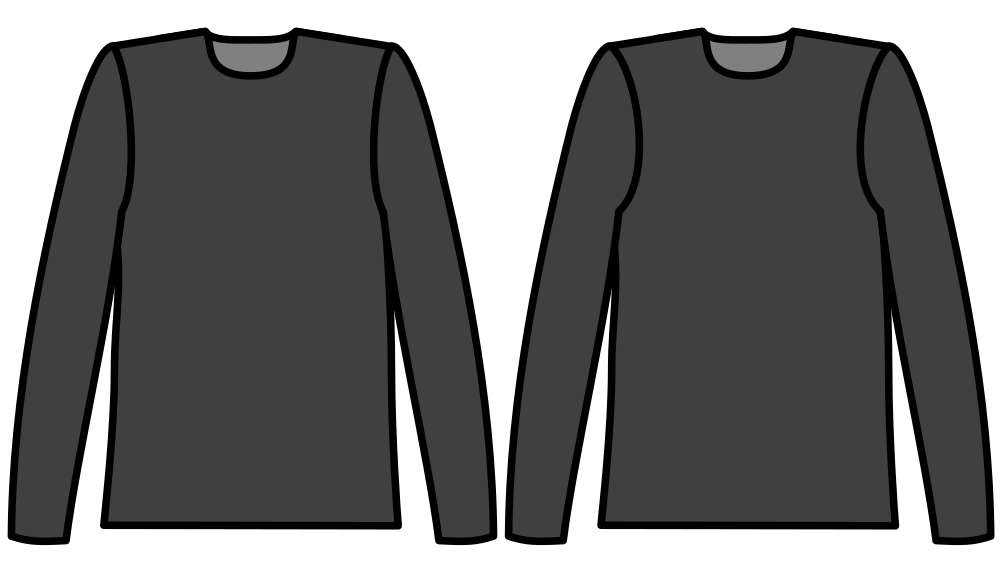

Controls how much the front of the armhole is cut deeper into the garment than the back.

Since the human shoulder is more rounded at the front of the body, the sleeve(cap) is more
rounded there too, and the armhole is typically cut deeper into the front of the garment than
the back. This option controls how much deeper.
