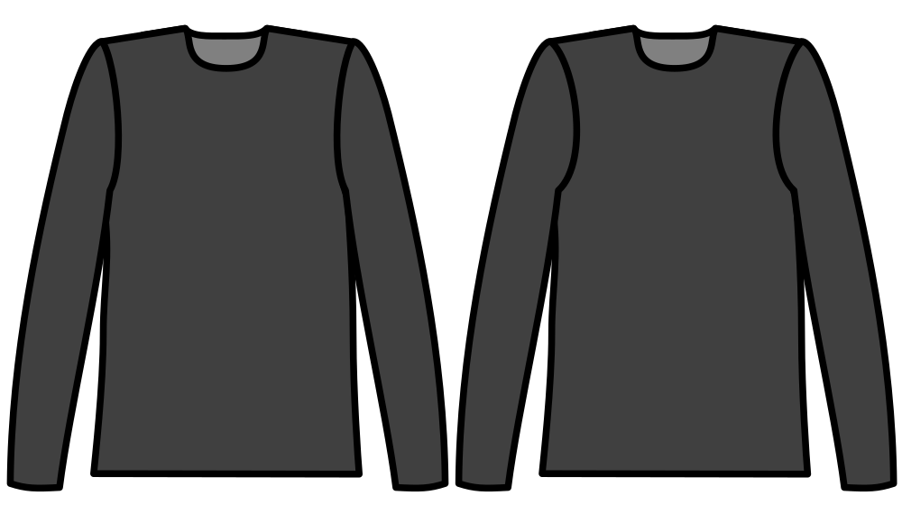

Bepaalt hoeveel het armsgat vooraan dieper in het kledingstuk wordt gesneden, dan de achterkant.

Aangezien de menselijke schouder meer aan de voorkant van het lichaam is afgerond, is de mouw(cap) ook daar meer afgerond en het armsgat wordt meestal dieper geknipt in de voorkant van het kledingstuk dan de achterkant. Deze optie bepaalt hoeveel dieper.

## Effect van deze optie op het patroon

