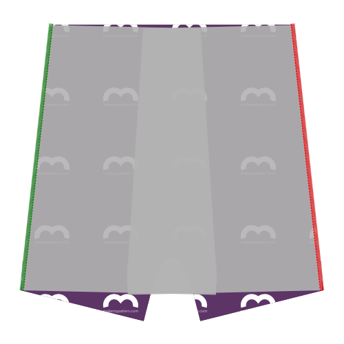
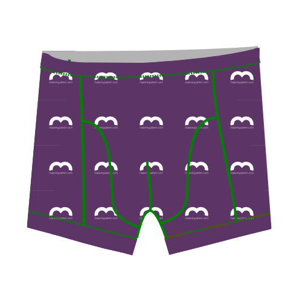

<YouTube id='PL1gv5yv3DoZME1xe5fBEHd0rKPW_xNpF3' playlist />

### Paso 1: Vuelve al primer lado

Alinear el lado de la parte trasera (parte 1) con el lado (parte 3) asegurándose de juntar los lados buenos. Dado que el lado (pieza 3) es simétrico, no se puede ir mal.

Servir juntos teniendo en cuenta que la franquicia de costura es 1cm. Así que apriete la aguja exterior de su serger a 1cm del borde de su tejido.

> Si la métrica no es su bolsa, 1 cm es de 3/8 pulgadas.

> Algunos sergueros tienen una palanca para elegir entre costuras planas o costuras empaquetadas. Si planeas unirte más tarde (ver Paso 6), asegúrate de elegir costuras planas.

### Paso 2: Vuelve al segundo lado

Alinear el otro lado de la parte trasera (parte 1) con el segundo lado (parte 3) asegurándose de juntar los lados buenos. Dado que el lado (pieza 3) es simétrico, no se puede ir mal.

Servir juntos, como hizo usted en el otro lado.

> La espalda y los lados ahora se unen. Pongámoslos a un momento mientras dirigimos nuestra atención a las otras piezas.

### Paso 3: Únete al primer recuadro y frontales

  

Unirse al recuadro (pieza 4) con los frontales (pieza 2) requiere que los sirvas juntos a través de sus bordes curvos.

> Recuerde que tiene dos frentes. Tienes que ponerlas encima y tratarlas como un frente de doble capa.

Enfrentado a una costura complicada como ésta, usted podría llegar a los pines o al bastar el hilo, pero no. Fijar o derribar esto hará que sea más difícil coser.

En lugar de ello, empiece en la parte superior de la costura curvada, alineando las piezas como se muestra y sirviéndolas lentamente unos cuantos cm.

A medida que se mueve, manipule la tela para asegurarse de que ambos bordes se mantengan sobre los demás mientras se alimentan a través de su sarga.

A medida que se manipula el tejido para que se alinee adecuadamente, es fácil estirar una parte más que la otra. La escalera en el borde curvado puede ayudarle a asegurarse de que mantiene las cosas igualmente.

Una vez que haya superado, las cosas se harán más fáciles. También sería un buen momento para comparar la longitud restante de las costuras curvas. Si uno es un poco más largo que el otro, simplemente estira el más corto hasta que igualen.

Sin embargo, si la diferencia es demasiado grande, simplemente déjenla. It will get cut off when we do the crotchseam.

<Note>

Esta es probablemente la costura más dura en el patrón. Tómelo lento, y estará bien.

</Note>

<Tip>

###### O adjunta estas costuras sándwickeándolas entre los frentes

Mientras que es un poco más de trabajo usted puede encerrar esta costura si usted golpea los insets a una sola de las piezas frontales primero,
y luego coser las piezas delanteras junto con los insectos sándwicked en el interior.

Mantenga los dardos delanteros por separado y dé la vuelta a toda la cosa, y usted tiene una buena zona de paquete en la parte delantera.

</Tip>

### Paso 4: Unirse al segundo recuadro y frontales

Después de que te hayas unido a la primera entrada y a los frentes, continúa con la segunda.

Con los frontales e inets unidos juntos, quedas con 3 partes:

-   Los conjuntos y frontales unidos
-   Los lados unidos y atrás
-   El elástico

### Paso 5: Cerrar el dart de frontales

Doblar los frentes doble a lo largo de la línea frontal central, de modo que los colmillos en la línea inferior hacia arriba.

Servir los lados de los colmillos para cerrar el dart de los frentes. Para obtener mejores resultados, empiece en la parte superior de la costura (donde se pliega la tela) y trabaje hasta el fondo.

<Tip>

###### Mantener esa costura lejos de mi ...

Alternativamente, coser los dardos en cada pieza individualmente, de modo que ambas costuras se doblen en el interior.
Puede decirse que no tener una costura expuesta en esta zona es más cómodo para el portador.

</Tip>

### Paso 6: Opcional: Topstitch

<Note>

Este paso es opcional. Topstitching añade un efecto visual que enfatiza los patrones individuales de piezas.
Es bueno romper visualmente una tela sólida, pero si estás usando una impresión, o cuando estás bloqueando el color, tal vez quieras no empiezar.

</Note>

Si desea unir sus costuras sergeadas para el efecto visual, debería hacerlo ahora.

Si usted se une, simplemente hágalo por cada costura, asegurándose de hacerlo con una stitch flexible. Puedes usar una ranura zig-zag o una aguja gemela si no tienes un candado o un ajuste de stitch flexible específico.

<Tip>

Cuando se enciende la costura que cierra el dart de los frentes, empieza desde abajo,
y deja que la parte superior corra hasta la cima, donde vendrá la cintura.
La costura se detiene a mitad de camino (donde termina el dardo), pero la parte superior debe continuar.

</Tip>

### Paso 7: Únete al primer lado de los frentes

Alinear el borde lateral del primer lado con el borde formado por los frontos+inset (buenos lados juntos como de costumbre) y sirvan juntos.

### Paso 8: Únete al segundo lado de los frentes

Haga lo mismo con el segundo lado.

### Paso 9: Opcional: Enrollar

Si has topstitched antes, asegúrate de hacer lo mismo ahora para las costuras que has hecho en los pasos 7 y 8.

### Paso 10: Termina la costura de crotchseam

Ahora seremos la abertura arqueada en la parte posterior a las partes delanteras de los boxeadores, formados por los frentes e insets.

Las muñecas de la parte trasera te ayudarán. Está el centro y las otras dos muelles deben coincidir con donde se unen los frontales y las piezas de incrustación.

<Tip>

Es más fácil empezar en el punto medio y llegar a un lado. Luego vuelva a empezar desde el centro para hacer el otro lado.

Tomalo lento, y sé **muy conocido** de dónde corta tu espada serger.

</Tip>

### Paso 11: Hem la primera pierna

Es hora de cortar las piernas. Cámbielos como lo harías con cualquier otro tejido. Vaya a un stitch flexible. Puedes usar una ranura zig-zag o una aguja gemela si no tienes un candado o un ajuste flexible específico.

<Note>

Creo que hemming es mucho más fácil cuando se coloca las cosas en primer lugar.
Así que replíjate tu sombrero y póngalo en su lugar.
Aún mejor: anclar las dos piernas en el lugar y sólo coser cuando estés contento con cómo se ve.

</Note>

### Paso 12: Hem la segunda pierna

Ustedes saben que tiene sentido.

### Paso 13: Haz tu elástico en un bucle

Difunde ambos extremos de su elástico junto con buenos lados juntos.

<Note>

###### ¿No está seguro de cuánto elástico necesita?

###### Not sure how much elastic you need?

Simply wrap your elastic around your waist where it would end up sitting, and tighten it until it feels right.
Haz una marca de dónde se une el borde, añade 2 cm de costura, y esa es tu longitud.

</Note>

### Paso 14: Adjuntar elástico a cintura

Adjuntar el elástico a la cintura.

Hacer tan buenos lados juntos si se utiliza una tirita flexible o una aguja gemela en una máquina de coser convencional.

Si estás usando una cubierta, pon el elástico en la parte superior del buen lado de la tela.

<Tip>

La longitud de su elástico probablemente difiere de la longitud del tejido, ya que se estiran de forma diferente.
La fijación te ayudará a conseguir un estiramiento uniforme.

Divida su cintura elástica y boxeadora en 4 (o 8) partes. Fijar elástico y tejer juntos en estos puntos.

Al coser, estira elástica y teje juntos entre cada conjunto de pines quitando los pines a medida que se mueve.

</Tip>

### Paso 15: Recortar y limpiar

Recorta cualquier tejido excedente que puedas tener en elástico o en el tubo, y cualquier hilo suelto.
