- - -
title: "Boxer Bruce : Instructions de couture"
- - -

<YouTube id='PL1gv5yv3DoZME1xe5fBEHd0rKPW_xNpF3' playlist />

### Étape 1 : Assembler le dos et le premier côté

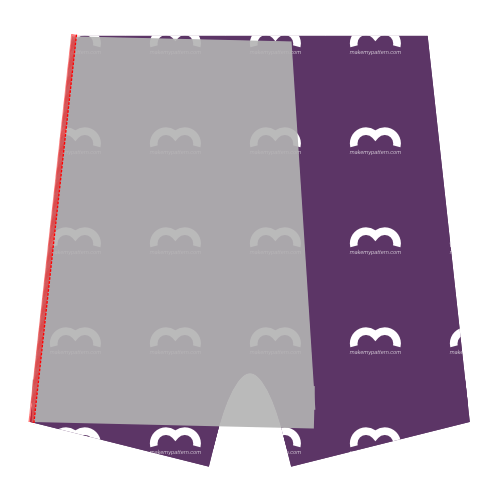

Alignez le côté du dos (pièce 1) avec le côté (pièce 3) endroit contre endroit. Le côté (pièce 3) n'est pas symétrique, alors faites attention à l'assembler dans le bon sens.

<Tip>
Si vous regardez la partie 3 (le côté) avec le texte dans le bon sens, alors le côté gauche doit être fixé à l'arrière,
et le côté droit fixé à l'avant et à l'insert. Les encoches vous aideront également à y parvenir.
</Tip>

Assemblez-les ensemble à la surjeteuse, en tenant compte d'une marge de couture de 1 cm. Placez donc l'aiguille extérieure de votre surjeteuse à 1 cm du bord de votre tissu.

> Pour ceux dont la mesure métrique n'est pas la tasse de thé : 1 cm correspond à 3/8 pouce.

> Certains sergeurs ont un levier pour choisir entre des coutures plates, ou des coutures groupées. Si vous prévoyez de surpiquer plus tard (voir Étape 6), assurez-vous de choisir des coutures plates.

### Étape 2 : Assembler le dos et le second côté

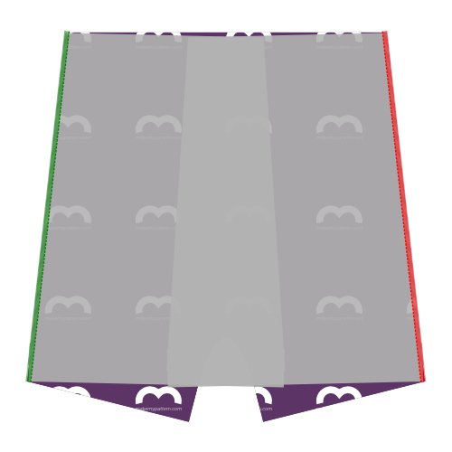

Align the other side of the back (piece 1) with the second side (piece 3) making sure to put the good sides together. Again, because the side (piece 3) is not symmetric, be careful to correctly match them.

Assemblez-les ensemble à la surjeteuse, comme précédemment.

> Le dos et les côtés sont maintenant assemblés. Mettez-les de côté pour l'instant.

### Étape 3 : Assembler le premier insert et les devants

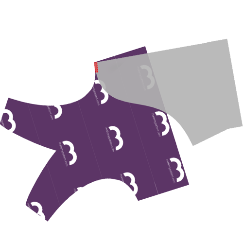 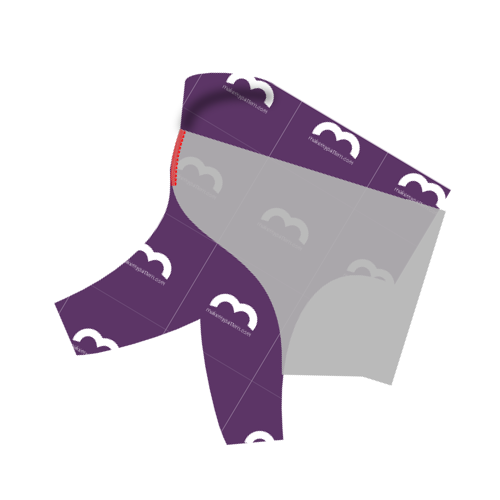 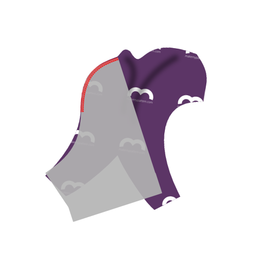

Rejoindre l'insert (pièce 4) avec les devant (pièce 2) nécessite que vous les surjetez ensemble sur leurs bords courbes.

> Rappelez-vous que vous avez deux devants. Vous devez les mettre l'un sur l'autre et les traiter comme une seule pièce à double épaisseur.

Face à une couture aussi délicate, vous pourriez être tenté d'épingler ou de bâtir, mais ne le faites pas. Épingler ou bâtir la rendra plus difficile à coudre.

Au lieu de cela, commencez en haut de la couture courbe, en alignant les pièces comme illustré, et en les assemblant à la surjeteuse lentement sur quelques cm.

Au fur et à mesure que vous avancez, manipulez le tissu pour vous assurer que les deux bords restent les uns sur les autres pendant qu'ils avancent dans la surjeteuse.

Lorsque vous maintenez les bords du tissu alignés, vous risquez d'étirer un côté plus que l'autre. Le repère sur le bord courbe peut vous aider à éviter cela.

Après le repère, les choses seront plus faciles. C'est le moment de comparer la longueur restante des coutures courbes. Si l'une est un peu plus longue que l'autre, étirez un peu la plus courte jusqu'à ce qu'elles correspondent.

Mais si la différence est trop grande, laissez comme ça. L'excédent sera coupé quand nous ferons la couture d'entrejambe.

<Note>

Il s'agit probablement de la couture la plus difficile de ce modèle. Prenez votre temps, et tout se passera bien.

</Note>

<Tip>

###### Ou enfermez ces coutures en les sandwichant entre les fronts

Tant que c'est un peu plus de travail, vous pouvez enfermer cette couture si vous bâtissez d'abord les entrées sur une seule des pièces avant.
puis coudre vos pièces avant ensemble avec les entrées sandwichées à l'intérieur.

Cousez les pinces du devant séparément et retourner le tout à l'intérieur, et vous avez une belle zone sans couture sur le devant.

</Tip>

### Étape 4 : Assembler le second insert et les devants

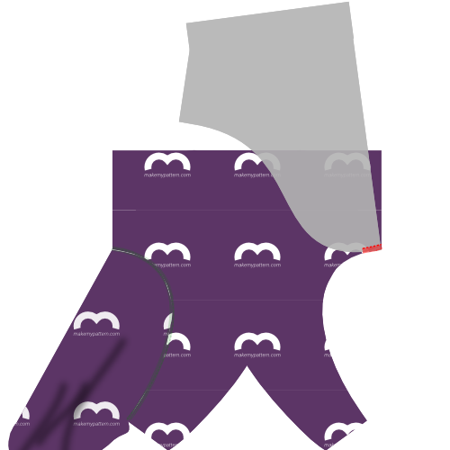

Après avoir assemblé le premier insert et les devants, continuez avec le second.

Avec les devant et les inserts assemblés ensemble, vous avez maintenant 3 parties :

- L'ensemble inserts + devants
- L'ensemble côtés + dos
- L'élastique

### Étape 5 : Fermer la pince frontale

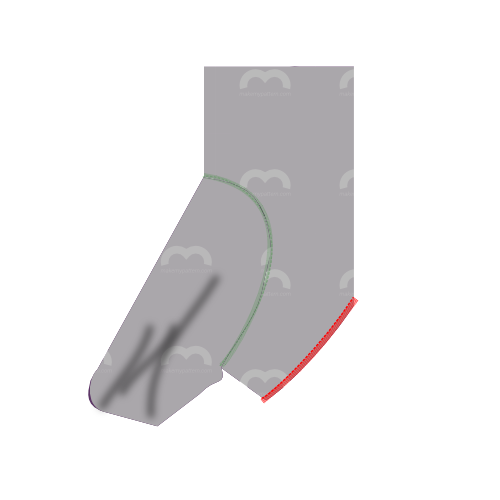

Pliez ensemble les devants le long de la ligne frontale centrale, en alignant les bords du V.

Piquez les côtés du V à la surjeteuse pour refermer la pince frontale. Pour un meilleur résultat, commencez par le haut de la couture (où le tissu est plié) et travaillez vers le bas.

<Tip>

###### Couvrez cette couture que je ne saurais voir ...

Vous pouvez également coudre les pinces de chaque pièce individuellement afin que les deux coutures soient prises à l'intérieur.
Ne pas avoir de couture apparente dans cette zone sera plus confortable.

</Tip>

### Étape 6 : Optionnel: Surpiquer

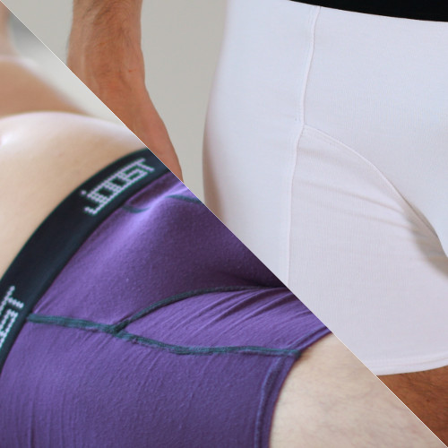

<Note>

Cette étape est facultative. Surpiquer ajoute un effet de style qui souligne les différentes pièces du patron.
Ce peut être joli avec un tissu uni, mais pas nécessairement avec un imprimé, ou avec des pièces de différentes couleur.

</Note>

Si vous voulez surpiquer les coutures faites à la surjeteuse, faites le maintenant.

Si vous surpiquez, faites-le pour chaque couture, en vous assurant d'utiliser un point de couture extensible. Vous pouvez utiliser un point zig-zag ou une aiguille double si vous n'avez pas de point overlock ou de réglage spécial point extensible.

<Tip>

Lorsque vous renversez la couture qui fermait la fléchette frontale, commencez par le bas,
et laissez la surpiqûre courir jusqu'au sommet, où viendra la ceinture.
La couture s’arrête à mi-chemin (là où se termine la pince), mais votre surpiqûre doit continuer.

</Tip>

### Étape 7 : Assembler le premier côté et les devants

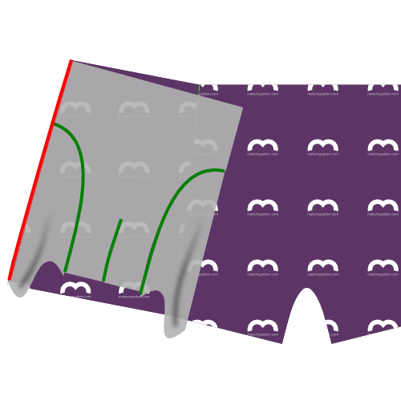

Alignez le bord latéral du premier côté avec le bord constitué des fronts+insert (bons côtés ensemble, comme d'habitude) et cousez-les ensemble a la surjeteuse.

### Étape 8 : Assembler le second côté et les devants

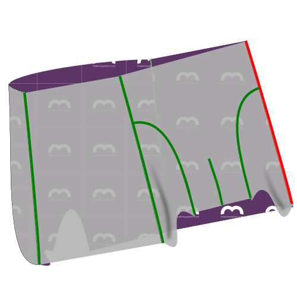

Faites la même chose pour le second côté.

### Étape 9 : Optionnel: Surpiquer

Si vous avez surpiqué précédemment, faites maintenant la même chose pour les coutures réalisées aux étapes 7 et 8.

### Étape 10 : Terminer la fourche

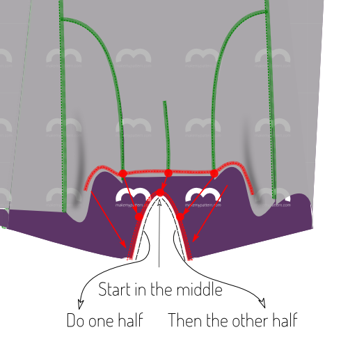

Nous allons maintenant coudre ensemble à la surjeteuse la fourche arrière du boxer et celle du devant, constituée des devants et des inserts.

Aidez-vous des repères du dos. Il y a un repère pour les milieux, les deux autres repères devant correspondre à la jointure des devants avec les inserts.

<Tip>

Il est plus facile de commencer au milieu et de faire un côté après l'autre. Recommencez à partir du milieu pour faire le deuxième côté.

Prenez votre temps, et soyez **très attentif** à l'endroit où votre surjeteuse coupe.

</Tip>

### Étape 11: Faire l'ourlet de la première jambe

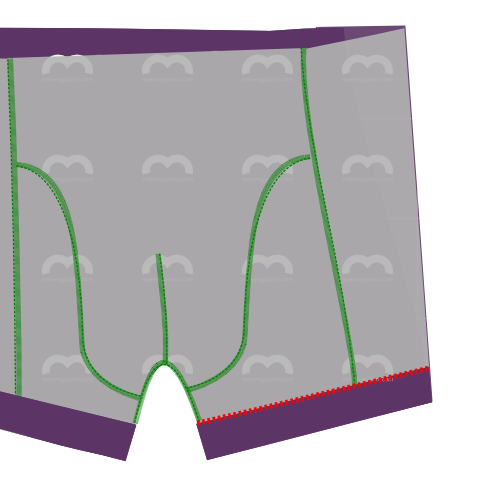

Il est temps de faire les ourlets. Procédez comme vous le feriez pour n'importe quel autre tissu extensible. Utilisez un point extensible. Vous pouvez utiliser un point zig-zag ou une double aiguille si vous n'avez pas de point overlock ou de règlage spécial point extensible.

<Note>

A mon avis l'ourlet est beaucoup plus facile à faire si vous épinglez d'abord.
Donc pliez votre ourlet et épinglez-le en place.
Ou mieux: épinglez les ourlets des deux jambes et ne cousez que lorsque l'aspect vous satisfait.

</Note>

### Étape 12: Faire l'ourlet de la seconde jambe

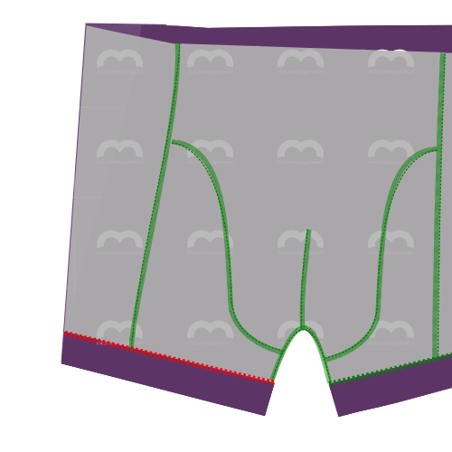

Vous avez compris.

### Étape 13 : Faire une boucle avec votre élastique

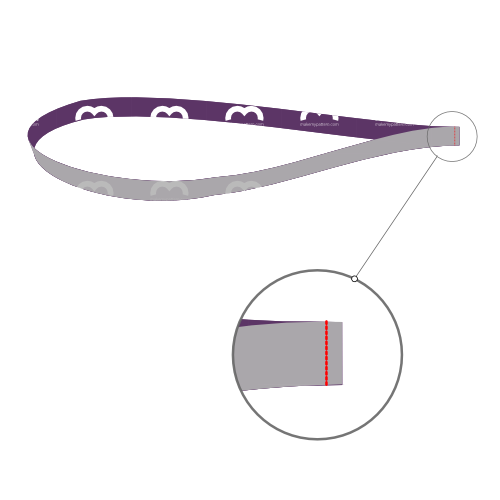

Cousez les deux extrémités de votre élastique ensemble endroit contre endroit.

<Note>

###### Combien d'élastique me faut-il ?

Enveloppez simplement votre élastique autour de votre tour de taille où il finirait par s'asseoir et le serrez jusqu'à ce qu'il se sente bien.
Marquez l'endroit où les bords se rejoignent, ajoutez une marge de couture de 2cm, et c'est votre longueur d'élastique.

</Note>

### Étape 14 : Fixer l'élastique à la taille

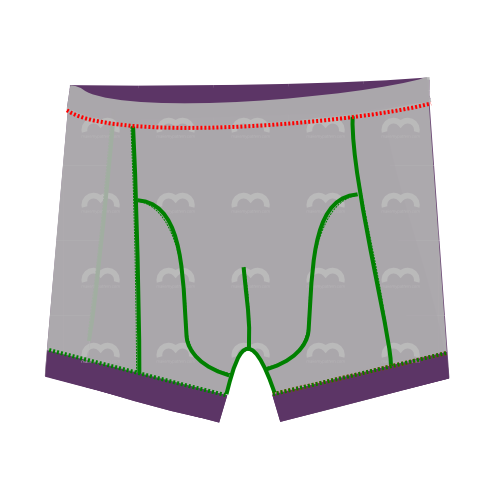

Fixez l'élastique à la taille.

A faire endroit contre endroit si vous utilisez un point extensible ou une double aiguille sur une machine à coudre conventionnelle.

Si vous utilisez un point overlock, placez l'élastique sur l'endroit, en haut du boxer.

<Tip>

La longueur de votre élastique sera plus courte que celle de la taille du boxer, l'élastique devra donc être étiré.
Epingler vous aidera à bien répartir l'étirement.

Divisez votre élastique et la taille de votre boxer en 4 (ou 8) parties. Pin élastique et tissu ensemble à ces points.

Lors de la couture, étirez l'élastique et tissez ensemble entre chaque ensemble de broches, retirez les broches au fur et à mesure que vous vous déplacez.

</Tip>

### Étape 15 : Dégarnir et nettoyer

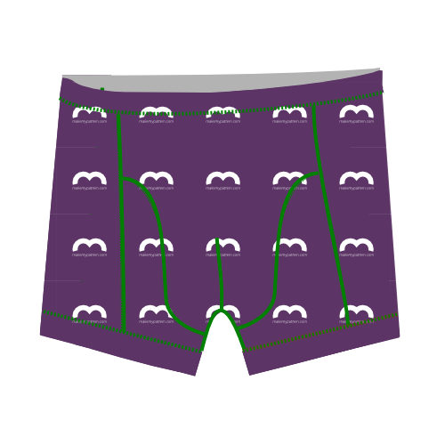

Coupez tout tissu excédentaire au niveau de l'élastique ou des ourlets et tous les fils qui dépassent.
