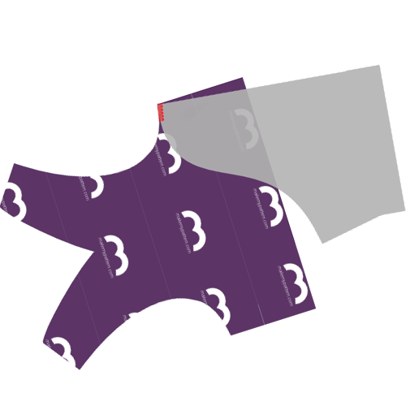

<YouTube id='PL1gv5yv3DoZME1xe5fBEHd0rKPW_xNpF3' playlist />

### Stap 1: Bevestig rugpand aan eerste zijkant

Leg de zijkant (stuk 3) op de rug (stuk 1) aan de zijrand, met de goede kanten op elkaar. Aangezien de zijkant (stuk 3) symmetrisch is kan dit niet fout lopen.

Lock de naad, met een naadwaarde van 1 cm. Mik dus met de buitenste naald van je lockmachine op 1 cm naast de rand van je stof.

> Als het metrieke stelsel niet je ding is, 1 cm is 3/8 inch.

> Some sergers have a lever to choose between flat seams, or bundled up seams. Als je van plan bent om sierstiksels te gebruiken (zie stap 6), kies dan zeker voor platte naden.

### Stap 2: Bevestig rugpand aan tweede zijkant

Leg de tweede zijkant (stuk 3) op de rug (stuk 1) aan de zijrand, met de goede kanten op elkaar. Aangezien de zijkant (stuk 3) symmetrisch is kan dit niet fout lopen.

Lock de naad samen, zoals je aan de andere kant al deed.

> Het rugpand en de zijkanten zijn nu aan elkaar bevestigd. Leg ze even opzij terwijl we ons focussen op de andere stukken.

### Stap 3: Bevestig inzetstukken aan voorkanten

  

Om het inzetstuk (stuk 4) aan de voorkant (stuk 2) te bevestigen moet je langs de gebogen randen locken.

> Onthou dat je twee voorpanden hebt. Je moet deze bovenop elkaar leggen en als één dubbel gelaagd voorpand verwerken.

Een lastige naad als deze geeft je zin om naar spelden of driegdraad te grijpen, maar laat dat. Spelden of driegen maakt dit moeilijker.

Begin aan de top van de gebogen naad, de stukken samenleggend zoals getoond, en lock ze langzaam een paar cm samen.

Terwijl je voortgaat manipuleer je de stof zodat de lagen gelijk blijven liggen terwijl je ze door de overlock haalt.

Als je de stof zo manipuleert is het makkelijk om één stuk meer uit te rekken dan de andere. Het merkteken op de gebogen rand kan je helpen om te controleren of alles gelijk blijft.

Zodra je voorbij dit merkteken bent wordt alles makkelijker. This would also be a good time to compare the remaining length of the curved seams. Als één stuk een beetje langer is dan het andere, rek het korte stuk dan een beetje tot ze even lang zijn.

Als het verschil te groot is, laat het dan gewoon. Het zal afgeknipt worden bij het naaien van de kruisnaad.

<Note>

Dit is zo ongeveer de moeilijkste naad in het patroon. Doe rustig aan, en alles komt goed.

</Note>

<Tip>

###### Or enclose these seams by sandwiching them between the fronts

While it's a bit more work, you can enclose this seam if you baste the insets to a single one of the front pieces first,
and then sew your front pieces together with the insets sandwiched inside.

Naai de nepen vooraan apart en keer alles binnenstebuiten, en je hebt een mooi naadloos pakketje vooraan.

</Tip>

### Stap 4: Bevestig tweede inzetstuk en voorkanten

Nadat je het eerste inzetstuk aan de voorpanden bevestigd hebt, doe je hetzelfde met het tweede.

Als de voorpanden en inzetstukken aan elkaar hangen heb je nog maar drie stukken:

 - De inzetstukken en voorpanden, aan elkaar bevestigd
 - De zijkanten en rugpand, aan elkaar bevestigd
 - De elastiek

### Stap 5: Sluit de neep in de voorpanden

Vouw de voorpanden in twee langs de middenvoorlijn, zodat de gebogen stukken onderaan gelijk liggen.

Lock de zijkanten van de gebogen delen om de voorste neep te sluiten. Voor het beste resultaat start je bovenaan de naad (waar de stof geplooid is) en ga je zo naar beneden.

<Tip>

###### Keep that seam away from my ...

Een andere optie is op de neep aan elk voorpand apart te naaien zodat de naden aan de binnenkant zitten.
Het is iets meer werk, maar het is het extra comfort meer dan waard.

</Tip>

### Stap 6: Optioneel: Sierstiksel

<Note>

Deze stap is optioneel. Sierstiksel voegt een visueel effect toe dat de individuele patroondelen benadrukt.
Het is een leuke manier om een effen stof visueel op te breken, maar als je een print gebruikt of verschillende kleuren, laat je het misschien beter.

</Note>

Als je je gelockte naden wil doorstikken voor visueel effect is het nu het moment.

Als je een sierstiksel geeft, die dit dan gewoon langs elke naad, steeds met een elastische steek. Je kan een zigzagsteek gebruiken of een tweelingnaald als je geen coverlock of specifieke stretchsteek hebt.

<Tip>

When topstitching the seam that closed the fronts dart, start from the bottom,
and let the topstitching run all the way to the top, where the waistband will come.
De naad stopt halverwege (waar de neep eindigt), maar je stiksel moet doorlopen.

</Tip>

### Stap 7: Bevestig de eerste zijkant aan de voorpanden

Align the side edge of the first side with the edge made up of the fronts+inset (good sides together as usual) and serge them together.

### Stap 8: Bevestig de tweede zijkant aan de voorpanden

Doe hetzelfde voor de tweede zijkant.

### Stap 9: Optioneel: Sierstiksel

Als je eerder al een sierstiksel gaf, doe dan nu hetzelfde voor de naden die je gemaakt hebt in stap 7 en 8.

### Stap 10: Werk de kruisnaad af

We gaan nu de gebogen opening aan de achterkant bevestigen aan de voorkant van de boxershort, bestaande uit de voorpanden en inzetstukken.

De merktekens op het rugpand zullen je helpen. Er is een merkteken in het midden, en de twee andere merktekens zouden moeten overeenkomen met waar de voorpanden en inzetstukken samenkomen.

<Tip>

Het is makkelijker om in het midden te beginnen en één kant af te werken. Begin dan opnieuw in het midden om de andere kant af te werken.

Take it slow, and be **very aware** of where your serger blade is cutting into.

</Tip>

### Stap 11: Zoom de eerste pijp

Tijd om de pijpen om te zomen. Zoom ze op dezelfde manier als je elke andere elastische gebreide stof zou zomen. Ga voor een elastische steek. Je kan een zigzaksteek of tweelingnaald gebruiken als je geen coverlock of specifieke stretchsteek hebt.

<Note>

Ik vind zomen veel eenvoudiger als je de dingen eerst op de juiste plek speldt.
Dus plooi je zoom om, en speld alles op z'n plaats.
Nog beter: speld beide pijpen vast en naai pas als je vindt dat het er goed uitziet.

</Note>

### Stap 12: Zoom de tweede pijp

Niet meer dan logisch.

### Stap 13: Maak een lus van je elastiek

Naai de uiteindes van je elastiek samen met de goede kanten op elkaar.

<Note>

###### Not sure how much elastic you need?
Simply wrap your elastic around your waist where it would end up sitting, and tighten it until it feels right.
Duid aan waar dat punt is, voeg 2 cm naadwaarde toe, en daar is je lengte.

</Note>

### Stap 14: Bevestig elastiek aan de taille

Bevestig de elastiek aan de taille.

Doe dit met de juiste kanten op elkaar als je een stretchsteek of tweelingnaald gebruikt op een gewone naaimachine.

Als je een coverlock gebruikt, leg de elastiek bovenop de goede kant van de stof.

<Tip>

De lengte van je elastiek is waarschijnlijk niet hetzelfde als de lengte van je stof, aangezien de twee op een andere manier uitrekken.
Een paar spelden helpen om alles gelijk te krijgen.

Verdeel zowel je elastiek als de taille van je boxershort in 4 (of 8) gelijke delen. Pin elastic and fabric together at these points.

While sewing, stretch elastic and fabric together between each set of pins, removing the pins as you move on.

</Tip>

### Stap 15: Knip bij en kuis op

Knip eventuele overtollige stukken stof aan de tailleband of zoom bij, en eventuele losse draadjes.
