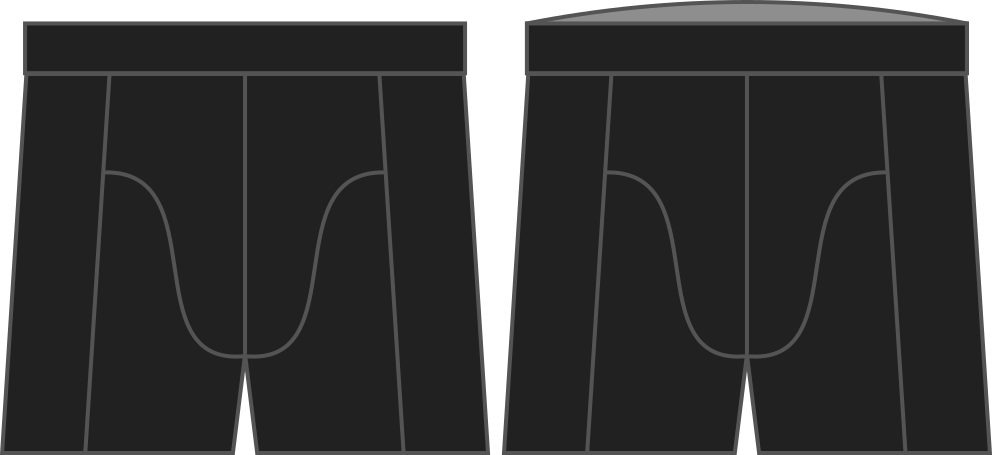

How much extra rise do you want at the back?

This factor will raise the waist at the back of your boxers only.

> Si quieres levantar la cintura en general, eso es lo que hace la opción **rise**

## Efecto de esta opción en el patrón

