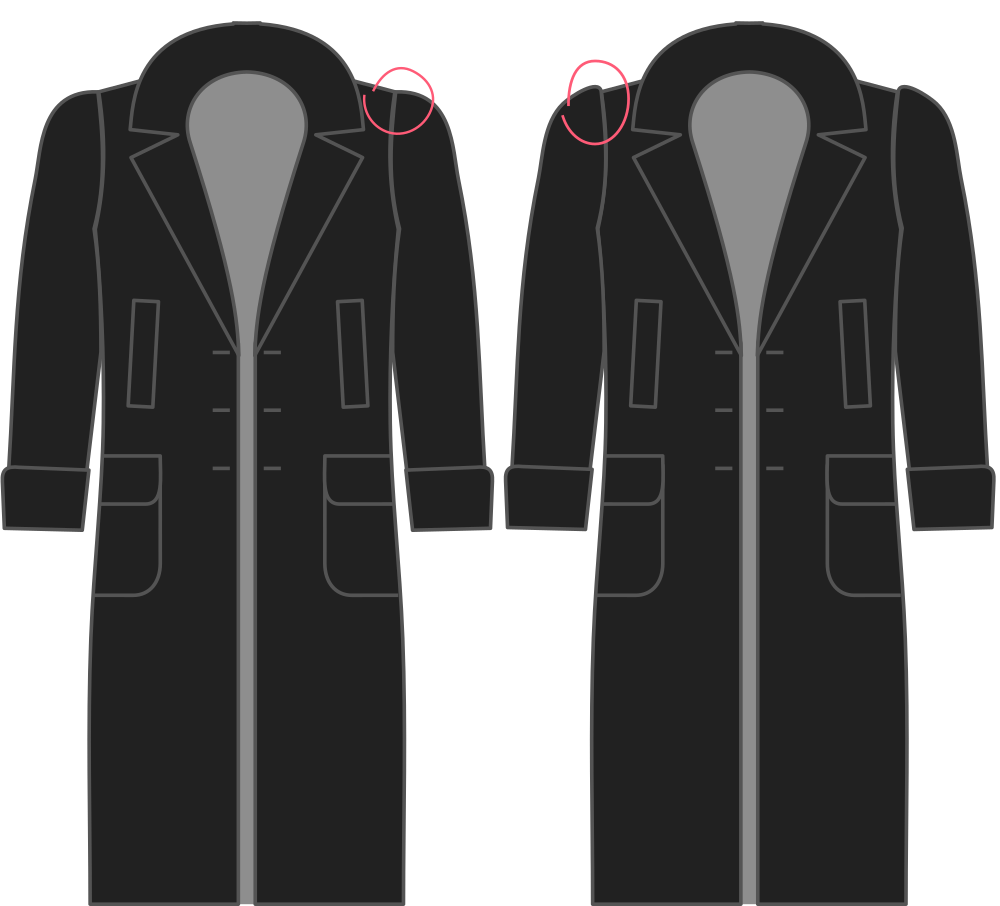

- - -
title: "Sleevecap ease"
- - -

How much sleevecap ease do you want?

> #### ###### Pour quoi faire ?
> 
> La quantité d'aisance de la tête de manche détermine comment les manches seront bombées à l'épaule.
> 
> Plus d'aisance rendra la manche plus courbée au niveau de la couture comme vous vous y attendriez sur un manteau. Moins d'aisance aura une manche au tombé plus plat.

> Plus votre tissu est léger, moins vous nécessitez d'aisance de tête de manche.

## Effet de cette option sur le motif

