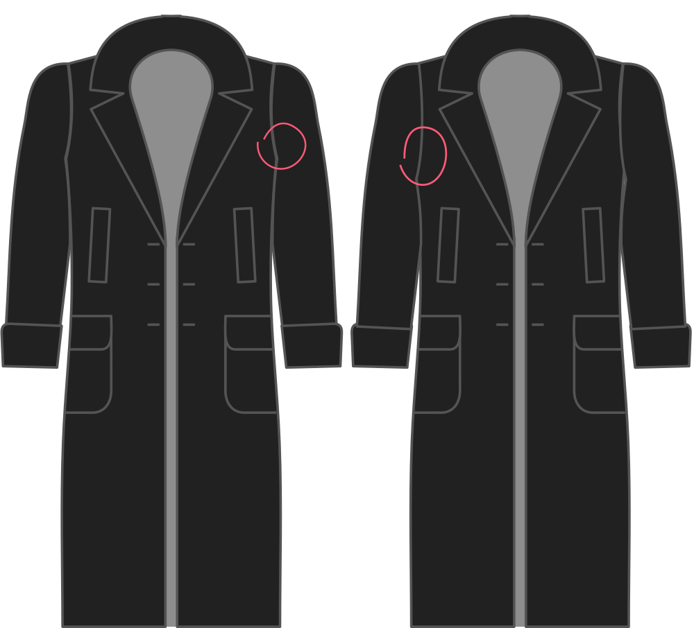

- - -
titre : "Facteur de profondeur d'emmanchure"
- - -

Cela permet de contrôler la profondeur de l'emmanchure qui, à son tour, influence la largeur de la manchette.

## Effet de cette option sur le motif

