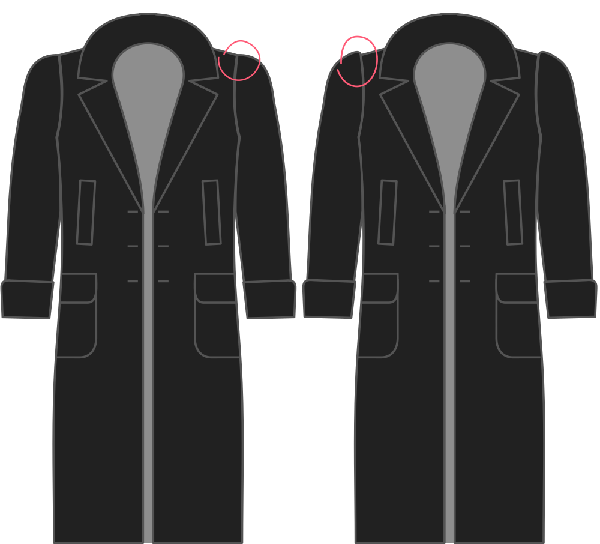

- - -
title: "Sleevecap ease"
- - -

How much sleevecap ease do you want?

> #### ¿Cuál es la cuestión?
> 
> La facilidad de manga determina cómo rodar las mangas desde el grifo.
> 
> Más facilidad hace que la manga se cuelgue en la costura como esperarías de un abrigo. Menos facilidad hace que la manga sea más lisa.

> Cuanto más ligero sea tu tejido, menos mangas te guste fácilmente.

## Efecto de esta opción en el patrón

