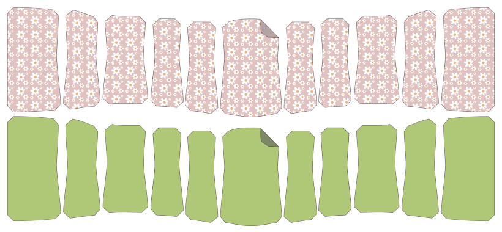

- - -
title: "Cathrin corset: Cutting Instructions"
- - -

Cut 1 core fabric and 1 outer fabric of the center panel, making sure to cut on the fold.

Cut 2 core and 2 outer of each side panel with _good sides together_.

For example, for the 11-panel version of Cathrin:

- Panneau 1 - Couper 1 cœur et 1 extérieur
- Panneau 2 - Couper 2 cœurs et 2 extérieurs
- Panneau 3 - Couper 2 cœurs et 2 extérieurs
- Panneau 4 - Couper 2 cœurs et 2 extérieurs
- Panneau 5 - Couper 2 cœurs et 2 extérieurs
- Panneau 6 - Couper 2 cœurs et 2 extérieurs

