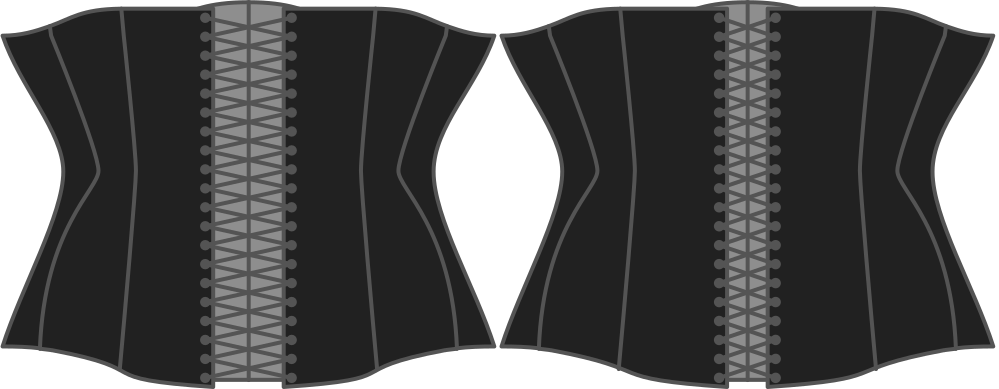

- - -
title: "Back opening"
- - -

This option determines how wide the back opening of your corset will be. The back opening is where you string the corset together.

## Effet de cette option sur le motif

