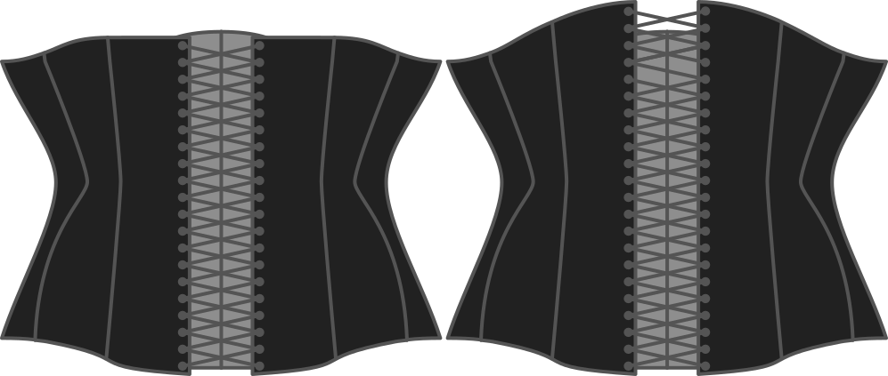

Wie hoch soll das Korsett an der Rückseite im Verhältnis zur Unterbruchhöhe ansteigen?

Null bedeutet, dass die Backline auf der Ebene des Unterbruchs horizontal bleibt. Mit anderen Worten, die Rückseite wird etwas die gleiche Höhe wie der BH haben.

Wenn du den Rückenaufstieg erhöhst, wird dein Korsett auf der Rückseite nach oben steigen.

> Da es sich um ein unterbrochenes Korsett handelt, ist der Rückenaufstieg eine Wahl und wunderbar<unk> €TMt beeinflussen die Passform
