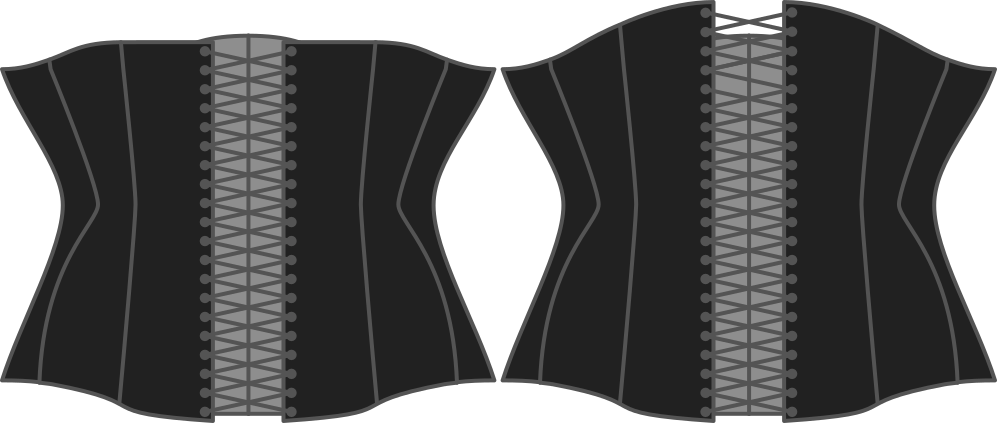

- - -
title: "Back rise"
- - -

How high do you want the corset to rise at the back, relative to the underbust height?

Zero means that the backline will stay horizontal at the level of your underbust. In other words, the back will be somewhat the same height as your bra strap.

If you increase the back rise, your corset will rise upwards at the back.

> Dado que este es un corsé por debajo del pecho, la elevación trasera es una elección de estilo y no afectará al ajuste

## Efecto de esta opción en el patrón

