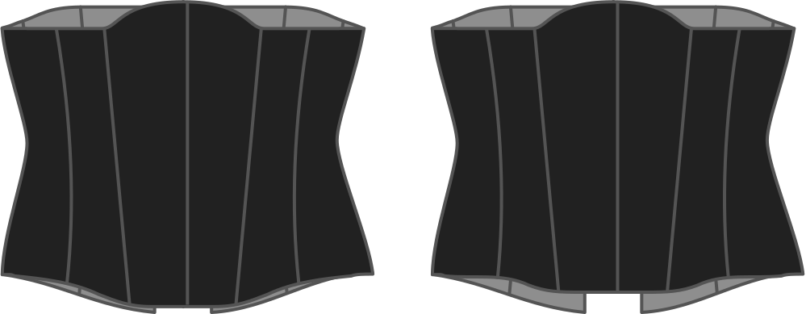

This option determines how far the center front will be lowered at the bottom of your corset.

> Si se rebaja demasiado, la sesión podría convertirse en un problema.

## Efecto de esta opción en el patrón

