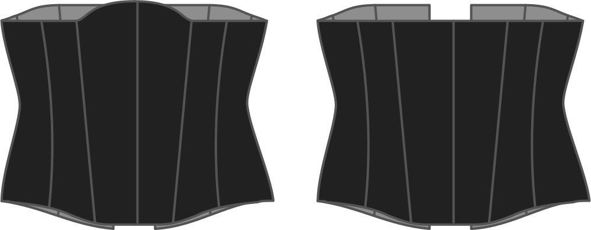

Qué tan alto quieres que el corsé se levante en el frente central.

> Este aumento se produce frente central entre sus pechos. No te canses de hacerlo o el borde de tu corsé se empujará a tus pechos.

> Esta opción también permite valores negativos. Harán que se reduzca la parte frontal central.

## Effect of this option on the pattern
