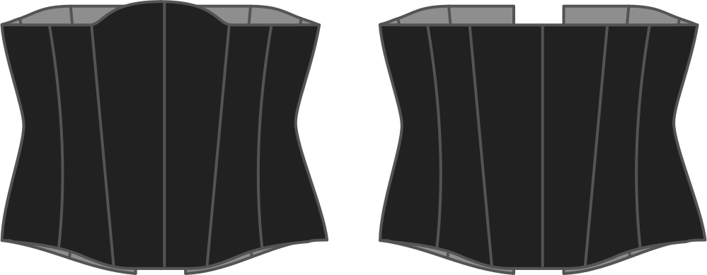

How high do you want the corset to rise up at the center front.

> Dit stukje verhoogt het middenvoorpand tussen je borsten. Doe hier niet te gek, anders duwt de rand van het korset in je borsten.

> Deze optie laat negatieve waarden toe. Die zullen het middenvoorpand verlagen.

## Effect van deze optie op het patroon

