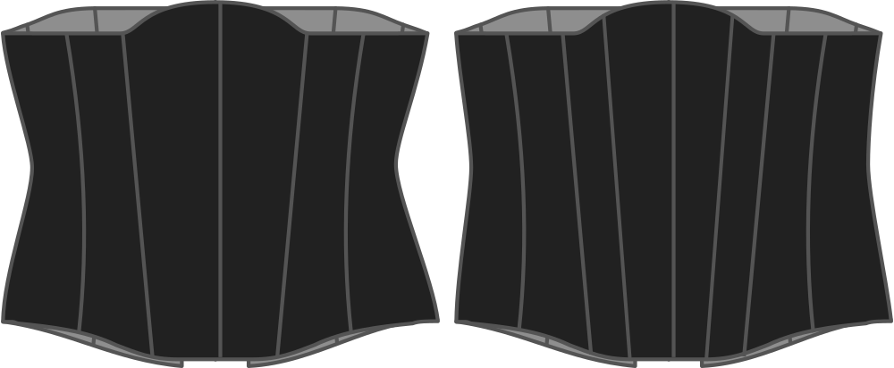

This options determines how many panels will be used to make up the corset. You have the choice between:

- 11 panels
- 13 panels

More panels is a bit more work, but also allows the difference between bust/waist/hips to be evened out over more darts, which may yield to better results.

> More curves = more panels

## Effect of this option on the pattern

