## Step 1: Close the back dart

First thing we're going to do is close the waist dart on the back panel.

To do so, fold the back panel double with _good sides together_ making sure to match both sides of the dart on top of each other.

Now sew the dart close, making sure to use a small stitch length, and to sew all the way to the end of the dart, even a couple of stitches off the fabric.

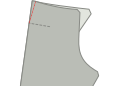

<Note>

Your back darts should be of equal length. Make sure to sew them precisely.

</Note>

## Step 2: Construct the back pockets

Follow [our double welt pocket instructions](/docs/sewing/double-welt-pockets/) to create the back welt pockets.

<Note>

Since these are chinos, you can/should edgestitch around the welt opening.
It's not strictly required for welt pockets, and typically not done on classic trousers (and thus not shown in
the instructions) but it's a very typical finish for chinos, and makes it easier to keep everything in place.

</Note>

### Attach the back pocket facing to the pocket bag

Join the back pocket facing to the pocket bag by placing them with _good sides together_ and sewing along the longest of the non-curved seams of the facing.

When you're done, press the seam allowance to the side of the pocket bag.

### Attach the back pocket bag

Sew the bottom of the pocket bag to the bottom welt. Press it down when done.

Now align the top of the pocket bag with the waist and sew it down in the waist's seam allowance.

### Close the pocket back

Fold the leg panel out of the way so you can close both sides of the pocket bag.

<Note>

Make sure to also sew the pocket welts down on the pocket bag

</Note>

You should overlock/serge the sides of the pocketbag so they don't ravel.

<Tip>

If you don't have a _serger_ you can always use a zig-zag stitch instead.

</Tip>

## Step 3: Overlock the front and back edges

Before we go any further, we'll overlock/serge the edges of the front and back panels of the legs.
Make sure to also catch the top of the pocket bag when doing the back panels.

What we want to to prevent these edges from ravelling after we've completed our trousers,
and now is the best time to do so.

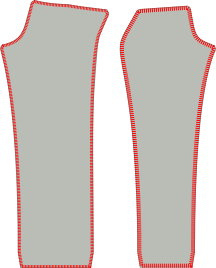

## Step 4:  Construct the front pocket opening

The front pockets are a little unusual because they have the appearance of classic slanted pockets, but are constructed on the side seam.

### Attach the front pocket facings to the pocket bags

We have two front pocket bags, that each have two pieces of facing to attach to them.

Align them with _good sides together_ (\*) and sew the facing in place.

<Note>

(\*) With a pocket bag, it's not so obvious what the good side should be.

Do you want the good side to be what you feel when you put your hand in your pocket?
Or do you want it to be what you see when your trousers lie on the floor with their insides showing.

There's no right or wrong answer here. You do you.

</Note>

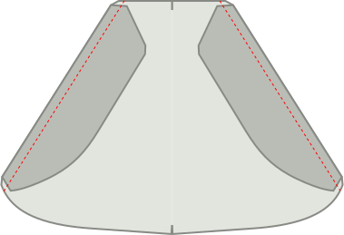

### Mark the pocket notch on pocket facing, and front and back leg panels

There's a notch on both front and back leg panels that indicates up to what point the pocket facing should be attached to the side seam.

Make sure to transfer this notch to both the (edge of the) pocket facing and the front trouser leg, since it's important we match them.

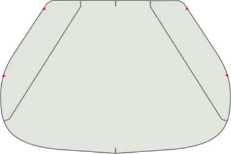

### Pin or base the pocket to the front and back leg panel

Both on the front and the back leg panel, we're going to sew the pocket facing to the side seam.

However, this needs to be precise, so you really want to make sure you either pin or baste it in place.

<Note>

Start with the front, since that's the easier seam. Once you've got some practice, you can do the back

</Note>

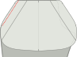

### Sew the front pocket in place

Sew from the waist down right until the notch that indicates where to stop.

### Press the front pocket slant

Now press the slant of the front pocket, both on the back and front panel, so that it's a sharp crease.

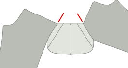

## Step 5:  Close the outseam

### Baste the front pockets shut

I strongly advise you to baste the pocket shut/in place before sewing this seam so that you know it's precise.

Closing the outseam means to place front and back panel with good sides together, and sew the outer seam.
That's easy enough at the legs, but at the top we have our pocket, which complicates things.

### Sew the top of the outer seam until the top notch of the pocket slant

Make sure everything is neatly aligned. Then sew from the top of the waist down to the top notch (this is just over a cm or half an inch).

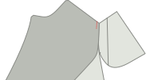

### Sew the bottom of the outer seam from the bottom notch of the pocket slant

Now move to the bottom notch of the pocket slant, and sew from there all the way to the bottom of the legs.

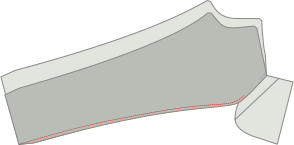

### Press the outer seam open

When you're done, make sure to press the seam allowance open along the leg. Don't press the pocket, we already did that.

## Step 6:  Finish the front pocket bag

### Sew pocket bag close inside-out

With our pocket opening constructed and outer seam closed, we should now finish the pocket bag.

Pull the pocket bag out so that it dangles on the outside of the trouser leg. Then place both halves together and
either use a serger to finish the edge, or sew closely to the edge.

Make sure you end up at the point where the bottom part of the outer seam starts.

### Finish pocket bag edge

When you're done, you can flip the pocket bag back to the inside of the trouser leg.

Our pocket bag is now closed, but when we put our hand in it, you can feel the raw edge of the seam allowance.
To avoid that, topstitch along the edge of the pocket bag, locking in the seam allowance.

<Note>
If your seam allowance is wide, you might want to trim it back first.
</Note>

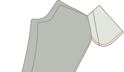

## Step 7:  Bar-tack the pocket opening

At the place the leg down with the good side up, making sure the pocket bag lies flat and towards the front panel.

Now at the top and bottom of the pocket opening, place a bar-tack perpendicular to the outer seam.

## Step 8:  Close the inseam

With our front pockets finished, close the inseam of both legs.

When you're done, press open the inseam.

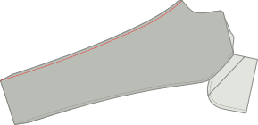

## Step 9:  Close the crossseam

<tip>

Double check that your right and left legs match the pattern markings. The right leg's crotch should extend slightly beyond the left. Refer to the pattern and cut excess on the left leg if necessary.

It can be valuable to mark with chalk or a running stitch the **Center Front** on each leg. This will help you make sure the peices are in the right place duing fly construction.

</tip>

Make sure one leg is turned with the good side out, and the other has the good side in.

Now tuck the leg with the good side out inside the leg that has the good side in.
This way, they have their good sides against each other.

Align the cross seam, starting at the back waist, pinning both halves together as you make your way
towards the fly. **Stop at the fly notch** and makes sure to back-stitch.

When you're done. Do it again. Always sew the cross seam twice.
It's one of those best practices you ignore at your own peril.

<Tip>

Take extra care to carefully align the seams where both legs have their back and front panels joined together.
Doing so will ensure your cross seam results with a perfectly aligned _cross_ where 4 pattern parts meet each other in a single point.

Getting it just right is one of those things you'll end up cherishing each time you wear these.

</Tip>

## Step 10: Construct the fly
### Close the fly extension and serge

Fold the fly extension on its fold line with good sides together.

Now sew along the bottom, to close the fly extension.

Trim back one half of the seam allowance to remove bulk before turning it good side out and pressing.

#### Serge the fly extension and fly facing

Serge (or zig-zag) along the open side of the fly extension. No need to serge the top as that will get caught in our waistband.

while you're at it, also serge along the entirety of the fly facings J-shaped edge.

### Attach the fly facing

Sew fly facing to left leg. You will be sewing slightly past the cross seam point, so be careful to keep the right leg seam allowance out of the way and aim to sew directly on top of the cross seam line.

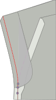

### Finish the fly facing

Trim the fly facing to half of the seam allowance.	
Tuck in the tip of the fly facing and secure it with a few stitches.
Edge stitch the fly facing to the seam allowance.
Press the seam allowance toward the facing and understitch the facing for a clean finish. Again, keeping the right leg 	seam allowance out of the way.

### Edge stitch the zipper to the fly extension

<tip>

**Zipper Length**

It's a good idea to ensure your zipper stop ends before the indicated stitch line on the pattern. This will ensure you don't sew over your zipper stop and reduces tension on the bottom of the fly. If your zipper is too long, you can do a 0 length zig zag stitch to create a new stop (on just the zipper itself).

</tip>

Edge stitch along the left edge of the zipper to the serged edge of the fly extension to hold it in place.

### Top stitch the right leg to the zipper

Start by pressing the right leg seam allowance to the back.

<tip>

Remember that the seam allowance starts slightly right of the center front, the center front is marked in purple in the image, make sure you don't fold along the center front line by mistake.

</tip>

Ensure you place the folded edge of the right leg just left of the zipper teeth to prevent fabric from being caught in the zipper.

Stop sewing at the top 'fly extention' notch, slightly above the cross seam, and be sure to backstitch. If you don't do this you won't be able to keep the extension out of the way when sewing the J-Seam.

### Attach the zipper to the fly facing.

Be careful to align the leg left on the right center front. It can be valuable to pin or baste through the facing and right zide of the zipper tape. (We need to sew the left side of the zipper tape to the left leg).
Ensuring everything is lined, sew the fly facing to the left side of the zipper. Try to get close to the zipper, but not too close.

### Sew the J-seam of the fly

<tip>

Use a peice of paper as a guide to sew the J seam, this can be cut from your pattern along the indicated stitch line.

</tip>

Now topstitch the so-called J-seam of the fly. Make sure to keep the fly extension out of the way. Since you didn't sew all the way along the fly extention, you should be able to pin it out of the way.

#### Bar tack the bottom of the fly

Now, bartack the very botton of the J-seam (the horizontal part) but this time make sure to also catch the fly extension.
You can choose to add an additional bar tack along the J-Seam as well (shown in purple).

## Step 11: Attach the belt loops

### Construct the belt loops

<Note>

For efficiency, we will contruct one long strip of belt loop that we'll divide into 8 parts.

</Note>

Cut a strip 80cm long (32 inch) and 2.8cm wide (1 1/8 inch).

Serge (or zigzag) the long edge of the strip on both sides.

Fold one side inwards, and the other side over it. Then press down with your iron.
The end result should be a long strip about 1cm wide.

Now sew along the entire length of the strip, smack in the middle of it.
Make sure to use a generous stitch length for this.

Finally, cut your length belt loops strip into 8 equal parts to make 8 belt loops.

### Attach the belt loops

We're going to divide our belt loops along the waist:

- 2 at the center back, each set aside a bit from the center so there's a small gap between them.
- 1 above the back dart on each side
- 1 on each side more or less where the side seam would hit the waist if it went straight up
- 1 on each side from center front. Not too close to each other so there's no room for belt buckles, but not too far either so it doesn't look weird

Place the belt loop at these places with their good side down (against the good side of the fabric of your trousers, and the top aligned with the waist)
Sew this down in the seam allowance of the waist, making sure that they are perpendicular to the waistband.

## Step 12: Attach the waist band

### Assemble curved waistband

If you're making a straight waistband, skip directly to attaching the waistband to the outside.

Place both waistbands with good sides together, and sew along the top of the waistband (the shorter edge).

Trim the seam allowance of the inner waistband, and press all seam allowances towards the inner waistband.

You can now treat your assembled waistband as one piece, and continue as for the straight waistband.

<Tip>
To make sure your inner waistband doesn't peek out, you can _understitch_.
Sew a line of stitching on the inside waistband, close to the edge, through the inner waistband and seam-allowances (but not the outer waistband!).
</Tip>

### Attach the waist band to the outside

Place the waistband with good sides together along the waist.
For the straight waistband, make sure the side with the standard seam allowance is aligned with the waist,
and not the side with double seam allowance.

Also make sure to leave suffucient seam allowance beyond the start and end of the waistband.

Sew along the entirety of the waist, attaching the waist band and sewing down the belt loops in one go.

### Press the waistband seam and fold the waistband

Press the seam you just sewed, pressing the seam allowance up into the waistband.

Now fold over the waistband at the correct width and press in the crease.

### Close the start and end of the waistband.

At the start and end, fold the waistband over so it has its good sides together.

Now sew the end shut by sewing top to bottom to just the point where the waistband seam ends.

Trim back the seam allowance a bit so you can tuck it all into the waistband later.

### Baste the waistband in place

The waistband has extra seam allowance here, and we're going to use that to our advantage.

Fold the waistband in the fold you pressed. Then on the inside, fold the seam allowance inwards, making sure to let it run a few mm beyond the waistband seam.

You want to baste this in place so it stays put as you make your way around the waistband.

At the start and end of the waistband, you'll need to tuck in some more seam allowance. Take a moment to get it right.

### Sew the waistband close

Now with the good side up, sew exactly in the seam that was sewn before (so called _stitch in the ditch_).

This will catch the back of the waistband which we've made to extend slightly further, and lock all the seam allowance inside.

## Step 13: Finalize the belt loops

### Sew the belt loops down to make them wider

It's best to make the belt loops a bit wider than the waistband, to accomodate wider belts.

For this, let the waistband lie flat, and sew it down with a bartack 1.5cm or so (half an inch) below the waistband.

### Fold upwards, down again, and sew down

Now fold the belt loops upwards (hiding the bartack you just did).

They'll extend beyond the top of the waistband. So fold the excess down again.
Don't fold it over/around the waistband, but fold it double on itself.

Now do a bartack along the top of the waistband to lock the belt loop in place.

When you're done, carefully twist the back of the beltloop to the front and cut off the excess right next to the bartack.

<Note>

Be careful not to bartack the front of your trousers to the back.

Double-check you don't have any extra layers under your needle because unpicking a bartack is no joy.

</Note>

## Step 14: Hem the pants

Fold the hem allowance halfway up, and press.
Then fold them again, and press again.

Finalize by hand and blind hem your trousers.

## Step 15: Button on buttonhole

Create a buttonhole. Either by hand (it's worth practicing) or with a machine.

Finally, attach the button.

Now take a moment to appreciate all the hard work you did.
We hope you'll get a lot of use out of these.
