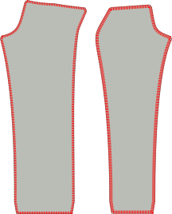

- - -
title: "Charlie chinos: Sewing Instructions"
- - -

## Paso 1: Cierra el dardo trasero

First thing we're going to do is close the waist dart on the back panel.

To do so, fold the back panel double with _good sides together_ making sure to match both sides of the dart on top of each other.

Now sew the dart close, making sure to use a small stitch length, and to sew all the way to the end of the dart, even a couple of stitches off the fabric.

<Note>

Sus dardos de espalda deben tener la misma longitud. Asegúrate de coser con precisión.

</Note>

## Paso 2: Construir los bolsillos de respaldo

Follow [our double welt pocket instructions](/docs/sewing/double-welt-pockets/) to create the back welt pockets.

<Note>

Dado que estos son chinos, usted puede/debe editar en torno a la apertura de la soldadura.
It's not strictly required for welt pockets, and typically not done on classic trousers (and thus not shown in
the instructions) but it's a very typical finish for chinos, and makes it easier to keep everything in place.

</Note>

### Adjuntar el bolsillo trasero hacia la bolsa de bolsillo

Join the back pocket facing to the pocket bag by placing them with _good sides together_ and sewing along the longest of the non-curved seams of the facing.

When you're done, press the seam allowance to the side of the pocket bag.

### Adjuntar la bolsa de bolsillo trasera

Sew the bottom of the pocket bag to the bottom welt. Press it down when done.

Now align the top of the pocket bag with the waist and sew it down in the waist's seam allowance.

### Cerrar el bolsillo de vuelta

Fold the leg panel out of the way so you can close both sides of the pocket bag.

<Note>

Asegúrate de coser también la bolsa de bolsa

</Note>

You should overlock/serge the sides of the pocketbag so they don't ravel.

<Tip>

Si no tienes un _serger_ siempre puedes usar un zig-zag en su lugar.

</Tip>

## Paso 3: Reemplaza los bordes frontales y traseros

Before we go any further, we'll overlock/serge the edges of the front and back panels of the legs. Make sure to also catch the top of the pocket bag when doing the back panels.

What we want to to prevent these edges from ravelling after we've completed our trousers, and now is the best time to do so.

## Paso 4: Construir la apertura del bolsillo frontal

The front pockets are a little unusual because they have the appearance of classic slanted pockets, but are constructed on the side seam.

### Adjuntar las miradas del bolsillo delantero a las bolsas de bolsillo

We have two front pocket bags, that each have two pieces of facing to attach to them.

Align them with _good sides together_ (\*) and sew the facing in place.

<Note>

(\*) Con una bolsa de bolsillo, no es tan obvio cuál debería ser el lado bueno.

Do you want the good side to be what you feel when you put your hand in your pocket?
Or do you want it to be what you see when your trousers lie on the floor with their insides showing.
¿O quieres que sea lo que ves cuando tus pantalones se encuentran en el suelo con su interior mostrando?.

No hay ninguna respuesta correcta o equivocada aquí. Te haces.

</Note>

### Marca el marco del bolsillo en la cara del bolsillo y los paneles de la parte frontal y trasera

There's a notch on both front and back leg panels that indicates up to what point the pocket facing should be attached to the side seam.

Make sure to transfer this notch to both the (edge of the) pocket facing and the front trouser leg, since it's important we match them.

### Anclar o basar el bolsillo en el panel de la pierna frontal y trasera

Both on the front and the back leg panel, we're going to sew the pocket facing to the side seam.

However, this needs to be precise, so you really want to make sure you either pin or baste it in place.

<Note>

Comience por el frente, ya que es la costura más fácil. Una vez que tienes alguna práctica, puedes hacer la espalda

</Note>

### Difunde el bolsillo frontal

Sew from the waist down right until the notch that indicates where to stop.

### Presione la capa delantera del bolsillo

Now press the slant of the front pocket, both on the back and front panel, so that it's a sharp crease.

## Paso 5: Cerrar el exterior

### Cerrar los bolsillos frontales

I strongly advise you to baste the pocket shut/in place before sewing this seam so that you know it's precise.

Closing the outseam means to place front and back panel with good sides together, and sew the outer seam. That's easy enough at the legs, but at the top we have our pocket, which complicates things.

### Difunde la parte superior de la costura exterior hasta la parte superior de la cortina de bolsillo

Make sure everything is neatly aligned. Then sew from the top of the waist down to the top notch (this is just over a cm or half an inch).

### Difunde la parte inferior de la costura externa de la parte inferior de la franja del bolsillo

Now move to the bottom notch of the pocket slant, and sew from there all the way to the bottom of the legs.

### Presione la costura externa abierta

When you're done, make sure to press the seam allowance open along the leg. Don't press the pocket, we already did that.

## Paso 6: Termina la bolsa de bolsillo frontal

### Difunde bolsa de bolsa de cerco dentro

With our pocket opening constructed and outer seam closed, we should now finish the pocket bag.

Pull the pocket bag out so that it dangles on the outside of the trouser leg. Then place both halves together and either use a serger to finish the edge, or sew closely to the edge.

Make sure you end up at the point where the bottom part of the outer seam starts.

### Finalizar borde de bolsa de bolsa

When you're done, you can flip the pocket bag back to the inside of the trouser leg.

Our pocket bag is now closed, but when we put our hand in it, you can feel the raw edge of the seam allowance. To avoid that, topstitch along the edge of the pocket bag, locking in the seam allowance.

<Note>
Si tu franquicia de costura es ancha, tal vez quieras recortarla primero.
</Note>

## Paso 7: Bar-tack la apertura del bolsillo

At the place the leg down with the good side up, making sure the pocket bag lies flat and towards the front panel.

Now at the top and bottom of the pocket opening, place a bar-tack perpendicular to the outer seam.

## Paso 8: Cerrar la entrada

With our front pockets finished, close the inseam of both legs.

When you're done, press open the inseam.

## Paso 9: Cerrar el cruce

Make sure one leg is turned with the good side out, and the other has the good side in.

Now tuck the leg with the good side out inside the leg that has the good side in. This way, they have their good sides against each other.

Align the cross seam, starting at the back waist, pinning both halves together as you make your way towards the fly. Stop at the lowest fly notch.

When you're done. Do it again. Always sew the cross seam twice. It's one of those best practices you ignore at your own peril.

<Tip>

Tenga mucho cuidado de alinear cuidadosamente las costuras donde ambas piernas tienen sus paneles trasero y frontal juntos.
Hacerlo asegurará que los resultados de su costura cruzada con una _cross_ perfectamente alineada, donde 4 partes de patrón se reúnen entre sí en un solo punto.

Conseguirlo bien es una de esas cosas que acabarás cherizando cada vez que las llevas.

</Tip>

## Paso 10: Construir la mosca

### Cerrar extensión de mosca

Fold the fly extension on its fold line with good sides together.

Now sew along the bottom, to close the fly extension.

Trim back one half of the seam allowance to remove bulk before turning it good side out and pressing.

### Sirve la extensión de la mosca y mira a la mosca

Serge (or zig-zag) along the open side of the fly extension. No need to serge the top as that will get caught in our waistband.

while you're at it, also serge along the entirety of the fly facings J-shaped edge.

### Cortar la costura extra en el frente de la pierna izquierda

There's extra seam allowance that runs along the fly. We only need this on the right leg panel. Cut it away on the left panel so you're left with the regular seam allowance only.

### Adjuntar la cara de vuelo

Sew the fly facing to the left front. Place them with good sides together, aligning the top.

### Pegado en la punta de la cara de la mosca

Fold the bottom of the fly facing seam allowance inwards and secure with a few stitches.

### El borde tira la mosca hacia la costura

Sew the fly facing to the seam allowance. Make sure to leave the front panel out of it.

### Presione la costura cruzada, la cara de la mosca y el borde de la mosca

Press open the cross seam. Press the fly facing to the side.

Then, fold over the extra seam allowance on the right front leg and press it down.

### Baste el zipper para la extensión de moscas

Place the zipper along the (slightly curved) edge of the fly extension.

Now sew along the edge. No need to get close to the zipper, just sew along the edge to hold them in place.

### Adjuntar zipper a la mosca

Now place the right front leg's fly with the extra seam allowance that you folded back on top of the zip.

Use a zipper foot edge-stitch the folded-over edge along the zipper edge.

<Tip>

Quizás quieras bastar esto primero para asegurarte de que es muy paralelo al zipper. Cerrar, pero no demasiado cerca.

</Tip>

### Difunde el caparazón hacia la mosca

Now sew the other side of the zipper to the fly facing. Make sure to align it properly so that when the trousers are closed, the zip is hidden.

### Termina la costura cruzada

Sew the last bit of the cross seam up to the highest fly notch.

### Difunde la costura J de la mosca

Now topstitch the so-called J-seam of the fly. Make sure to keep the fly extension out of the way.

### Barra toca la parte inferior de la mosca

Now bartack the very botton of the J-seam (the horizontal part) but this time make sure to also catch the fly extension.

## Paso 11: Adjuntar bucles de cinturón

### Construir los bucles de la cinta

<Note>

Para la eficiencia, contructaremos una larga franja de bucle de cinturón que dividiremos en 8 partes.

</Note>

Cut a strip 80cm long (32 inch) and 2.8cm wide (1 1/8 inch).

Serge (or zigzag) the long edge of the strip on both sides.

Fold one side inwards, and the other side over it. Then press down with your iron. The end result should be a long strip about 1cm wide.

Now sew along the entire length of the strip, smack in the middle of it. Make sure to use a generous stitch length for this.

Finally, cut your length belt loops strip into 8 equal parts to make 8 belt loops.

### Adjuntar bucles de la cinta

We're going to divide our belt loops along the waist:

- 2 en el centro de vuelta, cada uno de ellos apartado un poco del centro, así que hay un pequeño hueco entre ellos.
- 1 sobre el dardo trasero de cada lado
- 1 en cada lado más o menos donde la costura lateral golpearía la cintura si subiera recto
- 1 en cada lado desde el frente central. No está demasiado cerca unos de otros, así que no hay espacio para los cubos de cinta, pero tampoco demasiado lejos, por lo que no parece extraño

Place the belt loop at these places with their good side down (against the good side of the fabric of your trousers, and the top aligned with the waist) Sew this down in the seam allowance of the waist, making sure that they are perpendicular to the waistband.

## Paso 12: Adjuntar la banda de cintura

### Colmenar cintura curvada

If you're making a straight waistband, skip directly to attaching the waistband to the outside.

Place both waistbands with good sides together, and sew along the top of the waistband (the shorter edge).

Trim the seam allowance of the inner waistband, and press all seam allowances towards the inner waistband.

You can now treat your assembled waistband as one piece, and continue as for the straight waistband.

<Tip>
Para asegurarse de que tu pulsera interna no se apaga, puedes _understitch_.
Difunde una línea de cinta en el interior de la cintura, cerca del borde, a través de la cintura interna y las costuras (¡pero no la cintura exterior!).
</Tip>

### Adjuntar la banda de la cintura al exterior

Place the waistband with good sides together along the waist. For the straight waistband, make sure the side with the standard seam allowance is aligned with the waist, and not the side with double seam allowance.

Also make sure to leave suffucient seam allowance beyond the start and end of the waistband.

Sew along the entirety of the waist, attaching the waist band and sewing down the belt loops in one go.

### Presiona la costura de la cintura y dobla la cintura

Press the seam you just sewed, pressing the seam allowance up into the waistband.

Now fold over the waistband at the correct width and press in the crease.

### Cierre el inicio y el final de la cintura.

At the start and end, fold the waistband over so it has its good sides together.

Now sew the end shut by sewing top to bottom to just the point where the waistband seam ends.

Trim back the seam allowance a bit so you can tuck it all into the waistband later.

### Crea la cintura en su lugar

The waistband has extra seam allowance here, and we're going to use that to our advantage.

Fold the waistband in the fold you pressed. Then on the inside, fold the seam allowance inwards, making sure to let it run a few mm beyond the waistband seam.

You want to baste this in place so it stays put as you make your way around the waistband.

At the start and end of the waistband, you'll need to tuck in some more seam allowance. Take a moment to get it right.

### Cerrar la cintura

Now with the good side up, sew exactly in the seam that was sewn before (so called _stitch in the ditch_).

This will catch the back of the waistband which we've made to extend slightly further, and lock all the seam allowance inside.

## Paso 13: Finaliza los bucles de la cinta

### Difunde los bucles de la cinta para hacerlos más anchos

It's best to make the belt loops a bit wider than the waistband, to accomodate wider belts.

For this, let the waistband lie flat, and sew it down with a bartack 1.5cm or so (half an inch) below the waistband.

### Doble hacia arriba, abajo de nuevo, y coser

Now fold the belt loops upwards (hiding the bartack you just did).

They'll extend beyond the top of the waistband. So fold the excess down again. Don't fold it over/around the waistband, but fold it double on itself.

Now do a bartack along the top of the waistband to lock the belt loop in place.

When you're done, carefully twist the back of the beltloop to the front and cut off the excess right next to the bartack.

<Note>

Ten cuidado de no echar la parte delantera de tus pantalones a la espalda.

Comprueba que no tienes capas extra debajo de tu aguja porque descoger un bartack no es una alegría.

</Note>

## Paso 14: Hem los pantalones

Fold the hem allowance halfway up, and press. Then fold them again, and press again.

Finalize by hand and blind hem your trousers.

## Paso 15: Botón en el botón

Create a buttonhole. Either by hand (it's worth practicing) or with a machine.

Finally, attach the button.

Now take a moment to appreciate all the hard work you did. We hope you'll get a lot of use out of these.
