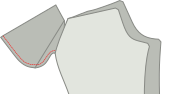

- - -
title: "Charlie chinos: Sewing Instructions"
- - -

## Étape 1 : Fermer la dart arrière

First thing we're going to do is close the waist dart on the back panel.

To do so, fold the back panel double with _good sides together_ making sure to match both sides of the dart on top of each other.

Now sew the dart close, making sure to use a small stitch length, and to sew all the way to the end of the dart, even a couple of stitches off the fabric.

<Note>

Vos fléchettes du dos doivent avoir la même longueur. Assurez-vous de les coudre avec précision.

</Note>

## Étape 2 : Construire les poches arrière

Follow [our double welt pocket instructions](/docs/sewing/double-welt-pockets/) to create the back welt pockets.

<Note>

Comme il s'agit de chinos, vous pouvez/devriez edgestitch autour de l'ouverture.
It's not strictly required for welt pockets, and typically not done on classic trousers (and thus not shown in
the instructions) but it's a very typical finish for chinos, and makes it easier to keep everything in place.

</Note>

### Attacher la poche arrière face au sac de poche

Join the back pocket facing to the pocket bag by placing them with _good sides together_ and sewing along the longest of the non-curved seams of the facing.

When you're done, press the seam allowance to the side of the pocket bag.

### Attacher le sac de poche arrière

Sew the bottom of the pocket bag to the bottom welt. Press it down when done.

Now align the top of the pocket bag with the waist and sew it down in the waist's seam allowance.

### Fermer le dos de poche

Fold the leg panel out of the way so you can close both sides of the pocket bag.

<Note>

Assurez-vous également de coudre la poche sur le sac de poche

</Note>

You should overlock/serge the sides of the pocketbag so they don't ravel.

<Tip>

Si vous n'avez pas de _serger_, vous pouvez toujours utiliser un point zig-zag à la place.

</Tip>

## Étape 3 : Surverrouillez les bords avant et arrière

Before we go any further, we'll overlock/serge the edges of the front and back panels of the legs. Make sure to also catch the top of the pocket bag when doing the back panels.

What we want to to prevent these edges from ravelling after we've completed our trousers, and now is the best time to do so.

## Étape 4 : Construire l'ouverture de la poche avant

The front pockets are a little unusual because they have the appearance of classic slanted pockets, but are constructed on the side seam.

### Fixer les faces de la poche avant aux poches

We have two front pocket bags, that each have two pieces of facing to attach to them.

Align them with _good sides together_ (\*) and sew the facing in place.

<Note>

(\*) Avec un sac de poche, il n'est pas si évident de savoir quel devrait être le bon côté.

Voulez-vous que le bon côté soit ce que vous ressentez lorsque vous mettez votre main dans votre poche?
Ou vous voulez que ce soit ce que vous voyez quand votre pantalon se couche sur le sol avec leur intérieur montré.

Il n'y a pas de bonne ou de mauvaise réponse ici. Vous le faites.

</Note>

### Marquer l'encoche de poche sur la face de la poche et sur les panneaux de la jambe avant et arrière

There's a notch on both front and back leg panels that indicates up to what point the pocket facing should be attached to the side seam.

Make sure to transfer this notch to both the (edge of the) pocket facing and the front trouser leg, since it's important we match them.

### Épingler ou baser la poche sur le panneau avant et arrière de la jambe

Both on the front and the back leg panel, we're going to sew the pocket facing to the side seam.

However, this needs to be precise, so you really want to make sure you either pin or baste it in place.

<Note>

Commencez avec le devant, puisque c'est la couture la plus facile. Une fois que vous avez un peu d'entraînement, vous pouvez faire le dos

</Note>

### Coudre la poche avant en place

Sew from the waist down right until the notch that indicates where to stop.

### Appuyer sur la poche avant

Now press the slant of the front pocket, both on the back and front panel, so that it's a sharp crease.

## Étape 5 : Fermer la sortie

### Coller les poches avant fermées

I strongly advise you to baste the pocket shut/in place before sewing this seam so that you know it's precise.

Closing the outseam means to place front and back panel with good sides together, and sew the outer seam. That's easy enough at the legs, but at the top we have our pocket, which complicates things.

### Coudre le haut de la couture extérieure jusqu'à l'encoche supérieure de la pochette

Make sure everything is neatly aligned. Then sew from the top of the waist down to the top notch (this is just over a cm or half an inch).

### Coudre le bas de la couture extérieure de l'encoche inférieure de la poche

Now move to the bottom notch of the pocket slant, and sew from there all the way to the bottom of the legs.

### Appuyez sur la couture extérieure ouverte

When you're done, make sure to press the seam allowance open along the leg. Don't press the pocket, we already did that.

## Étape 6 : Terminer le sac de poche avant

### Coudre le sac de poche à l'intérieur

With our pocket opening constructed and outer seam closed, we should now finish the pocket bag.

Pull the pocket bag out so that it dangles on the outside of the trouser leg. Then place both halves together and either use a serger to finish the edge, or sew closely to the edge.

Make sure you end up at the point where the bottom part of the outer seam starts.

### Arête du sac de poche

When you're done, you can flip the pocket bag back to the inside of the trouser leg.

Our pocket bag is now closed, but when we put our hand in it, you can feel the raw edge of the seam allowance. To avoid that, topstitch along the edge of the pocket bag, locking in the seam allowance.

<Note>
Si votre marge de couture est large, vous pourriez vouloir la couper en premier.
</Note>

## Étape 7 : Tape la poche à l'ouverture de la poche

At the place the leg down with the good side up, making sure the pocket bag lies flat and towards the front panel.

Now at the top and bottom of the pocket opening, place a bar-tack perpendicular to the outer seam.

## Étape 8 : Fermer la couture d'entrée

With our front pockets finished, close the inseam of both legs.

When you're done, press open the inseam.

## Étape 9 : Fermer la couture croisée

Make sure one leg is turned with the good side out, and the other has the good side in.

Now tuck the leg with the good side out inside the leg that has the good side in. This way, they have their good sides against each other.

Align the cross seam, starting at the back waist, pinning both halves together as you make your way towards the fly. Stop at the lowest fly notch.

When you're done. Do it again. Always sew the cross seam twice. It's one of those best practices you ignore at your own peril.

<Tip>

Faites très attention à aligner soigneusement les coutures où les deux jambes ont leur dos et les panneaux avant unis.
Ce faisant, vous assurerez que vos résultats de couture croisée seront parfaitement alignés avec une _croix_ où 4 parties de motif se rencontreront en un seul point.

Une de ces choses que vous finirez par chérir chaque fois que vous les porterez.

</Tip>

## Étape 10: Construire la mouche

### Extension "Fermer la mouche"

Fold the fly extension on its fold line with good sides together.

Now sew along the bottom, to close the fly extension.

Trim back one half of the seam allowance to remove bulk before turning it good side out and pressing.

### Serger l'extension de la mouche et faire face

Serge (or zig-zag) along the open side of the fly extension. No need to serge the top as that will get caught in our waistband.

while you're at it, also serge along the entirety of the fly facings J-shaped edge.

### Couper la marge de couture supplémentaire sur le devant de la jambe gauche

There's extra seam allowance that runs along the fly. We only need this on the right leg panel. Cut it away on the left panel so you're left with the regular seam allowance only.

### Fixer la face de la mouche

Sew the fly facing to the left front. Place them with good sides together, aligning the top.

### Tuck in the tip of the fly facing

Fold the bottom of the fly facing seam allowance inwards and secure with a few stitches.

### Coudre le bord de la mouche face à la couture

Sew the fly facing to the seam allowance. Make sure to leave the front panel out of it.

### Appuyez sur la couture de croix, la couture de la mouche et le bord de la mouche

Press open the cross seam. Press the fly facing to the side.

Then, fold over the extra seam allowance on the right front leg and press it down.

### Collez la fermeture éclair à l'extension de la mouche

Place the zipper along the (slightly curved) edge of the fly extension.

Now sew along the edge. No need to get close to the zipper, just sew along the edge to hold them in place.

### Attacher la fermeture éclair à la mouche

Now place the right front leg's fly with the extra seam allowance that you folded back on top of the zip.

Use a zipper foot edge-stitch the folded-over edge along the zipper edge.

<Tip>

Vous pourriez vouloir baster cette première fois pour vous assurer qu'elle est bien parallèle à la fermeture à glissière. Fermé, mais pas trop proche.

</Tip>

### Coudre la fermeture éclair sur la mouche

Now sew the other side of the zipper to the fly facing. Make sure to align it properly so that when the trousers are closed, the zip is hidden.

### Terminer la couture de croix

Sew the last bit of the cross seam up to the highest fly notch.

### Coudre la couture J-de la mouche

Now topstitch the so-called J-seam of the fly. Make sure to keep the fly extension out of the way.

### Tape le bas de la mouche

Now bartack the very botton of the J-seam (the horizontal part) but this time make sure to also catch the fly extension.

## Étape 11 : Fixer les boucles de ceinture

### Construire les boucles de ceinture

<Note>

Pour plus d'efficacité, nous fabriquerons une longue bande de boucle de courroie que nous diviserons en 8 parties.

</Note>

Cut a strip 80cm long (32 inch) and 2.8cm wide (1 1/8 inch).

Serge (or zigzag) the long edge of the strip on both sides.

Fold one side inwards, and the other side over it. Then press down with your iron. The end result should be a long strip about 1cm wide.

Now sew along the entire length of the strip, smack in the middle of it. Make sure to use a generous stitch length for this.

Finally, cut your length belt loops strip into 8 equal parts to make 8 belt loops.

### Attacher les boucles de ceinture

We're going to divide our belt loops along the waist:

- 2 au centre arrière, chacun mis de côté un peu du centre donc il y a un petit écart entre eux.
- 1 au-dessus du dard arrière de chaque côté
- 1 de chaque côté plus ou moins où la couture latérale frapperait la taille si elle était droite vers le haut
- 1 de chaque côté à partir du centre devant. Pas trop près les uns des autres donc il n'y a pas de place pour les boucles de ceinture, mais pas trop loin non plus, donc ça ne semble pas bizarre

Place the belt loop at these places with their good side down (against the good side of the fabric of your trousers, and the top aligned with the waist) Sew this down in the seam allowance of the waist, making sure that they are perpendicular to the waistband.

## Étape 12 : Attacher la bande de taille

### Assembler une bande de taille courbée

If you're making a straight waistband, skip directly to attaching the waistband to the outside.

Place both waistbands with good sides together, and sew along the top of the waistband (the shorter edge).

Trim the seam allowance of the inner waistband, and press all seam allowances towards the inner waistband.

You can now treat your assembled waistband as one piece, and continue as for the straight waistband.

<Tip>
Pour vous assurer que la taille de votre ceinture intérieure ne fait pas de dérapage, vous pouvez _understitch_.
Coudre une ligne de couture sur la ceinture intérieure, près du bord, à travers la ceinture intérieure et les coutures (mais pas la ceinture!).
</Tip>

### Attacher la bande de taille à l'extérieur

Place the waistband with good sides together along the waist. For the straight waistband, make sure the side with the standard seam allowance is aligned with the waist, and not the side with double seam allowance.

Also make sure to leave suffucient seam allowance beyond the start and end of the waistband.

Sew along the entirety of the waist, attaching the waist band and sewing down the belt loops in one go.

### Appuyez sur la couture de la ceinture et pliez la ceinture

Press the seam you just sewed, pressing the seam allowance up into the waistband.

Now fold over the waistband at the correct width and press in the crease.

### Fermer le début et la fin de la ceinture.

At the start and end, fold the waistband over so it has its good sides together.

Now sew the end shut by sewing top to bottom to just the point where the waistband seam ends.

Trim back the seam allowance a bit so you can tuck it all into the waistband later.

### Déposer la ceinture de taille en place

The waistband has extra seam allowance here, and we're going to use that to our advantage.

Fold the waistband in the fold you pressed. Then on the inside, fold the seam allowance inwards, making sure to let it run a few mm beyond the waistband seam.

You want to baste this in place so it stays put as you make your way around the waistband.

At the start and end of the waistband, you'll need to tuck in some more seam allowance. Take a moment to get it right.

### Coudre la ceinture

Now with the good side up, sew exactly in the seam that was sewn before (so called _stitch in the ditch_).

This will catch the back of the waistband which we've made to extend slightly further, and lock all the seam allowance inside.

## Étape 13: Finaliser les boucles de ceinture

### Coudre les boucles de la ceinture pour les agrandir

It's best to make the belt loops a bit wider than the waistband, to accomodate wider belts.

For this, let the waistband lie flat, and sew it down with a bartack 1.5cm or so (half an inch) below the waistband.

### Pliez vers le haut, vers le bas, et coudez vers le bas

Now fold the belt loops upwards (hiding the bartack you just did).

They'll extend beyond the top of the waistband. So fold the excess down again. Don't fold it over/around the waistband, but fold it double on itself.

Now do a bartack along the top of the waistband to lock the belt loop in place.

When you're done, carefully twist the back of the beltloop to the front and cut off the excess right next to the bartack.

<Note>

Faites attention à ne pas abîmer le devant de votre pantalon vers le dos.

Vérifiez à deux reprises que vous n'avez pas de calques supplémentaires sous votre aiguille car désélectionner un écorchon n'est pas une joie.

</Note>

## Étape 14 : Entailler le pantalon

Fold the hem allowance halfway up, and press. Then fold them again, and press again.

Finalize by hand and blind hem your trousers.

## Étape 15 : Bouton sur trou de bouton

Create a buttonhole. Either by hand (it's worth practicing) or with a machine.

Finally, attach the button.

Now take a moment to appreciate all the hard work you did. We hope you'll get a lot of use out of these.
