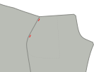

## Étape 1 : Fermer la dart arrière

La première chose que nous allons faire est de fermer la ceinture sur le panneau arrière.

Pour cela, pliez le panneau arrière double avec _bons côtés ensemble_ en s'assurant de faire correspondre les deux côtés de la fléchette les uns aux autres.

Now sew the dart close, making sure to use a small stitch length, and to sew all the way to the end of the dart, even a couple of stitches off the fabric.

<Note>

Vos fléchettes du dos doivent avoir la même longueur. Assurez-vous de les coudre avec précision.

</Note>

## Étape 2 : Construire les poches arrière

Suivez [nos instructions](/docs/sewing/double-welt-pockets/) pour créer les poches de soudure.

<Note>

Comme il s'agit de chinos, vous pouvez/devriez edgestitch autour de l'ouverture.
It's not strictly required for welt pockets, and typically not done on classic trousers (and thus not shown in
the instructions) but it's a very typical finish for chinos, and makes it easier to keep everything in place.

</Note>

### Attacher la poche arrière face au sac de poche

Rejoignez la poche arrière face au sac de poche en les plaçant avec _de bons côtés ensemble_ et en cousant le long des coutures les plus longues de la face non incurvée.

Lorsque vous avez terminé, appuyez sur le côté du sac de poche.

### Attacher le sac de poche arrière

Coudre le bas du sac de poche vers le bas de la soudure. Appuyez dessus lorsque vous avez terminé.

Alignez maintenant le dessus du sac de poche avec la taille et courez-le dans la marge de couture de la taille.

### Fermer le dos de poche

Repliez le panneau de la jambe hors de la route pour pouvoir fermer les deux côtés du sac de poche.

<Note>

Assurez-vous également de coudre la poche sur le sac de poche

</Note>

Vous devriez surverrouiller/serrer les côtés du sac de poche pour qu'ils ne se ravissent pas.

<Tip>

Si vous n'avez pas de _serger_, vous pouvez toujours utiliser un point zig-zag à la place. 

</Tip>

## Étape 3 : Surverrouillez les bords avant et arrière

Avant d'aller plus loin, nous surverouillerons les bords des panneaux avant et arrière des jambes. Assurez-vous également de prendre le dessus du sac de poche lorsque vous faites les panneaux arrière.

What we want to to prevent these edges from ravelling after we've completed our trousers, and now is the best time to do so.

## Étape 4 : Construire l'ouverture de la poche avant

Les poches avant sont un peu inhabituelles parce qu'elles ont l'apparence de poches inclinées classiques, mais sont construites sur la couture latérale.

### Fixer les faces de la poche avant aux poches

Nous avons deux sacs de poche avant, qui ont chacun deux pièces en face pour les fixer.

Alignez-les avec _bons côtés ensemble_ (\*) et cousez la face en place.

<Note>

(\*) Avec un sac de poche, il n'est pas si évident de savoir quel devrait être le bon côté.

Voulez-vous que le bon côté soit ce que vous ressentez lorsque vous mettez votre main dans votre poche?
Ou vous voulez que ce soit ce que vous voyez quand votre pantalon se couche sur le sol avec leur intérieur montré.

Il n'y a pas de bonne ou de mauvaise réponse ici. Vous le faites.

</Note>

### Marquer l'encoche de poche sur la face de la poche et sur les panneaux de la jambe avant et arrière

Il y a une encoche sur les panneaux des jambes avant et arrière qui indique jusqu'à quel point la poche devant doit être fixée à la couture latérale.

Assurez-vous de transférer cette encoche à la fois sur le bord de la poche face et sur la jambe du pantalon avant, car il est important que nous les assortions.

### Épingler ou baser la poche sur le panneau avant et arrière de la jambe

À l'avant et à l'arrière, nous allons coudre la poche face à la couture latérale.

Cependant, cela doit être précis, donc vous voulez vraiment vous assurer que vous l'épinglez ou que vous le basez en place.

<Note>

Commencez avec le devant, puisque c'est la couture la plus facile. Une fois que vous avez un peu d'entraînement, vous pouvez faire le dos

</Note>

### Coudre la poche avant en place

Coudre de la taille vers le bas à droite jusqu'à l'encoche qui indique où arrêter.

### Appuyer sur la poche avant

Appuyez maintenant sur la courbure de la poche avant, tant sur le panneau arrière que sur le panneau avant, de sorte que c'est un pli tranchant.

## Étape 5 : Fermer la sortie

### Coller les poches avant fermées

I strongly advise you to baste the pocket shut/in place before sewing this seam so that you know it's precise.

Fermer le revêtement extérieur signifie placer le panneau avant et arrière avec de bons côtés ensemble, et coudre la couture extérieure. C'est assez facile aux jambes, mais en haut nous avons notre poche, ce qui complique les choses.

### Coudre le haut de la couture extérieure jusqu'à l'encoche supérieure de la pochette

Assurez-vous que tout est bien aligné. Coudre ensuite du haut de la taille jusqu'à l'encoche supérieure (soit un peu plus d'un cm ou un demi pouce).

### Coudre le bas de la couture extérieure de l'encoche inférieure de la poche

Déplacez maintenant à l'encoche inférieure de la tige de poche, et cousez à partir de là jusqu'au bas des jambes.

### Appuyez sur la couture extérieure ouverte

Lorsque vous avez terminé, assurez-vous d'appuyer sur la marge de couture ouverte le long de la jambe. N'appuyez pas sur la poche, nous l'avons déjà fait.

## Étape 6 : Terminer le sac de poche avant

### Coudre le sac de poche à l'intérieur

Avec notre ouverture de poche construite et couture extérieure fermée, nous devrions maintenant finir le sac de poche.

Tirez le sac de poche pour qu'il se prolonge à l'extérieur de la jambe de pantalon. Then place both halves together and either use a serger to finish the edge, or sew closely to the edge.

Assurez-vous de vous retrouver au point où commence la partie inférieure de la couture extérieure.

### Arête du sac de poche

Lorsque vous avez terminé, vous pouvez retourner le sac de poche à l'intérieur de la jambe du pantalon.

Notre sac de poche est maintenant fermé, mais lorsque nous y mettons la main, vous pouvez sentir le bord brut de la couture. Pour éviter cela, emballer le long du bord du sac de poche, verrouiller dans la marge de couture.

<Note>
Si votre marge de couture est large, vous pourriez vouloir la couper en premier.
</Note>

## Étape 7 : Tape la poche à l'ouverture de la poche

À la place de la jambe vers le bas avec le bon côté vers le haut, en s'assurant que le sac de poche est à plat et vers le panneau avant.

Maintenant en haut et en bas de la poche, placez un bar-taquet perpendiculaire à la couture extérieure.

## Étape 8 : Fermer la couture d'entrée

Une fois les poches avant terminées, fermez la couture des deux jambes.

Lorsque vous avez terminé, appuyez sur ouvrir la couture.

## Étape 9 : Fermer la couture croisée

Assurez-vous qu'une jambe est retournée avec le bon côté dehors, et l'autre a le bon côté dedans.

Now tuck the leg with the good side out inside the leg that has the good side in. De cette façon, ils ont leurs bons côtés les uns contre les autres.

Align the cross seam, starting at the back waist, pinning both halves together as you make your way towards the fly. Arrête à l'encoche de vol la plus basse.

Quand vous avez terminé. Faites-le à nouveau. Coudre toujours la couture de croix deux fois. C'est l'une de ces meilleures pratiques que vous ignorez à vos propres risques.

<Tip>

Faites très attention à aligner soigneusement les coutures où les deux jambes ont leur dos et les panneaux avant unis.
Ce faisant, vous assurerez que vos résultats de couture croisée seront parfaitement alignés avec une _croix_ où 4 parties de motif se rencontreront en un seul point.

Une de ces choses que vous finirez par chérir chaque fois que vous les porterez.

</Tip>

## Étape 10: Construire la mouche

### Extension "Fermer la mouche"

Repliez le rallonge de la mouche sur sa ligne de pliage avec de bons côtés ensemble.

Maintenant coudre le long du fond, pour fermer l'extension de la mouche.

Garnir la moitié de la marge de couture pour retirer en vrac avant de la retirer et de la presser sur le bon côté.

### Serger l'extension de la mouche et faire face

Serge (ou zig-zag) le long du côté ouvert de l'extension de la mouche. Pas besoin de serrer le dessus car cela se fera prendre dans notre ceinture.

pendant que vous y êtes, aussi serez-vous le long de la totalité de la mouche face aux bords en forme de J.

### Couper la marge de couture supplémentaire sur le devant de la jambe gauche

Il y a une marge de couture supplémentaire qui coule le long de la mouche. Nous avons seulement besoin de cela sur le panneau de droite. Coupez-le sur le panneau de gauche pour que vous ayez la marge de couture habituelle seulement.

### Fixer la face de la mouche

Coudre la mouche face à gauche. Place them with good sides together, aligning the top.

### Tuck in the tip of the fly facing

Plier le fond de la mouche en faisant face à la couture à l'intérieur et sécuriser avec quelques points.

### Coudre le bord de la mouche face à la couture

Coudre la mouche face à la marge de couture. Assurez-vous de laisser le panneau avant hors de celui-ci.

### Appuyez sur la couture de croix, la couture de la mouche et le bord de la mouche

Appuyez sur ouvrir la couture croisée. Appuyez sur la mouche face au côté.

Pliez ensuite la marge de couture supplémentaire sur la jambe avant droite et appuyez dessus vers le bas.

### Collez la fermeture éclair à l'extension de la mouche

Placez la fermeture éclair le long du bord (légèrement courbe) de l'extension de la mouche.

Maintenant coudre le long du bord. Pas besoin de se rapprocher de la fermeture à glissière, il suffit de coudre le long du bord pour les tenir en place.

### Attacher la fermeture éclair à la mouche

Placez maintenant la mouche de la jambe avant droite avec la marge de couture supplémentaire que vous avez pliée sur le haut de la glissière.

Utilisez une couture au bord du pied zippé, le long du bord zippé.

<Tip>

Vous pourriez vouloir baster cette première fois pour vous assurer qu'elle est bien parallèle à la fermeture à glissière. Fermé, mais pas trop proche.

</Tip>

### Coudre la fermeture éclair sur la mouche

Coudre ensuite l'autre côté de la fermeture à la mouche. Make sure to align it properly so that when the trousers are closed, the zip is hidden.

### Terminer la couture de croix

Coudre le dernier morceau de la couture de croix jusqu'à l'encoche la plus haute.

### Coudre la couture J-de la mouche

Désormais, renverser la soi-disant couture J-de la mouche. Assurez-vous de ne pas prendre le contrôle de l'extension du vol.

### Tape le bas de la mouche

Désormais, abîmez le fond même de la couture J-(la partie horizontale) mais cette fois-ci assurez-vous de prendre également la prolongation de la mouche.

## Étape 11 : Fixer les boucles de ceinture

### Construire les boucles de ceinture

<Note>

Pour plus d'efficacité, nous fabriquerons une longue bande de boucle de courroie que nous diviserons en 8 parties.

</Note>

Cut a strip 80cm long (32 inch) and 2.8cm wide (1 1/8 inch).

Serge (ou zigzag) le bord long de la bande des deux côtés.

Plier un côté à l'intérieur, et l'autre côté dessus. Ensuite appuyez sur votre fer à repasser. Le résultat final devrait être une bande longue d'environ 1 cm de large.

Maintenant coudre sur toute la longueur de la bande, piquer au milieu de celle-ci. Assurez-vous d'utiliser une longueur de point généreuse pour cela.

Enfin, coupez votre bande de courroies de longueur en 8 parties égales pour faire 8 boucles de courroie.

### Attacher les boucles de ceinture

Nous allons diviser nos boucles de ceinture le long de la taille :

 - 2 au centre arrière, chacun mis de côté un peu du centre donc il y a un petit écart entre eux.
 - 1 au-dessus du dard arrière de chaque côté
 - 1 de chaque côté plus ou moins où la couture latérale frapperait la taille si elle était droite vers le haut
 - 1 de chaque côté à partir du centre devant. Pas trop près les uns des autres donc il n'y a pas de place pour les boucles de ceinture, mais pas trop loin non plus, donc ça ne semble pas bizarre

Place the belt loop at these places with their good side down (against the good side of the fabric of your trousers, and the top aligned with the waist) Sew this down in the seam allowance of the waist, making sure that they are perpendicular to the waistband.

## Étape 12 : Attacher la bande de taille

### Assembler une bande de taille courbée

Si vous faites une ceinture droite, glissez directement pour attacher la ceinture à l'extérieur.

Placez les deux bandes de taille avec de bons côtés ensemble, et cousez le long du haut de la ceinture (le bord plus court).

Trim the seam allowance of the inner waistband, and press all seam allowances towards the inner waistband.

You can now treat your assembled waistband as one piece, and continue as for the straight waistband.

<Tip>
Pour vous assurer que la taille de votre ceinture intérieure ne fait pas de dérapage, vous pouvez _understitch_.
Coudre une ligne de couture sur la ceinture intérieure, près du bord, à travers la ceinture intérieure et les coutures (mais pas la ceinture!).
</Tip>

### Attacher la bande de taille à l'extérieur

Placez la ceinture avec de bons côtés le long de la taille. For the straight waistband, make sure the side with the standard seam allowance is aligned with the waist, and not the side with double seam allowance.

Assurez-vous également de laisser une marge de couture suffisante au-delà du début et de la fin de la ceinture.

Coudre le long de l'intégralité de la taille, attacher la bande de la taille et coudre les boucles de la ceinture en une seule fois.

### Appuyez sur la couture de la ceinture et pliez la ceinture

Appuyez sur la couture que vous venez de coudre en pressant la couture dans la ceinture.

Pliez maintenant la ceinture à la bonne largeur et appuyez dans le creux.

### Fermer le début et la fin de la ceinture.

At the start and end, fold the waistband over so it has its good sides together.

Maintenant coudre la fin fermée par la couture de haut en bas au point où se termine la couture de la ceinture.

Coupez un peu la couture afin de pouvoir la glisser plus tard dans la ceinture.

### Déposer la ceinture de taille en place

La ceinture a une marge de couture supplémentaire ici, et nous allons l'utiliser à notre avantage.

Pliez la ceinture dans le pli que vous avez pressé. Puis à l'intérieur, plissez la marge de couture à l'intérieur, en veillant à la laisser courir quelques mm au-delà de la couture de la ceinture.

Vous voulez badigeonner ceci en place pour qu'il reste mis au fur et à mesure que vous faites votre chemin autour de la ceinture.

Au début et à la fin de la ceinture, vous devrez ajouter une marge de couture. Prenez un moment pour y parvenir.

### Coudre la ceinture

Maintenant avec le bon côté vers le haut, coudre exactement dans la couture qui a été cousue avant (appelé _point dans le fossé_).

Cela accrochera l'arrière de la ceinture que nous avons fait pour aller un peu plus loin, et verrouille toute la marge de couture à l'intérieur.

## Étape 13: Finaliser les boucles de ceinture

### Coudre les boucles de la ceinture pour les agrandir

It's best to make the belt loops a bit wider than the waistband, to accomodate wider belts.

For this, let the waistband lie flat, and sew it down with a bartack 1.5cm or so (half an inch) below the waistband.

### Pliez vers le haut, vers le bas, et coudez vers le bas

Maintenant pliez la ceinture vers le haut (cachant l'écorce que vous venez de faire).

Ils s'étendront au-delà du haut de la ceinture. Repliez l'excès à nouveau. Ne la pliez pas sur la ceinture, mais pliez-la sur elle-même.

Maintenant, faites un bartack le long du haut de la ceinture pour verrouiller la boucle de la ceinture.

When you're done, carefully twist the back of the beltloop to the front and cut off the excess right next to the bartack.

<Note>

Faites attention à ne pas abîmer le devant de votre pantalon vers le dos.

Vérifiez à deux reprises que vous n'avez pas de calques supplémentaires sous votre aiguille car désélectionner un écorchon n'est pas une joie.

</Note>

## Étape 14 : Entailler le pantalon

Plier la marge d'ourlet à mi-chemin et presser. Puis pliez-les à nouveau et appuyez à nouveau.

Finalisez votre pantalon à la main et à l'ourlet aveugle.

## Étape 15 : Bouton sur trou de bouton

Créer un trou de bouton. Soit à la main (cela vaut la peine d'être pratiqué) soit avec une machine.

Enfin, attachez le bouton.

Prenez maintenant un moment pour apprécier tout le travail acharné que vous avez fait. We hope you'll get a lot of use out of these.
