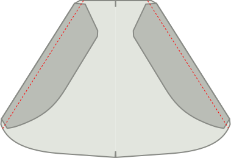

## Stap 1: Sluit de neep op de rug

Eerst gaan we de neep van de taille op de achterkant sluiten.

Om dat te doen Plooi het achterpaneel dubbel met *goede kanten op elkaar,* en zorg ervoor dat de twee kanten van de neep bovenop elkaar liggen.

Now sew the dart close, making sure to use a small stitch length, and to sew all the way to the end of the dart, even a couple of stitches off the fabric.

<Note>

Je achterste nepen moeten even lang zijn. Let op dat je ze precies stikt.

</Note>

## Stap 2: Maak de achterzakken

Volg [onze instructies voor de dubbele paspelzak](/docs/sewing/double-welt-pockets/) voor het maken van de paspelzakken.

<Note>

Omdat dit chino's zijn, kan je niet /should edgestitch rond de paspelopening.
It's not strictly required for welt pockets, and typically not done on classic trousers (and thus not shown in
the instructions) but it's a very typical finish for chinos, and makes it easier to keep everything in place.

</Note>

### Bevestig het beleg van de achterzak aan het zakdeel

Bevestig het beleg aan het zakdeel van de achterzak door ze met *goede kanten op elkaar te plaatsen* en de langste naad van de niet-gebogen naden van het gezicht te stikken.

Strijk de naadwaarde aan de zijkant van het zakdeel als je klaar bent.

### Bevestig het achterzakdeel

Stik de onderkant van het zakdeel aan de onderste paspel. Strijk het omlaag als je klaar bent.

Leg nu de bovenkant van het zakdeel gelijk met de taille en stik deze vast in de naadwaarde van de taille.

### Sluit het zakdeel

Plooi het potje uit de weg zodat je beide kanten van het zakdeel kan sluiten.

<Note>

Stik de paspels ook vast aan het zakdeel

</Note>

Je zou de zijkanten van het zakdeel moeten oververgrendelen/verstoppen zodat ze niet rafelen.

<Tip>

Als je geen *serger* hebt, kun je in plaats daarvan een zigzagsteek gebruiken.

</Tip>

## Stap 3: Overlock de voor- en achterkanten

Voordat we verder gaan, overlock je de randen van de voor- en achterpanelen van de broekspijpen en van de broekspijpen. Let op dat je ook de bovenkant van het zakdeel vastpakt wanneer je de achterpanelen opneemt.

Wat we willen voorkomen dat deze randen gaan breken nadat we onze broek hebben voltooid, en nu is de beste tijd om dit te doen.

## Stap 4: Maak de zakopening

De voorzakken zijn een beetje ongewoon omdat ze het uiterlijk hebben van klassieke schuine zakken, maar zijn geconstrueerd aan de zijnaad.

### Bevestig de belanden van de steekzak aan de zakdelen

We hebben twee voorzakken die elk twee stukken beleg hebben om aan ze vast te bevestigen.

Leg ze gelijk met *goede kanten op elkaar* (\*) en stik het beleg vast.

<Note>

(\*) Met een zakdeel is het niet zo duidelijk wat de goede kant zou moeten zijn.

Wil je dat de goede kant is wat je voelt als je je hand in je zak stopt?
Of wilt u dat het is wat u ziet wanneer uw broek op de vloer ligt en hun ingewanden laten zien.

Er is hier geen juist of verkeerd antwoord. Jullie doen jullie.

</Note>

### Markeer het zakmerkteken op de voor- en achterste delen van de zak

Er is een merkteken op zowel voor- als achterbeendelen dat aangeeft tot aan welk punt het beleg van de zak vastzit aan de zijnaad.

Zorg dat je dit merkteken overmaakt naar zowel het (rand van het) zakbeleg als het voorpand broekspijp, omdat het belangrijk is dat we ze overeenkomen.

### Speld of geef de zak op het voor- en achterste deel

Zowel aan het voorpand als aan het rugpand gaan we het zakbeleg stikken aan de zijnaad.

Dit moet echter nauwkeurig zijn, dus u wilt er zeker van zijn dat u het ergens op de juiste plaats zet of driegt.

<Note>

Begin met de voorkant, want dat is de makkelijkste naad. Zodra je een oefening hebt, kan je de rug doen

</Note>

### Stik de voorzak vast

Stik van de taille naar beneden tot het merkteken dat aangeeft waar te stoppen.

### Strijk de voorste steekzak

Strijk nu de schuine zak vooraan, zowel aan de achterkant als aan het voorpand, zodat het een scherpe plooi is.

## Stap 5: Sluit de buitennaad

### Drieg de voorzakken dicht

I strongly advise you to baste the pocket shut/in place before sewing this seam so that you know it's precise.

Sluit de buitennaad om de voor- en achterkant van het paneel te plaatsen met de goede kanten op elkaar, en stik de buitennaad. Dat is makkelijk genoeg aan de benen, maar aan de bovenkant hebben we onze portemonnee, wat de zaken ingewikkelder maakt.

### Stik de bovenrand van de buitenste naad tot het bovenste merkteken van de zakopening

Zorg ervoor dat alles netjes is afgestemd. Stik dan van de bovenkant van de taille naar het bovenste merkteken (dit is iets meer dan een halve cm of een inch).

### Stik de onderkant van de buitenste naad vanaf het onderste merkteken van de zakopening

Ga nu naar het onderste merkteken van de zakopening en stik van daar helemaal naar de onderkant van de broekspijpen.

### Strijk de buitenste naad open

Let op dat je de naadwaarde langs het podium open strijkt. Strijk de zak niet, dat hebben we al gedaan.

## Stap 6: Werk het voorste zakdeel af

### Stik zakdeel dicht bij binnenzijde

Als onze zakopening is geconstrueerd en de buitenste naad is gesloten, moeten we nu het zakdeel afwerken.

Trek het zakdeel uit zodat het aan de buitenkant van de broekspijp gevaar loopt. Plaats dan beide helften samen en of gebruik een overlock om de rand af te maken, of stik dicht bij de rand.

Zorg dat je eindigt op het punt waar het onderste deel van de buitenste naad begint.

### Werk de rand van het zakdeel af

Wanneer je klaar bent kun je het zakdeel terug naar de binnenkant van de broekspijp omdraaien.

Ons zakdeel is nu gesloten, maar als we onze hand erin steken kan je de onafgewerkte rand van de naadwaarde voelen. Om dat te voorkomen steek je langs de rand van het zakdeel door de naadwaarde vast te leggen.

<Note>
Als je naadwaarde breed is, zou je hem eerst terug kunnen bijknippen.
</Note>

## Stap 7: Bevestig de zakopening

Op de goede kant naar beneden met de goede kant naar boven, zorg ervoor dat het zakdeel plat ligt en richting het voorpand.

Leg nu aan de bovenkant en onderkant van de zakopening een bar-tack in de buitenste naad.

## Stap 8: Sluit de binnennaad

Als onze voorzakken klaar zijn, sluit je de binnennaad van beide broekspijpen.

Strijk de binnennaad open wanneer je klaar bent.

## Stap 9: Sluit de kruisnaad

Zorg dat de ene broekspijp met de goede kant naar buiten gekeerd is, en de andere de goede kant erin heeft.

Now tuck the leg with the good side out inside the leg that has the good side in. Op die manier hebben ze hun goede kanten tegen elkaar.

Align the cross seam, starting at the back waist, pinning both halves together as you make your way towards the fly. Stop bij de laagste gulpbel.

Wanneer je klaar bent. Doe het opnieuw. Stik de kruisnaad altijd twee keer. Het is een van die beste praktijken die je negeert op eigen risico.

<Tip>

Let op dat de naden waarbij de achterpanden aan beide broekspijpen en voorpanden aan elkaar bevestigd zijn, zorgvuldig op elkaar worden afgestemd.
Dit zorgt ervoor dat de kruisnaadresultaten perfect zijn uitgelijnd *kruis* waar 4 patroondelen elkaar op één punt ontmoeten.

Het goed doen is een van die dingen die je uiteindelijk altijd zal koesteren wanneer je dit draagt.

</Tip>

## Stap 10: Maak de gulp

### Sluit gulp extensie

Plooi de gulp op de geplooide lijn met de goede kanten op elkaar.

Stik nu langs de onderkant, om de vlieg extensie te sluiten.

Knip de helft van de naadwaarde terug om bulk te verwijderen voordat je de goede kant naar buiten zet en strijkt.

### Serveer de vliegextensie en vlieg met beleg

Serge (of zigzag) langs de open kant van de vlieg extensie. Het is niet nodig om de top te verstoppen want die wordt gepakt in onze tailleband.

wanneer je er aan toe bent, lock je ook langs het geheel van de gulpbelanden J-vormige rand.

### Knip de extra naadwaarde aan het linkervoorpand weg

Er is extra naadwaarde die langs de vliegen loopt. Dat is alleen nodig aan de rechterzijde. Knip het weg op het linkerpaneel zodat je alleen de naadwaarde aan de linkerkant achterlaat.

### Bevestig het gulpbeleg

Stik de gulp aan het voorpand. Place them with good sides together, aligning the top.

### Trek in de punt van de gulp

Plooi de onderkant van de gulp naar binnen en bevestig met een paar steken.

### Stik de gulp naar de naad door

Stik de gulp aan de naadwaarde. Zorg ervoor dat het voorpaneel er buiten blijft.

### Strijk de kruisnaad, guld en de gulpdeel

Strijk de kruisnaad open. Strijk het gulpbeleg naar de zijkant.

Plooi vervolgens de extra naadwaarde aan de rechterbovenhoek om en strijk deze omlaag.

### Drieg de rits naar de gulp extensie

Leg de rits langs de (licht gebogen) rand van de gulpextensie.

Stik nu langs de rand. Je hoeft niet dicht bij de rits, stik gewoon langs de rand om ze vast te houden.

### Bevestig de rits aan de gulp

Leg nu de rechterbroekspijp met de extra naadwaarde die je langs de rits heen geplooid hebt.

Gebruik een rits voet langs de rand van de rits door de geplooide rand.

<Tip>

Misschien wil je dit eerst driegen om ervoor te zorgen dat het aardig parallel is met de rits. Sluiten, maar niet te dichtbij.

</Tip>

### Stik de rits aan de gulpbeleg

Stik nu de andere kant van de rits aan het gulpdeel. Zorg ervoor dat het goed uitgelijkt zodat wanneer de broek wordt gesloten, de rits verborgen is.

### Werk de kruisnaad af

Stik het laatste stukje van de kruisnaad tot aan de hoogste gulpbok.

### Stik de J-naad van de gulp

Stik nu de zogenaamde J-naad van de gulp. Zorg ervoor dat de vliegextensie buiten de weg blijft.

### Balk de onderkant van de gulp aan

Schiet nu de fles van de J-naad (het horizontale deel) maar deze keer zorg dat je ook de vlieg extensie vangt.

## Stap 11: Bevestig de riemlusjes

### Bouw de riemlusjes

<Note>

Voor de efficiëntie, zullen we een lange strook riem herhalen die we in 8 delen zullen verdelen.

</Note>

Cut a strip 80cm long (32 inch) and 2.8cm wide (1 1/8 inch).

Serge (of zigzag) de lange rand van de strip aan beide zijden.

Plooi de ene kant naar binnen en de andere kant erover. Druk daarna neer met je ijzer. Het eindresultaat moet een lange strook van ongeveer 1 cm breed zijn.

Stik nu langs de hele strook en knik er middenin. Zorg dat je hier een genereuze stiklengte voor gebruikt.

Knip ten slotte de lengte van de riemlusjes in 8 gelijke delen om 8 riemlusjes te maken.

### Bevestig de riemlusjes

We gaan onze riemlusjes verdelen langs de taille:

-   2 aan de middenrug, elke zet een beetje apart van het midden, dus er is een kleine opening tussen hen.
-   1 boven de achterste neep op elke zijde
-   1 aan elke kant min of meer waar de zijnaad de taille zou raken als het recht omhoog zou gaan
-   1 op elke kant van het middenvoorpand. Niet te dicht bij elkaar dus er is geen plaats voor gordels, maar ook niet te ver dus het ziet er niet raar uit

Place the belt loop at these places with their good side down (against the good side of the fabric of your trousers, and the top aligned with the waist) Sew this down in the seam allowance of the waist, making sure that they are perpendicular to the waistband.

## Stap 12: Bevestig de tailleband

### Montagegebogen tailleband

Als je een rechte tailleband maakt, sla de tailleband dan direct naar buiten toe.

Leg beide taillebanden met de goede kanten op elkaar, en stik langs de bovenkant van de tailleband (de kortere rand).

Trim the seam allowance of the inner waistband, and press all seam allowances towards the inner waistband.

You can now treat your assembled waistband as one piece, and continue as for the straight waistband.

<Tip>
Om ervoor te zorgen dat de tailleband van je innerlijke tailleband niet knippert, kun je _onderstik_.
Stik een lijn van stiksel aan de binnenkant van de tailleband, dicht bij de rand, door de binnenste tailleband en naadvogels (maar niet de buitenste tailleband!).
</Tip>

### Bevestig de tailleband aan de buitenkant

Leg de tailleband met de goede kanten op elkaar langs de taille. Voor de rechte tailleband zorg je dat de zijkant met de standaard naadwaarde overeenkomt met de taille, en niet de zijkant met dubbele naadwaarde.

Zorg er ook voor dat je achterliggende naadwaarde voorbij het begin en het einde van de tailleband achterlaat.

Stik langs de totale taille en bevestig de tailleband en stik de riemlusjes in één keer.

### Strijk de naad van de tailleband en plooi de tailleband

Strijk de naad die net gestikt is, en strijk de naadwaarde in de tailleband.

Plooi nu de tailleband aan de juiste breedte en strijk in de plooi.

### Sluit het begin en einde van de tailleband.

At the start and end, fold the waistband over so it has its good sides together.

Stik nu het einde door de bovenkant naar de onderkant te naaien, precies het punt waar de taillebandnaad eindigt.

Knip de naadwaarde een beetje terug zodat je alles later in de tailleband kan stoppen.

### Drieg de tailleband vast

De tailleband heeft extra naadwaarde hier, en dat gaan we tot ons voordeel gebruiken.

Plooi de tailleband in de plooi die je hebt ingedrukt. Plooi dan de naadwaarde naar binnen en zorg dat deze een paar mm voorbij de tailleband loopt.

Je wilt dit op z'n plek driegen zodat het blijft terwijl je door de tailleband komt.

Aan het begin en einde van de tailleband moet je wat meer naadwaarde instoppen. Neem even de tijd om het goed te doen.

### Stik de tailleband dicht

Nou, met de goede kant naar boven, stik precies in de naad die voor de naad was (zoal *stiksel in de naad* genoemd).

Dit houdt in dat de achterkant van de tailleband die we gemaakt hebben om iets verder uit te breiden, en alle naadwaarde erin vergrendelen.

## Stap 13: Voltooi de riemlusjes

### Stik de riemlusjes vast om ze breder te maken

It's best to make the belt loops a bit wider than the waistband, to accomodate wider belts.

For this, let the waistband lie flat, and sew it down with a bartack 1.5cm or so (half an inch) below the waistband.

### Plooi omhoog, neer en stik vast

Plooi nu de riemlusjes omhoog (verbergt de duwtje die je net hebt gedaan).

Ze zullen zich verder uitstrekken dan de top van de tailleband. Vouw de overtollige dus weer naar beneden. Vouw het niet over/rond de tailleband, maar plooi het dubbel op zichzelf.

Doe nu een zak langs de bovenkant van de tailleband om de riemlus op zijn plaats te zetten.

When you're done, carefully twist the back of the beltloop to the front and cut off the excess right next to the bartack.

<Note>

Wees voorzichtig om de voorkant van je broek niet achteraan te slaan.

Dubbel check je met geen extra lagen onder je naald omdat het geen vreugde is om een stack los te maken.

</Note>

## Stap 14: Zoom de broek

Plooi de zoomtoelage halverwege en strijk. Plooi ze daarna opnieuw en strijk opnieuw.

Afronden met de hand en je broek je broek blind.

## Stap 15: Knop op het knoopsgat

Maak een knoopsgat. Ofwel met de hand (het is de moeite waard) of met een machine.

Bevestig tenslotte de knop.

Neem nu even de tijd om al uw harde werk te waarderen. We hope you'll get a lot of use out of these.
