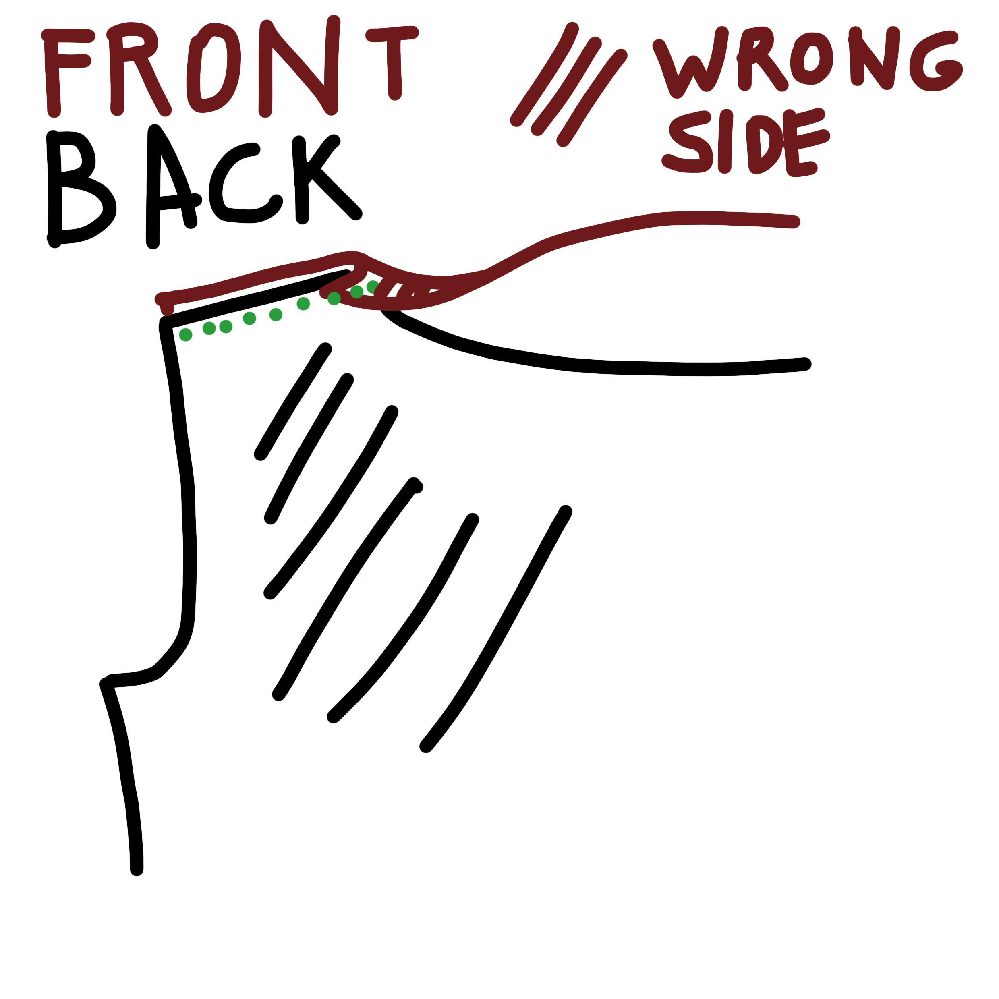

## Terminer l'encolure dos

Cut a strip of self fabric the length of your back neckline, and around 3 cm wide.  
Press a fold into this strip, 1 cm from the edge.

<Tip>

Make this a bias cut strip if you are using a woven fabric, 
or a strip with the stretch direction running along the long edge if you are using a knit. 

</Tip>

Align the non-folded edge of the strip with the back neckline with good sides together. Sew the strip to the back neckline and trim the seam. Turn the strip to the wrong side of the fabric and topstitch along the folded edge to keep it in place.

## Fermer les coutures d'épaule

Finish the raw edge on the front neckline in a way that suits your fabric (if it doesn’t fray, you can leave it unfinished).

Place the front on the back with good sides together, aligning the shoulder seams. Fold the front neckline seam allowance over to the wrong side of the back.

If you have a lightweight woven fabric you can fold this edge up again, so it will form a narrow double hem afterwards (it can help to press these folds first).

Stitch the shoulder seam, enclosing the raw edge of the back neckline in the fold.

Turn to the right side and press.

## Terminer l'encollure avant

Press the hem formed in your fabric by the folds you made at the shoulder seam when you closed the shoulder and topstitch close to the edge.

## Attacher les manches

The sleeve will be inserted flat, meaning the armhole seam will be sewn first and the sleeve and side seam will be closed in one go.

Place the sleeve head along the armhole, with *good sides together* and matching notches. If necessary, ease in the sleeve head at the top, between the notches.

Sew, finish and press the seam.

## Fermer la couture des côtés et des manches

Place the front on the back with good sides together so the side seams and sleeve seam match and the whole thing starts to look like a shirt.  
Make sure the armhole seam lines up across the front and back.

Sew, finish and press the seam.

## Faire les ourlets

Finish the sleeves and bottom hems in a way that works with your fabric choice.

Again, this can mean folding the hem under twice and topstitching, finishing the raw edge with a serger or zig zag stitch and folding it under once or leaving the edge raw, folding it under once and trimming close to the stitching.
