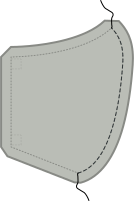
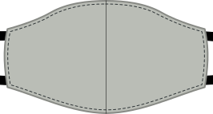

### Étape 1 : Coudre la couture centrale

Placer les deux pièces du tissu destiné à l'extérieur du masque endroit contre endroit, et les coudre ensemble sur le côté courbe, qui sera au milieu de notre masque *endroit contre endroit/0>.

<Note>Répétez cette étape pour le tissu destiné à l'intérieur du masque (doublure).</Note>

### Étape 2 (facultative) : Repasser la couture centrale

<Note>

Cette étape n'a aucune valeur fonctionnelle, elle améliore seulement l'aspect de votre masque.
Donc, si le look n'est pas une préoccupation pour vous, n'hésitez pas à la sauter.

</Note>

Repassez la couture centrale ouverte pour qu'elle soit bien plate.

Comme il s'agit d'une couture courbe, elle ne sera pas complètement plate. Mais vous pouvez vous en approcher en repassant d'abord la moitié d'un côté, puis la seconde moitié de l'autre côté. Vous pouvez également utiliser un jambon de tailleur ou un coussin pour presser.

<Note>Répétez cette étape pour le tissu destiné à l'intérieur du masque (doublure).</Note>

### Étape 3 : Coudre ensemble l'extérieur et la doublure

Maintenant nous allons coudre ensemble le tissu intérieur (doublure) et le tissu extérieur, et les liens, en une seule étape.

 - Placez votre doublure sur l'envers.
 - Ensuite, placez deux liens aux coins d'un des côtés (à droite dans notre exemple) afin qu'ils sortent juste un peu du masque, le reste des liens étant maintenu à l'intérieur.
 - Maintenant, placez dessus le tissu extérieur, sur l'endroit. Vous devriez maintenant avoir les deux épaisseurs de votre masque l'une sur l'autre *endroit contre endroit* avec deux liens pris en sandwich
 - Épingler les liens et les épaisseurs de tissu ensemble
 - Maintenant, faites la même chose de l'autre côté

<Tip>

Avec un peu de pratique, vous n'aurez plus besoin d'épingler les liens.

</Tip>

Maintenant cousez autour du masque, en veillant à laisser un côté ouvert pour pouvoir retourner le masque par la suite.

<Warning>

Faites attention à ne pas coincer les liens dans la couture ailleurs qu'à l'endroit où ils doivent être cousus.
Faites les passer à travers l'ouverture que vous laissez d'un côté, ou regroupez les entre les épaisseurs de votre masque pour les garder hors du tracé de couture.

</Warning>

### Étape 4 : Retourner le masque

Votre masque est actuellement à l'envers donc le retourner signifiera que nous le mettrons en le tissu principal à l'extérieur.

Il suffit de retourner le masque en passant par le côté laissé ouvert et en tirant délicatement.

### Étape 5 (facultative) : Repasser le masque

<Note>

Cette étape n'a pas de valeur fonctionnelle, elle améliore seulement l'aspect de votre masque.
Donc, si le look n'est pas une préoccupation pour vous, n'hésitez pas à la sauter.

</Note>

Maintenant que le masque est presque terminé, il est temps de le repasser. Au préalable, sur le côté laissé ouvert, replier la marge de couture à l'intérieur, et repasser le pli.

### Étape 6: Fermer l'ouverture et surpiquer les bords

Maintenant, il est temps de fermer notre masque sur le côté laissé ouvert.

Nous n'allons pas seulement fermer l'ouverture, mais aussi surpiquer tout le pourtour du masque pour le stabiliser et maintenir la doublure à l'arrière.

Assurez-vous que les bords du côté ouvert sont bien repliés à l'intérieur, puis surpiquez tout le pourtour du masque.

### Étape 7 : Mettez votre masque ou faites-en une série

Voilà, vous avez fini ! Vous pouvez maintenant porter votre masque.

Ou encore mieux, faites-en une série, pour pouvoir en donner aux autres.

