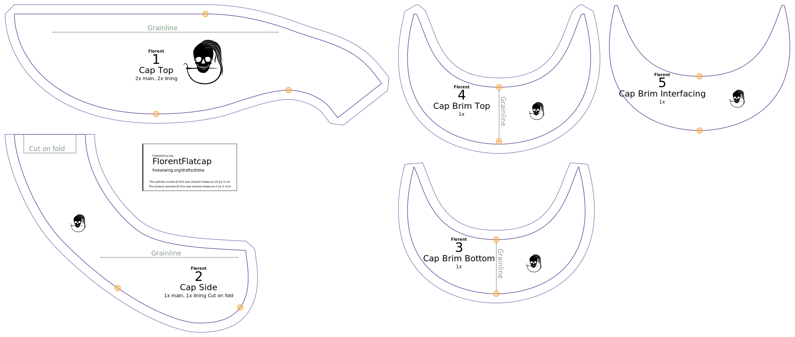

Depending on how much fabric is available, you might want to cut two top and or side parts, hence the instructions on the pattern itself. Opgelet: het patroon heeft een naadwaarde rondom de bovenkant dus laat deze weg als je dit deel aan de stofvouw knipt!

De onderkant van de klep wordt iets naar binnen gezet, terwijl de bovenkant iets naar voor gezet wordt en de naad "onder de rand valt". Keep that in mind when cutting the parts, and mark them accordingly, so that you don't end up with the seam on top of the brim (I don't want to force you into this design choice, I simply want to point out the difference between the parts so that you are aware of it and act accordingly).

 - **Buitenstof**
   - Cut **1 top** on the fold but don't include the center seam allowance, or **2 top** with the center seam allowance.
   - Cut **1 side** on the fold, or **2 side**.
   - Cut **1 brim top**.
   - Cut **1 brim bottom**.
 - **Voering**
   - Cut **1 top** on the fold but don't include the seam allowance, or **2 top** with the center seam allowance.
   - Cut **1 side** on the fold, or **2 side**.
 - **Plastic**
   - Cut **1 brim interfacing**. Kleef het patroon op het plastic, maar knip de markeringen niet in. Je kan ze in het plastic krassen of aanduiden met een stift. You don't really want any sharp edge, so make sure everything is smooth and rounded a bit (especially on the pointy sides).

Een typisch Florent patroon ziet er zo uit:

