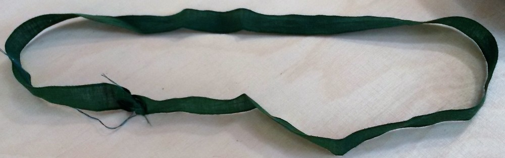
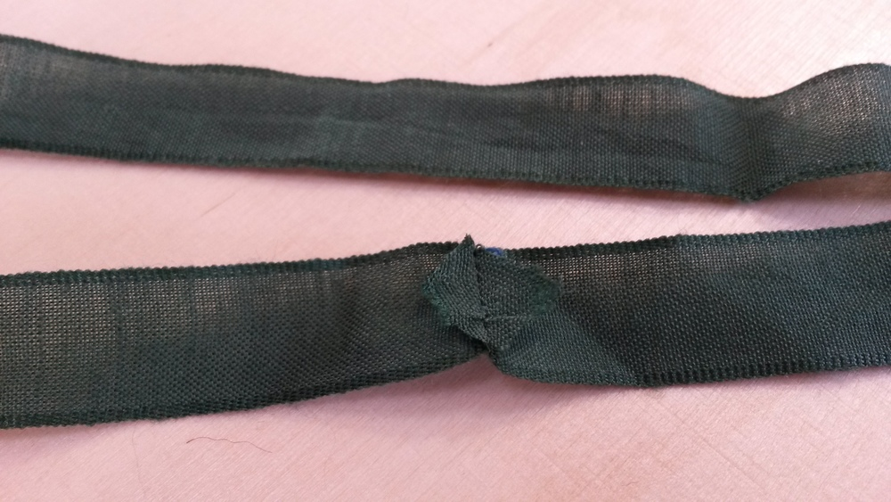
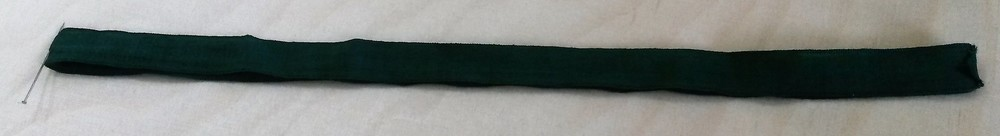

### Paso 1: Fusionar interfaz

Dependiendo del peso de tu tela es posible que quieras fusionar todas tus partes principales de tela Sin importar el espesor de tu tejido, debería considerar reforzar los lados de las partes de su brillo (donde está la marca de tamaño). Esto ayudará a prevenir los extremos puntiagudos de la pieza de plástico para pegar fuera de la gorra en esta zona

### Paso 2: Cerrando el dardo trasero

#### Versión con parte superior cortada al doblar

Debes marcar la parte superior del dardo de la espalda en el lado equivocado de la tela para que sepas dónde terminar tu costura

Hay varios trucos para coser oscuros, Aquí es cómo lo hago (creo que se llama "equilibrar la oscura"): prepara un rectángulo de corte sesgado del mismo tejido que va a meter y colocarlo debajo del punto de su futuro dart. Une el dardo, comenzando por la parte inferior y sigue pegando unos pocos tras el dardo. Deja una buena longitud de hilo para hacer un nudo a mano.

Donde comienza el rectángulo de la tela, cortar la costura que está en contra de este rectángulo, hasta la costura para que la costura pueda ser planchada abierta antes del rectángulo. En el área donde el dart está unido al rectángulo, ambos permisos de costura en un lado, y el rectángulo doblado en el otro lado. Capa los bordes del rectángulo. El borde contra el tejido principal es más amplio, el anterior es más pequeño

#### Versión con la parte superior cortada dos veces

Este dardo es más directo hacia adelante, ya que la costura es continua. Simplemente tira la costura hasta el final

#### planchar la costura

Es posible que tenga que marcar la franquicia de costura para presionarla plana. Utiliza un Jamón a la medida o algo redondeado debajo para ayudarte a pulsar la costura abierta manteniendo la forma agradable que acabas de crear.

#### Más empalmado

Dependiendo del estilo que quieras lograr, puedes juntar todas tus costuras (por máquina a mano). Sin embargo, la costura delantera será un poco complicada para la máquina (pero no imposible). De todos modos, lo pongo aquí y no te lo recordaré después de cada paso, pero básicamente, el proceso sería: empantanado, hierro, cúspide superior, Repetir en el siguiente paso.

### Paso 3: Opcional: Únete a ambas partes laterales.

Esto sólo se aplica si cortas dos partes para la parte lateral. Es una costura recta. nada que decir al respecto. Hierre la costura plana, con las costuras abiertas.

### Paso 4: Únete a la parte superior

ADVERTENCIA: Habrá unos cuantos pines involucrados Alinear las escaleras y fijar las partes juntas para que esta parte redondeada se mantenga bien en su lugar.

 

Para el stitching, tiende a empezar desde el frente central, hacer una mitad, y luego empezar de nuevo, parte trasera del frente central para hacer la otra mitad (la parte lateral **** está en la parte superior para ambas unidades). Así que, si mi máquina desplaza el tejido inferior, sería un "desplazamiento simétrico" en ambos lados. Recorta las franquicias de costura cuando sea necesario, en la curva, tal vez desee recortar el permiso de costura de la parte lateral, y mejorarlo, para ayudar al proceso de planchado.

### Paso 5: La costura exterior del borde.

Alinear las muñecas y fijar las partes superior e inferior. Técnicamente, la parte inferior tiene una longitud de costura más corta, así que puede que tengas que estirarla para que la costura se meta. En la práctica, el tejido suele ser suficientemente estirado para que la diferencia de longitud pueda ser más fácil. Ambas posibilidades de costura contra la **parte inferior**

### Paso 6: Insertando la parte de plástico

La parte de plástico se inserta dentro de la cerámica, teniendo cuidado de mantener la franquicia de costura plana en la **parte superior**. A continuación, la mano se apaga el brillo cerrado, manteniendo las piezas en su lugar y bien tensadas.

### Paso 7: Uniendo el brillo al tope

Alinear las muñecas y unir el brillo al tapón. Tenga cuidado de no meterse en el plástico. Podría ser más fácil si "libres" el brazo de su máquina

### Paso 8: Prepara el revestimiento

Básicamente, repite los pasos 2, 3 y 4 con la forja **top** y **partes laterales**. Esto también sería un buen momento para unir una etiqueta en la **parte superior** del forro si estás en este tipo de cosas.

### Paso 9: Únete el revestimiento a la tela principal.

Da la vuelta al revestimiento y coloca el tejido principal en él (lado bueno contra el lado bueno). Pin y se tira de un extremo del brillo al otro extremo del brillo (dejando la costura del brillo abierta).

No te olvides de volver a tocar esta stitch bastante bien, ya que conseguirá algo de estiramiento cuando giraremos el tapón "afuera". Deja la tapa afuera, para que el lado bueno esté fuera. En la zona de Brim funda el revestimiento en su lugar y la mano lo tira al brillo de una manera de ocultar las otras cositas que ya están en la costura permitida. 

### Paso 10: Encender la parte inferior de la tapa

Es una buena idea juntar la costura inferior de la gorra para que el revestimiento permanezca dentro. Para tener un mejor control lo suelo bastar primero, para que el borde sea nítido. 

### Paso 11: La cinta

Formar un bucle con la cinta para que la circunstancia del bucle coincida con la circunstancia medida de la cabeza del portador de la gorra. El mejor resultado se consigue al fijar la cinta mientras la envuelve alrededor de la cabeza del futuro propietario de la gorra. Una vez que el bucle está cerrado, puede incluso comprobarlo doble y preguntar si este ajuste es correcto para el portador.

Recorta los extremos de la cinta en forma de flecha para evitar que se agote. 

Dividir la cinta en dos con dos pines

Pin la cinta en su lugar: Los dos pines se utilizan para distribuir la cinta por igual en ambos lados. Coloque un pin en la parte trasera y el otro en la parte delantera. Dado que el brillo está en su lugar no puede ser muy estirado, así que fije la cinta en esta área "normalmente" Para la parte restante puede que necesite aliviar la tela a lo largo de la cinta. Recomiendo que la mano tire la cinta en su lugar, en ambos bordes de la cinta

### Paso 12: Unir el lado al brillo

Casi hemos terminado, y el último paso será sujetar el brillo al frente del cuerpo de la gorra. Anclar las dos partes en posición desde el exterior, girar la gorra en el lado del forro y juntar ambas partes varias veces.

 

