### Stap 1: Bevestig tussenvoering

Afhankelijk van hoe zwaar je stof is kan het aan te raden zijn al je buitenste stofdelen te verstevigen. Onafhankelijk van de dikte van je stof is het een goed idee om de zijkanten van je klepdelen (waar de markering is) te verstevigen. Dit zal voorkomen dat de hoeken van het plastic deel hier uit de pet gaan steken

### Stap 2: Achterste neep sluiten

#### Versie met bovenkant aan de stofvouw geknipt

Markeer het eindpunt van de achterste neep op de verkeerde kant van de stof zodat je weet waar je moet stoppen

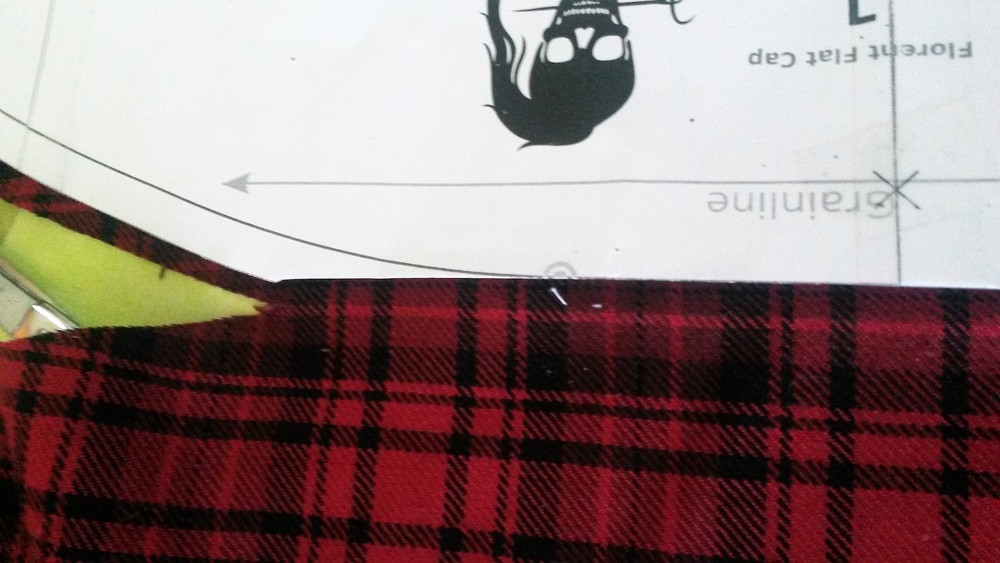

Er zijn verschillende trucjes om nepen te naaien, hier is het mijne (ik denk dat ze dit "een neep balanceren" noemen): knip een rechthoek van je buitenstof schuin van draad en plaats deze onder de punt van je neep. Stik de neep, van beneden tot de punt, en stik een paar steken voorbij de punt van de neep. Laat een paar lange draadjes hangen om ze te kunnen knopen.

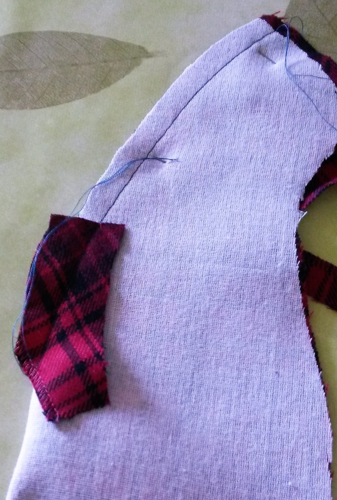

Knip de naadwaarde die tegen het rechthoekige stukje stof ligt open tot aan de naad zodat de naad voor het rechthoekige stukje stof opengestreken kan worden. Op de plek waar de neep samen met het rechthoekige stukje stof gestikt is strijk je de naadwaarde naar 1 kant, en het geplooide rechthoekige stukje stof naar de andere kant. Knip de randen van het rechthoekige stukje stof bij. De rand aan de buitenstof is breder, die daarbovenop smaller

#### Versie met bovenkant in twee delen

Deze neep is eenvoudiger aangezien de naad doorloopt. Stik de naad gewoon van begin tot einde

#### De naad strijken

Het kan helpen om knipjes in de naadwaarde te geven zodat ze plat ligt. Gebruik een perskussen of iets rond onder je stof om de naad open te strijken en toch de vorm die je net gemaakt hebt te behouden.

#### Sierstiksel

Afhankelijk van de look die je wil kan je een sierstiksel langs je naden geven (met de machine of zelfs met de hand). De voorste klepnaad zal een beetje lastig zijn met de machine, maar niet onmogelijk. In elk geval zeg ik dit hier en zal ik het niet blijven herhalen, maar als je kiest voor een sierstiksel is dit het proces: Stik, Strijk, Sierstiksel, Herhaal.

### Stap 3: Optioneel: Bevestig zijpanden aan elkaar.

Dit is enkel relevant als je de zijpanden in twee delen geknipt hebt. Het is een rechte naad. Niet veel over te zeggen. Strijk de naadwaarde open.

### Stap 4: Bevestig de bovenkant aan de zijkant

Opgelet: hier komen een hoop spelden bij kijken.

 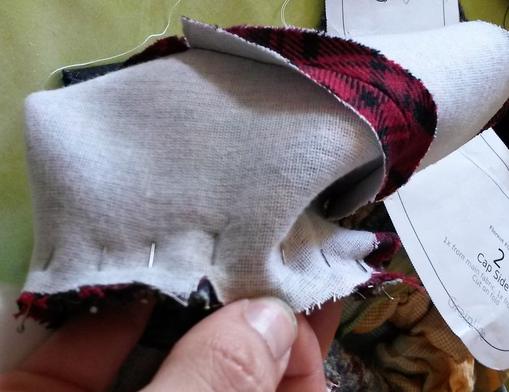

Om dit te stikken start ik liefst aan het midden van de voorkant, doe dan één helft, en begin opnieuw aan het midden van de voorkant om de andere helft te doen (de **zijkant** ligt telkens bovenaan). Als mijn machine dan de lagen stof toch een beetje verschuift is het tenminste "symmetrisch verschoven". Geef knipjes in de naadwaarde waar nodig, en knip ze eventueel bij, om het strijken makkelijker te maken.

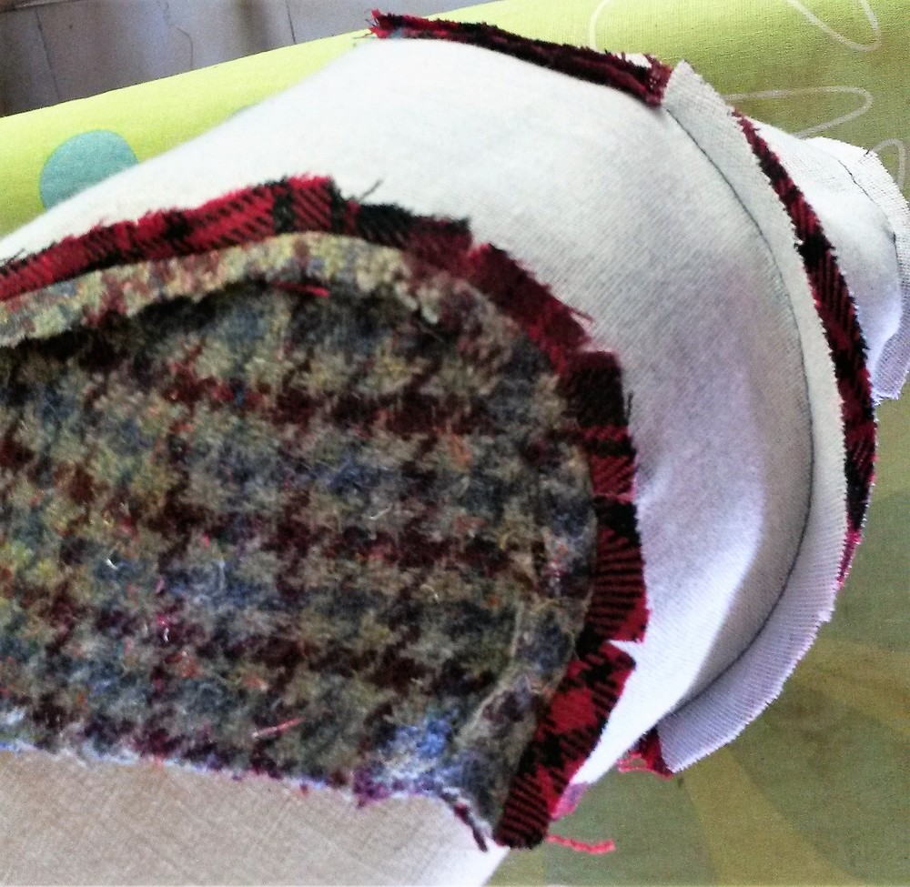

### Stap 5: Buitenste naad van de klep.

Leg de markeringen op elkaar en speld de boven- en onderkant samen. De onderkant heeft een iets kortere naadlengte, dus misschien moet je het een beetje uitrekken zodat de naadwaardes samen liggen. In de praktijk is de meeste stof soepel genoeg om het verschil te verwerken. Stik en strijk de naadwaarde naar de **onderkant** toe

### Stap 6: het plastic deel toevoegen

Het plastic deel wordt dan in de klep geschoven. Let op dat de naadwaarde plat op de **onderkant** van de klep blijft. Daarna naai je de klep dicht met de hand. Let goed op dat alles op zijn plek blijft zitten en mooi opgespannen is.

### Stap 7: Stik de klep aan de pet

Leg de markeringen samen en stik de klep vast aan de pet. Let op dat je niet door het plastic stikt. Hier kan het helpen om de "vrije arm" van je machine te gebruiken

### Stap 8: Bereid de voering voor

Herhaal stap 2, 3 en 4 met de **bovenkant** en **zijpanden** van de voering. Als je een label op de **bovenkant** van de voering wil is dit ook een goed moment om dat te doen.

### Stap 9: Bevestig de voering aan de buitenstof.

Keer de goede kant van de voering naar binnen en plaats de buitenstof in de voering (met goede kanten op elkaar). Speld en stik van één kant van de klep naar de andere (laat het stuk aan de klepnaad open).

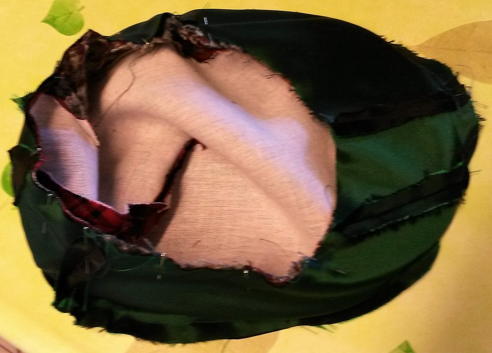

Vergeet niet hier een beetje terug te stikken om het stiksel vast te zetten aangezien hier wel wat aa getrokken wordt bij het keren van de pet. Keer de pet naar de goede kant. Drieg de voering op zijn plek aan de klep en naai ze met de hand vast. Verberg zo meteen ook de andere stiksels die al in de naadwaarde zaten. 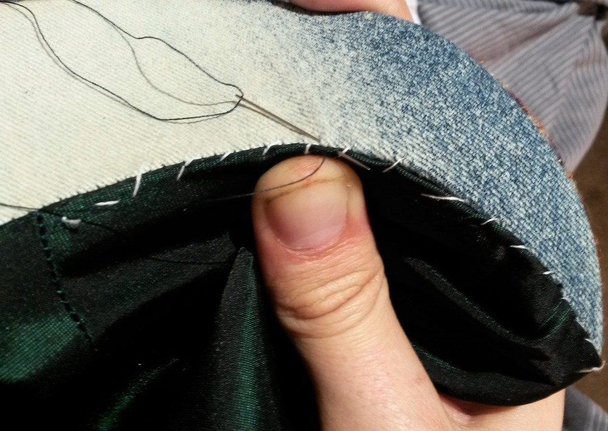

### Stap 10: Sierstiksel aan de onderkant

Het is een goed idee om de onderrand van de pet door te stikken zodat de voering aan de binnenkant blijft. Om meer controle te hebben drieg ik dit meestal eerst, zodat de rand netjes is. 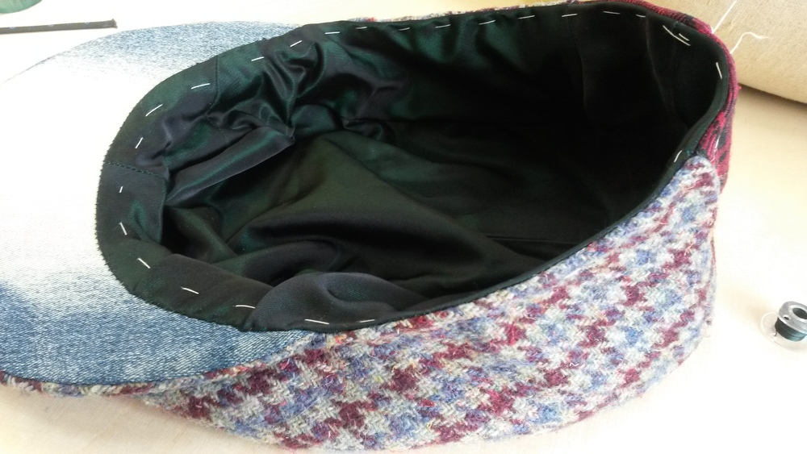

### Stap 11: De band

Maak een lus van de band zodat de omtrek overeenkomt met de hoofdomtrek van de drager van de pet. Je krijgt het beste resultaat door de band te spelden terwijl je hem rond het hoofd van de drager wikkelt. Zodra je de lus gestikt hebt kan je ook nog eens controleren of hij goed rond het hoofd zit.

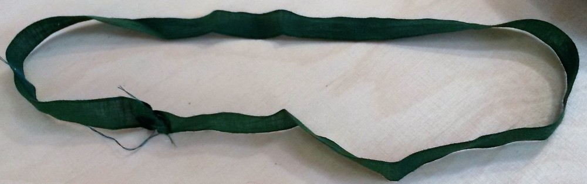

Knip de uiteindes van de band schuin bij zodat ze niet zichtbaar zijn. 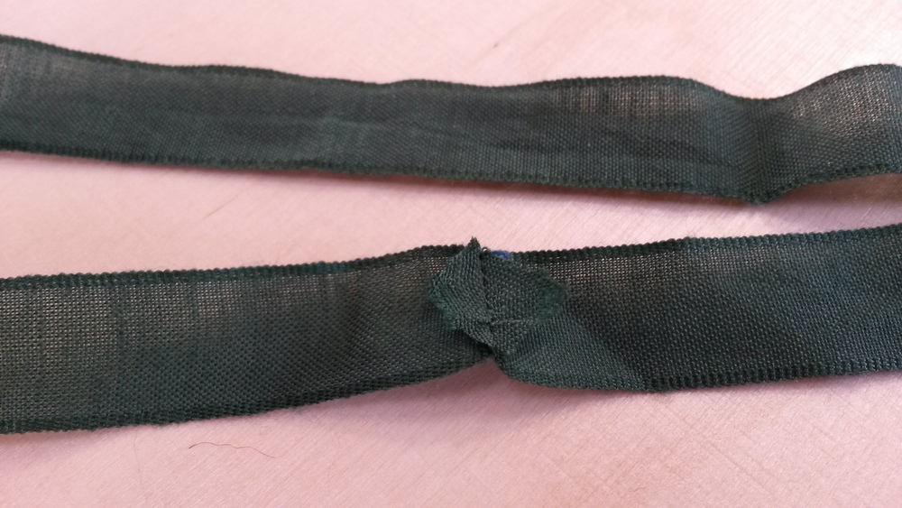

Verdeel de band in twee met spelden

Speld de band op de juiste plek: de twee spelden worden gebruikt om de band gelijk te verdelen. Plaats een speld aan de achterkant, en één aan de voorkant. Aangezien de klep verstevigd is kan je deze niet echt meer manipuleren, dus speld de band hier "gewoon" recht vast. Voor de rest kan het zijn dat je wat overtollige buitenstof in de band moet verdelen. Ik raad je aan de band met de hand vast te naaien, aan beide randen

### Stap 12: Stik de zijkant aan de klep

We zijn bijna klaar, en de laatste stap is de bovenkant van de klep vastmaken aan de pet zelf. Speld de twee delen langs de buitenkant op de juiste plaats, keer de pet naar de binnenkant en stik beide kanten een paar keer door.

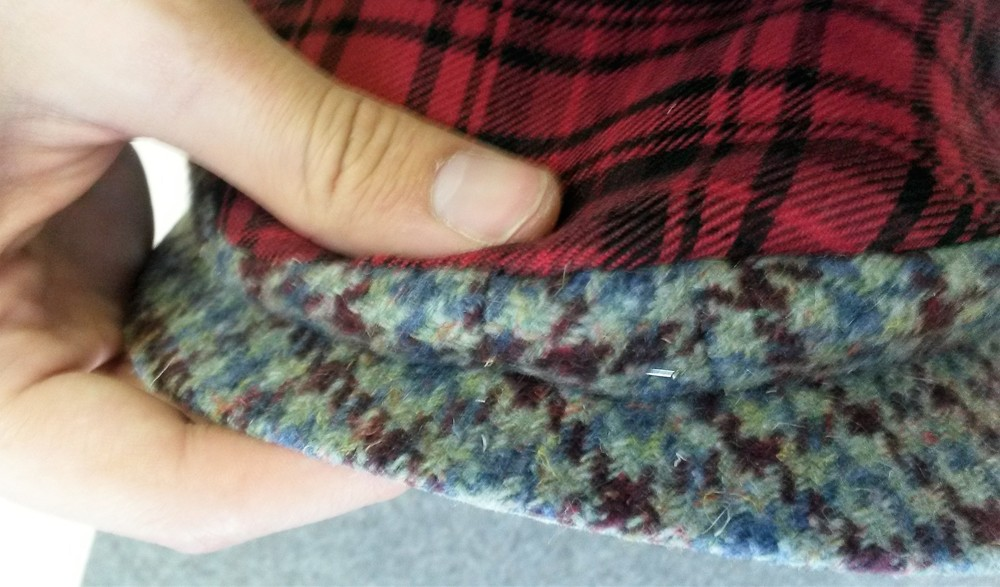 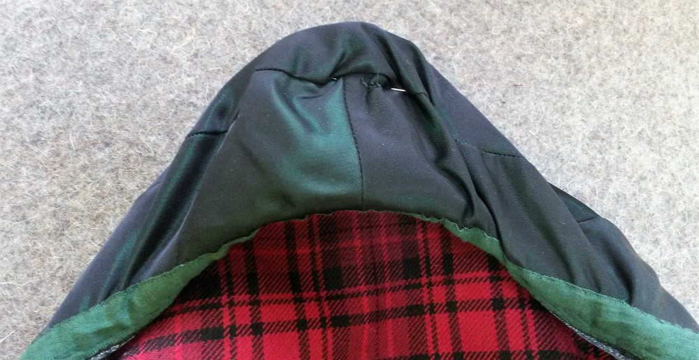

